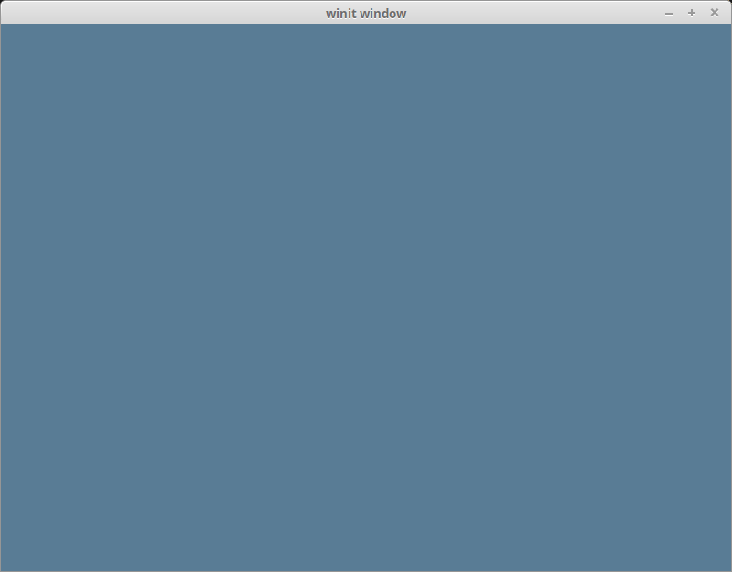

# The Surface

## First, some housekeeping: State

We created state in the last tutorial, now let's put stuff
in it.

```rust
// lib.rs

pub struct State {
    surface: wgpu::Surface<'static>,
    device: wgpu::Device,
    queue: wgpu::Queue,
    config: wgpu::SurfaceConfiguration,
    is_surface_configured: bool,
    window: Arc<Window>,
}
```

I'm glossing over `State`s fields, but they'll make more sense as I explain the code behind these methods.

## State::new()

The code for this is pretty straightforward, but let's break it down a bit.

```rust
impl State {
    // ...
    async fn new(window: Arc<Window>) -> anyhow::Result<State> {
        let size = window.inner_size();

        // The instance is a handle to our GPU
        // BackendBit::PRIMARY => Vulkan + Metal + DX12 + Browser WebGPU
        let instance = wgpu::Instance::new(&wgpu::InstanceDescriptor {
            #[cfg(not(target_arch = "wasm32"))]
            backends: wgpu::Backends::PRIMARY,
            #[cfg(target_arch = "wasm32")]
            backends: wgpu::Backends::GL,
            ..Default::default()
        });

        let surface = instance.create_surface(window.clone()).unwrap();

        let adapter = instance
            .request_adapter(&wgpu::RequestAdapterOptions {
                power_preference: wgpu::PowerPreference::default(),
                compatible_surface: Some(&surface),
                force_fallback_adapter: false,
            })
            .await?;

        // ...
    }
```

### Instance and Adapter

The `instance` is the first thing you create when using wgpu. Its main purpose
is to create `Adapter`s and `Surface`s.

The `adapter` is a handle for our actual graphics card. You can use this to get information about the graphics card, such as its name and what backend the adapter uses. We use this to create our `Device` and `Queue` later. Let's discuss the fields of `RequestAdapterOptions`.

* `power_preference` has two variants: `LowPower` and `HighPerformance`. `LowPower` will pick an adapter that favors battery life, such as an integrated GPU. `HighPerformance` will pick an adapter for more power-hungry yet more performant GPU's, such as a dedicated graphics card. WGPU will favor `LowPower` if there is no adapter for the `HighPerformance` option.
* The `compatible_surface` field tells wgpu to find an adapter that can present to the supplied surface.
* The `force_fallback_adapter` forces wgpu to pick an adapter that will work on all hardware. This usually means that the rendering backend will use a "software" system instead of hardware such as a GPU.

<div class="note">

The options I've passed to `request_adapter` aren't guaranteed to work for all devices, but will work for most of them. If wgpu can't find an adapter with the required permissions, `request_adapter` will return `None`. If you want to get all adapters for a particular backend, you can use `enumerate_adapters`. This will give you an iterator that you can loop over to check if one of the adapters works for your needs.

```rust
let adapter = instance
    .enumerate_adapters(wgpu::Backends::all())
    .filter(|adapter| {
        // Check if this adapter supports our surface
        adapter.is_surface_supported(&surface)
    })
    .next()
    .unwrap()
```

One thing to note is that `enumerate_adapters` isn't available on WASM, so you have to use `request_adapter`.

Another thing to note is that `Adapter`s are locked to a specific backend. If you are on Windows and have two graphics cards, you'll have at least four adapters available to use: 2 Vulkan and 2 DirectX.

For more fields you can use to refine your search, [check out the docs](https://docs.rs/wgpu/latest/wgpu/struct.Adapter.html).

</div>

### The Surface

The `surface` is the part of the window that we draw to. We need it to draw directly to the screen. Our `window` needs to implement [raw-window-handle](https://crates.io/crates/raw-window-handle)'s `HasRawWindowHandle` trait to create a surface. Fortunately, winit's `Window` fits the bill. We also need it to request our `adapter`.

### Device and Queue

Let's use the `adapter` to create the device and queue.

```rust
        let (device, queue) = adapter
            .request_device(&wgpu::DeviceDescriptor {
                label: None,
                required_features: wgpu::Features::empty(),
                // WebGL doesn't support all of wgpu's features, so if
                // we're building for the web we'll have to disable some.
                required_limits: if cfg!(target_arch = "wasm32") {
                    wgpu::Limits::downlevel_webgl2_defaults()
                } else {
                    wgpu::Limits::default()
                },
                memory_hints: Default::default(),
                trace: wgpu::Trace::Off,
            })
            .await?;
```

The `features` field on `DeviceDescriptor` allows us to specify what extra features we want. For this simple example, I've decided not to use any extra features.

<div class="note">

The graphics card you have limits the features you can use. If you want to use certain features, you may need to limit what devices you support or provide workarounds.

You can get a list of features supported by your device using `adapter.features()` or `device.features()`.

You can view a full list of features [here](https://docs.rs/wgpu/latest/wgpu/struct.Features.html).

</div>

The `limits` field describes the limit of certain types of resources that we can create. We'll use the defaults for this tutorial so we can support most devices. You can view a list of limits [here](https://docs.rs/wgpu/latest/wgpu/struct.Limits.html).

The `memory_hints` field provides the adapter with a preferred memory allocation strategy, if supported. You can view the available options [here](https://wgpu.rs/doc/wgpu/enum.MemoryHints.html).

```rust
        let surface_caps = surface.get_capabilities(&adapter);
        // Shader code in this tutorial assumes an sRGB surface texture. Using a different
        // one will result in all the colors coming out darker. If you want to support non
        // sRGB surfaces, you'll need to account for that when drawing to the frame.
        let surface_format = surface_caps.formats.iter()
            .find(|f| f.is_srgb())
            .copied()
            .unwrap_or(surface_caps.formats[0]);
        let config = wgpu::SurfaceConfiguration {
            usage: wgpu::TextureUsages::RENDER_ATTACHMENT,
            format: surface_format,
            width: size.width,
            height: size.height,
            present_mode: surface_caps.present_modes[0],
            alpha_mode: surface_caps.alpha_modes[0],
            view_formats: vec![],
            desired_maximum_frame_latency: 2,
        };
```

Here we are defining a config for our surface. This will define how the surface creates its underlying `SurfaceTexture`s. We will talk about `SurfaceTexture` when we get to the `render` function. For now, let's talk about the config's fields.

The `usage` field describes how `SurfaceTexture`s will be used. `RENDER_ATTACHMENT` specifies that the textures will be used to write to the screen (we'll talk about more `TextureUsages`s later).

The `format` defines how `SurfaceTexture`s will be stored on the GPU. We can get a supported format from the `SurfaceCapabilities`.

`width` and `height` are the width and the height in pixels of a `SurfaceTexture`. This should usually be the width and the height of the window.

<div class="warning">

Make sure that the width and height of the `SurfaceTexture` are not 0, as that can cause your app to crash.

</div>

`present_mode` uses `wgpu::PresentMode` enum, which determines how to sync the surface with the display. For the sake of simplicity, we select the first available option. If you do not want runtime selection, `PresentMode::Fifo` will cap the display rate at the display's framerate. This is essentially VSync. This mode is guaranteed to be supported on all platforms. There are other options, and you can see all of them [in the docs](https://docs.rs/wgpu/latest/wgpu/enum.PresentMode.html)

<div class="note">

If you want to let your users pick what `PresentMode` they use, you can use [SurfaceCapabilities::present_modes](https://docs.rs/wgpu/latest/wgpu/struct.SurfaceCapabilities.html#structfield.present_modes) to get a list of all the `PresentMode`s the surface supports:

```rust
let modes = &surface_caps.present_modes;
```

Regardless, `PresentMode::Fifo` will always be supported, and `PresentMode::AutoVsync` and `PresentMode::AutoNoVsync` have fallback support and therefore will work on all platforms.

</div>

`alpha_mode` is honestly not something I'm familiar with. I believe it has something to do with transparent windows, but feel free to open a pull request. For now, we'll just use the first `AlphaMode` in the list given by `surface_caps`.

`view_formats` is a list of `TextureFormat`s that you can use when creating `TextureView`s (we'll cover those briefly later in this tutorial as well as more in depth [in the texture tutorial](../tutorial5-textures)). As of writing, this means that if your surface is sRGB color space, you can create a texture view that uses a linear color space.

Now that we've configured our surface properly, we can add these new fields at the end of the method. The `is_surface_configured` field will be used later.

```rust
    async fn new(window: Arc<Window>) -> anyhow::Result<State> {
        // ...

        Ok(Self {
            surface,
            device,
            queue,
            config,
            is_surface_configured: false,
            window,
        })
    }
```

## resize()

If we want to support resizing in our application, we're going to need to reconfigure the `surface` every time the window's size changes. That's the reason we stored the physical `size` and the `config` used to configure the `surface`. With all of these, the resize method is very simple.

```rust
// impl State
pub fn resize(&mut self, width: u32, height: u32) {
    if width > 0 && height > 0 {
        self.config.width = width;
        self.config.height = height;
        self.surface.configure(&self.device, &self.config);
        self.is_surface_configured = true;
    }
}
```

This is where we configure the `surface`. We need the surface to be configured before we can do anything with it. We set the `is_surface_configured` flag to true here and we'll check it in the `render()` function.

## handle_key()

This is where we'll handle keyboard events. Currently just want to exit the app when the escape key is pressed. We'll do some other stuff later.

```rust
// impl State
fn handle_key(&self, event_loop: &ActiveEventLoop, code: KeyCode, is_pressed: bool) {
    match (code, is_pressed) {
        (KeyCode::Escape, true) => event_loop.exit(),
        _ => {}
    }
}
```

We'll need to call our new `handle_key()` function in the `window_event()` function in `App`.

```rust
impl ApplicationHandler<State> for App {
    // ...

    fn window_event(
        &mut self,
        event_loop: &ActiveEventLoop,
        _window_id: winit::window::WindowId,
        event: WindowEvent,
    ) {
        let state = match &mut self.state {
            Some(canvas) => canvas,
            None => return,
        };

        match event {
            // ...
            WindowEvent::KeyboardInput {
                event:
                    KeyEvent {
                        physical_key: PhysicalKey::Code(code),
                        state: key_state,
                        ..
                    },
                ..
            } => state.handle_key(event_loop, code, key_state.is_pressed()),
            _ => {}
        }
    }
}
```

## update()

We don't have anything to update yet, so leave the method empty.

```rust
fn update(&mut self) {
    // remove `todo!()`
}
```

We'll add some code here later on to move around objects.

## render()

Here's where the magic happens. First, we need to get a frame to render to.

```rust
// impl State

fn render(&mut self) -> Result<(), wgpu::SurfaceError> {
    self.window.request_redraw();

    // We can't render unless the surface is configured
    if !self.is_surface_configured {
        return Ok(());
    }
        
    let output = self.surface.get_current_texture()?;
```

The `get_current_texture` function will wait for the `surface` to provide a new `SurfaceTexture` that we will render to. We'll store this in `output` for later.

```rust
    let view = output.texture.create_view(&wgpu::TextureViewDescriptor::default());
```

This line creates a `TextureView` with default settings. We need to do this because we want to control how the render code interacts with the texture.

We also need to create a `CommandEncoder` to create the actual commands to send to the GPU. Most modern graphics frameworks expect commands to be stored in a command buffer before being sent to the GPU. The `encoder` builds a command buffer that we can then send to the GPU.

```rust
    let mut encoder = self.device.create_command_encoder(&wgpu::CommandEncoderDescriptor {
        label: Some("Render Encoder"),
    });
```

Now we can get to clearing the screen (a long time coming). We need to use the `encoder` to create a `RenderPass`. The `RenderPass` has all the methods for the actual drawing. The code for creating a `RenderPass` is a bit nested, so I'll copy it all here before talking about its pieces.

```rust
    {
        let _render_pass = encoder.begin_render_pass(&wgpu::RenderPassDescriptor {
            label: Some("Render Pass"),
            color_attachments: &[Some(wgpu::RenderPassColorAttachment {
                view: &view,
                resolve_target: None,
                ops: wgpu::Operations {
                    load: wgpu::LoadOp::Clear(wgpu::Color {
                        r: 0.1,
                        g: 0.2,
                        b: 0.3,
                        a: 1.0,
                    }),
                    store: wgpu::StoreOp::Store,
                },
            })],
            depth_stencil_attachment: None,
            occlusion_query_set: None,
            timestamp_writes: None,
        });
    }

    // submit will accept anything that implements IntoIter
    self.queue.submit(std::iter::once(encoder.finish()));
    output.present();

    Ok(())
}
```

First things first, let's talk about the extra block (`{}`) around `encoder.begin_render_pass(...)`. `begin_render_pass()` borrows `encoder` mutably (aka `&mut self`). We can't call `encoder.finish()` until we release that mutable borrow. The block tells Rust to drop any variables within it when the code leaves that scope, thus releasing the mutable borrow on `encoder` and allowing us to `finish()` it. If you don't like the `{}`, you can also use `drop(render_pass)` to achieve the same effect.

The last lines of the code tell `wgpu` to finish the command buffer and submit it to the GPU's render queue.

We need to update the event loop again to call this method. We'll also call `update()` before it, too.

```rust
// run()
    fn window_event(
        &mut self,
        event_loop: &ActiveEventLoop,
        _window_id: winit::window::WindowId,
        event: WindowEvent,
    ) {
        let state = match &mut self.state {
            Some(canvas) => canvas,
            None => return,
        };

        match event {
            // ...
            WindowEvent::RedrawRequested => {
                state.update();
                match state.render() {
                    Ok(_) => {}
                    // Reconfigure the surface if it's lost or outdated
                    Err(wgpu::SurfaceError::Lost | wgpu::SurfaceError::Outdated) => {
                        let size = state.window.inner_size();
                        state.resize(size.width, size.height);
                    }
                    Err(e) => {
                        log::error!("Unable to render {}", e);
                    }
                }
            }
            // ...
        }
    }
```

With all that, you should be getting something that looks like this.



## Wait, what's going on with RenderPassDescriptor?

Some of you may be able to tell what's going on just by looking at it, but I'd be remiss if I didn't go over it. Let's take a look at the code again.

```rust
&wgpu::RenderPassDescriptor {
    label: Some("Render Pass"),
    color_attachments: &[
        // ...
    ],
    depth_stencil_attachment: None,
}
```

A `RenderPassDescriptor` only has three fields: `label`, `color_attachments` and `depth_stencil_attachment`. The `color_attachments` describe where we are going to draw our color to. We use the `TextureView` we created earlier to make sure that we render to the screen.

<div class="note">

The `color_attachments` field is a "sparse" array. This allows you to use a pipeline that expects multiple render targets and only supplies the ones you care about.

</div>

We'll use `depth_stencil_attachment` later, but we'll set it to `None` for now.

```rust
Some(wgpu::RenderPassColorAttachment {
    view: &view,
    resolve_target: None,
    ops: wgpu::Operations {
        load: wgpu::LoadOp::Clear(wgpu::Color {
            r: 0.1,
            g: 0.2,
            b: 0.3,
            a: 1.0,
        }),
        store: wgpu::StoreOp::Store,
    },
})
```

The `RenderPassColorAttachment` has the `view` field, which informs `wgpu` what texture to save the colors to. In this case, we specify the `view` that we created using `surface.get_current_texture()`. This means that any colors we draw to this attachment will get drawn to the screen.

The `resolve_target` is the texture that will receive the resolved output. This will be the same as `view` unless multisampling is enabled. We don't need to specify this, so we leave it as `None`.

The `ops` field takes a `wgpu::Operations` object. This tells wgpu what to do with the colors on the screen (specified by `view`). The `load` field tells wgpu how to handle colors stored from the previous frame. Currently, we are clearing the screen with a bluish color. The `store` field tells wgpu whether we want to store the rendered results to the `Texture` behind our `TextureView` (in this case, it's the `SurfaceTexture`). We use `StoreOp::Store` as we do want to store our render results.

<div class="note">

It's not uncommon to not clear the screen if the screen is going to be completely covered up with objects. If your scene doesn't cover the entire screen, however, you can end up with something like this.


</div>

## Validation Errors?

If wgpu is using Vulkan on your machine, you may run into validation errors if you are running an older version of the Vulkan SDK. You should be using at least version `1.2.182` as older versions can give out some false positives. If errors persist, you may have encountered a bug in wgpu. You can post an issue at [https://github.com/gfx-rs/wgpu](https://github.com/gfx-rs/wgpu)

## Demo

<WasmExample example="tutorial2_surface"></WasmExample>

<AutoGithubLink/>

## Challenge

Create a `handle_mouse_moved()` method to capture mouse events, and update the clear color using that. *Hint: you'll probably need to use `WindowEvent::CursorMoved`*.
