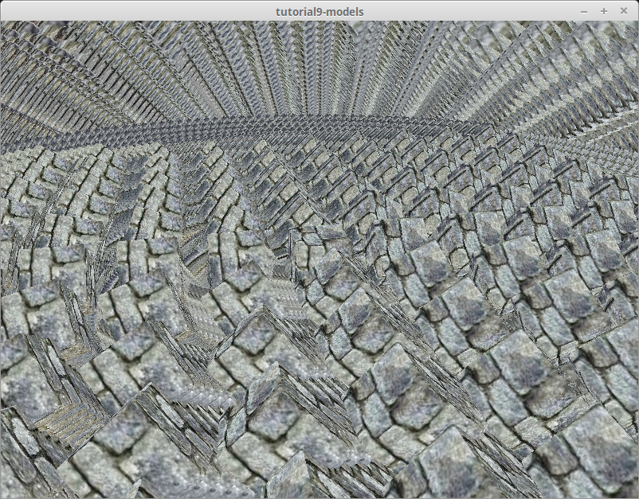

# The Swapchain

## First, some house keeping: State
For convenience we're going to pack all the fields into a struct, and create some methods on that.

```rust
// main.rs
struct State {
    surface: wgpu::Surface,
    device: wgpu::Device,
    queue: wgpu::Queue,
    sc_desc: wgpu::SwapChainDescriptor,
    swap_chain: wgpu::SwapChain,
    size: winit::dpi::PhysicalSize<u32>,
}

impl State {
    // Creating some of the wgpu types requires async code
    async fn new(window: &Window) -> Self {
        todo!()
    }

    fn resize(&mut self, new_size: winit::dpi::PhysicalSize<u32>) {
        todo!()
    }

    fn input(&mut self, event: &WindowEvent) -> bool {
        todo!()
    }

    fn update(&mut self) {
        todo!()
    }

    fn render(&mut self) {
        todo!()
    }
}
```

I'm glossing over `State`s fields, but they'll make more sense as I explain the code behind the methods.

## State::new()
The code for this is pretty straight forward, but let's break this down a bit.

```rust
impl State {
    // ...
    async fn new(window: &Window) -> Self {
        let size = window.inner_size();

        // The instance is a handle to our GPU
        // BackendBit::PRIMARY => Vulkan + Metal + DX12 + Browser WebGPU
        let instance = wgpu::Instance::new(wgpu::BackendBit::PRIMARY);
        let surface = unsafe { instance.create_surface(window) };
        let adapter = instance.request_adapter(
            &wgpu::RequestAdapterOptions {
                power_preference: wgpu::PowerPreference::Default,
                compatible_surface: Some(&surface),
            },
        ).await.unwrap();
```

The `surface` is used to create the `swap_chain`. Our `window` needs to implement [raw-window-handle](https://crates.io/crates/raw-window-handle)'s `HasRawWindowHandle` trait to access the native window implementation for `wgpu` to properly create the graphics backend. Fortunately, winit's `Window` fits the bill. We also need it to request our `adapter`.

We need the `adapter` to create the device and queue.

```rust
        let (device, queue) = adapter.request_device(
            &wgpu::DeviceDescriptor {
                features: wgpu::Features::empty(),
                limits: wgpu::Limits::default(),
                shader_validation: true,
            },
            None, // Trace path
        ).await.unwrap();
```

The `features` field on `DeviceDescriptor`, allows us to specify what extra features we want. For this simple example, I've deviced to not use any extra features.

<div class="note">

The device you have limits the features you can use. If you want to use certain features you may need to limit what devices you support, or provide work arounds.

You can get a list of features supported by your device using `adapter.features()`, or `device.features()`.

You can view a full list of features [here](https://docs.rs/wgpu/0.6.0/wgpu/struct.Features.html).

</div>

The `limits` field describes the limit of certain types of resource we can create. We'll use the defaults for this tutorial, so we can support most devices. You can view a list of limits [here](https://docs.rs/wgpu/0.6.0/wgpu/struct.Limits.html).

```rust
        let sc_desc = wgpu::SwapChainDescriptor {
            usage: wgpu::TextureUsage::OUTPUT_ATTACHMENT,
            format: wgpu::TextureFormat::Bgra8UnormSrgb,
            width: size.width,
            height: size.height,
            present_mode: wgpu::PresentMode::Fifo,
        };
        let swap_chain = device.create_swap_chain(&surface, &sc_desc);
```
Here we are defining and creating the `swap_chain`. The `usage` field describes how the `swap_chain`'s underlying textures will be used. `OUTPUT_ATTACHMENT` specifies that the textures will be used to write to the screen (we'll talk about more `TextureUsage`s later).

The `format` defines how the `swap_chain`s textures will be stored on the gpu. Usually you want to specify the format of the display you're using. As of writing, I was unable to find a way to query what format the display has through `wgpu`, though [there are plans on including such a method](https://github.com/gfx-rs/wgpu-rs/issues/123#issuecomment-555803321), so `wgpu::TextureFormat::Bgra8UnormSrgb` will do for now. We use `wgpu::TextureFormat::Bgra8UnormSrgb` because that's the format that's [guaranteed to be natively supported by the swapchains of all the APIs/platforms](https://github.com/gfx-rs/wgpu-rs/issues/123#issuecomment-555800583) which are currently supported.

`width` and `height`, are self explanatory.

The `present_mode` uses the `wgpu::PresentMode` enum which is defined as follows.

```rust
#[repr(C)]
#[derive(Copy, Clone, Debug, PartialEq, Eq, Hash)]
#[cfg_attr(feature = "serde", derive(Serialize, Deserialize))]
pub enum PresentMode {
    /// The presentation engine does **not** wait for a vertical blanking period and
    /// the request is presented immediately. This is a low-latency presentation mode,
    /// but visible tearing may be observed. Will fallback to `Fifo` if unavailable on the
    /// selected  platform and backend. Not optimal for mobile.
    Immediate = 0,
    /// The presentation engine waits for the next vertical blanking period to update
    /// the current image, but frames may be submitted without delay. This is a low-latency
    /// presentation mode and visible tearing will **not** be observed. Will fallback to `Fifo`
    /// if unavailable on the selected platform and backend. Not optimal for mobile.
    Mailbox = 1,
    /// The presentation engine waits for the next vertical blanking period to update
    /// the current image. The framerate will be capped at the display refresh rate,
    /// corresponding to the `VSync`. Tearing cannot be observed. Optimal for mobile.
    Fifo = 2,
}
```

At the end of the method, we simply return the resulting struct.

```rust
        Self {
            surface,
            device,
            queue,
            sc_desc,
            swap_chain,
            size,
        }
    }
    // ...
}
```

We'll want to call this in our main method before we enter the event loop.

```rust
use futures::executor::block_on;

// Since main can't be async, we're going to need to block
let mut state = block_on(State::new(&window));
```

## resize()
If we want to support resizing in our application, we're going to need to recreate the `swap_chain` everytime the window's size changes. That's the reason we stored the physical `size` and the `sc_desc` used to create the swapchain. With all of these, the resize method is very simple.

```rust
// impl State
fn resize(&mut self, new_size: winit::dpi::PhysicalSize<u32>) {
    self.size = new_size;
    self.sc_desc.width = new_size.width;
    self.sc_desc.height = new_size.height;
    self.swap_chain = self.device.create_swap_chain(&self.surface, &self.sc_desc);
}
```

There's nothing really different here from creating the `swap_chain` initially, so I won't get into it.

We call this method in `main()` in the event loop for the following events.

```rust
match event {
    // ...

    } if window_id == window.id() => if !state.input(event) {
        match event {
            // ...

            WindowEvent::Resized(physical_size) => {
                state.resize(*physical_size);
            }
            WindowEvent::ScaleFactorChanged { new_inner_size, .. } => {
                // new_inner_size is &&mut so we have to dereference it twice
                state.resize(**new_inner_size);
            }
            // ...
}
```

## input()

`input()` returns a `bool` to indicate whether an event has been fully processed. If the method returns `true`, the main loop won't process the event any further.

We're just going to return false for now because we don't have any events we want to capture.

```rust
// impl State
fn input(&mut self, event: &WindowEvent) -> bool {
    false
}
```

We need to do a little more work in the event loop. We want `State` to have priority over `main()`. Doing that (and previous changes) should have your loop looking like this.

```rust
// main()
event_loop.run(move |event, _, control_flow| {
    match event {
        Event::WindowEvent {
            ref event,
            window_id,
        } if window_id == window.id() => if !state.input(event) { // UPDATED!
            match event {
                WindowEvent::CloseRequested => *control_flow = ControlFlow::Exit,
                WindowEvent::KeyboardInput {
                    input,
                    ..
                } => {
                    match input {
                        KeyboardInput {
                            state: ElementState::Pressed,
                            virtual_keycode: Some(VirtualKeyCode::Escape),
                            ..
                        } => *control_flow = ControlFlow::Exit,
                        _ => {}
                    }
                }
                WindowEvent::Resized(physical_size) => {
                    state.resize(*physical_size);
                }
                WindowEvent::ScaleFactorChanged { new_inner_size, .. } => {
                    state.resize(**new_inner_size);
                }
                _ => {}
            }
        }
        _ => {}
    }
});
```

## update()

We don't have anything to update yet, so leave the method empty.

```rust
fn update(&mut self) {
    // remove `todo!()`
}
```

## render()

Here's where the magic happens. First we need to get a frame to render to. This will include a `wgpu::Texture` and `wgpu::TextureView` that will hold the actual image we're drawing to (we'll cover this more when we talk about textures).

```rust
// impl State

fn render(&mut self) {
    let frame = self.swap_chain.get_current_frame()
        .expect("Timeout getting texture")
        .output;
```

We also need to create a `CommandEncoder` to create the actual commands to send to the gpu. Most modern graphics frameworks expect commands to be stored in a command buffer before being sent to the gpu. The `encoder` builds a command buffer that we can then send to the gpu.

```rust
    let mut encoder = self.device.create_command_encoder(&wgpu::CommandEncoderDescriptor {
        label: Some("Render Encoder"),
    });
```

Now we can actually get to clearing the screen (long time coming). We need to use the `encoder` to create a `RenderPass`. The `RenderPass` has all the methods to do the actual drawing. The code for creating a `RenderPass` is a bit nested, so I'll copy it all here, and talk about the pieces.

```rust
    {
        let _render_pass = encoder.begin_render_pass(&wgpu::RenderPassDescriptor {
            color_attachments: &[
                wgpu::RenderPassColorAttachmentDescriptor {
                    attachment: &frame.view,
                    resolve_target: None,
                    ops: wgpu::Operations {
                        load: wgpu::LoadOp::Clear(wgpu::Color {
                            r: 0.1,
                            g: 0.2,
                            b: 0.3,
                            a: 1.0,
                        }),
                        store: true,
                    }
                }
            ],
            depth_stencil_attachment: None,
        });
    }

    // submit will accept anything that implements IntoIter
    self.queue.submit(std::iter::once(encoder.finish()));
}
```

First things first, let's talk about the `{}`. `encoder.begin_render_pass(...)` borrows `encoder` mutably (aka `&mut self`). We can't call `encoder.finish()` until we release that mutable borrow. The `{}` around `encoder.begin_render_pass(...)` tells rust to drop any variables within them when the code leaves that scope thus releasing the mutable borrow on `encoder` and allowing us to `finish()` it. If you don't like the `{}`, you can also use `drop(render_pass)` to achieve the same effect.

We can get the same results by removing the `{}`, and the `let _render_pass =` line, but we need access to the `_render_pass` in the next tutorial, so we'll leave it as is.

The last lines of the code tell `wgpu` to finish the command buffer, and to submit it to the gpu's render queue.

We need to update the event loop again to call this method. We'll also call update before it too.

```rust
// main()
event_loop.run(move |event, _, control_flow| {
    match event {
        // ...
        Event::RedrawRequested(_) => {
            state.update();
            state.render();
        }
        Event::MainEventsCleared => {
            // RedrawRequested will only trigger once, unless we manually
            // request it.
            window.request_redraw();
        }
        // ...
    }
});
```

With all that, you should be getting something that looks like this.


## Wait, what's going on with RenderPassDescriptor?

Some of you may be able to tell what's going on just by looking at it, but I'd be remiss if I didn't go over it. Let's take a look at the code again.

```rust
&wgpu::RenderPassDescriptor {
    color_attachments: &[
        // ...
    ],
    depth_stencil_attachment: None,
}
```

A `RenderPassDescriptor` only has two fields: `color_attachments` and `depth_stencil_attachment`. The `color_attachements` describe where we are going to draw our color to.

We'll use `depth_stencil_attachment` later, but we'll set it to `None` for now.

```rust
wgpu::RenderPassColorAttachmentDescriptor {
    attachment: &frame.view,
    resolve_target: None,
    ops: wgpu::Operations {
        load: wgpu::LoadOp::Clear(wgpu::Color {
            r: 0.1,
            g: 0.2,
            b: 0.3,
            a: 1.0,
        }),
        store: true,
    }
}
```

The `RenderPassColorAttachmentDescriptor` has the `attachment` field which informs `wgpu` what texture to save the colors to. In this case we specify `frame.view` that we created using `swap_chain.get_current_frame()`. This means that any colors we draw to this attachment will get drawn to the screen.

The `resolve_target` is the texture that will receive the resolved output. This will be the same as `attachment` unless multisampling is enabled. We don't need to specify this, so we leave it as `None`.

The `ops` field takes a `wpgu::Operations` object. This tells wgpu what to do with the colors on the screen (specified by `frame.view`). The `load` field tells wgpu how to handle colors stored from the previous frame. Currently we are clearing the screen with a bluish color.

<div class="note">

It's not uncommon to not clear the screen if the screen is going to be completely covered up with objects. If your scene doesn't cover the entire screen however you'll end up with something like this.



</div>

## Challenge

Modify the `input()` method to capture mouse events, and update the clear color using that. *Hint: you'll probably need to use `WindowEvent::CursorMoved`*.

<AutoGithubLink/>
