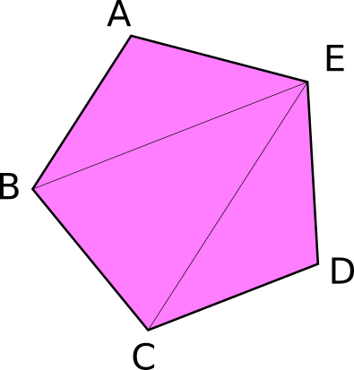
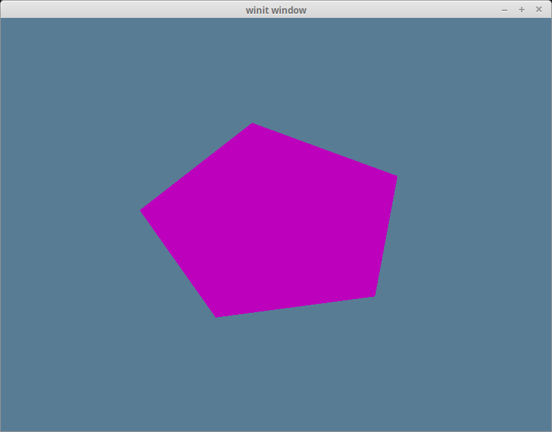

# Buffers and Indices

## We're finally talking about them!

You were probably getting sick of me saying stuff like, "We'll get to that when we talk about buffers". Well, now's the time to finally talk about buffers, but first...

## What is a buffer?

A buffer is a blob of data on the GPU. A buffer is guaranteed to be contiguous, meaning that all the data is stored sequentially in memory. Buffers are generally used to store simple things like structs or arrays, but they can store more complex stuff such as graph structures like trees (provided all the nodes are stored together and don't reference anything outside the buffer). We are going to use buffers a lot, so let's get started with two of the most important ones: the vertex buffer and the index buffer.

## The vertex buffer

Previously, we've stored vertex data directly in the vertex shader. While that worked fine to get our bootstraps on, it simply won't do for the long term. The types of objects we need to draw will vary in size, and recompiling the shader whenever we need to update the model would massively slow down our program. Instead, we are going to use buffers to store the vertex data we want to draw. Before we do that, though, we need to describe what a vertex looks like. We'll do this by creating a new struct.

```rust
// lib.rs
#[repr(C)]
#[derive(Copy, Clone, Debug)]
struct Vertex {
    position: [f32; 3],
    color: [f32; 3],
}
```

Our vertices will all have a position and a color. The position represents the x, y, and z of the vertex in 3d space. The color is the red, green, and blue values for the vertex. We need the `Vertex` to be `Copy` so we can create a buffer with it.

Next, we need the actual data that will make up our triangle. Below `Vertex`, add the following.

```rust
// lib.rs
const VERTICES: &[Vertex] = &[
    Vertex { position: [0.0, 0.5, 0.0], color: [1.0, 0.0, 0.0] },
    Vertex { position: [-0.5, -0.5, 0.0], color: [0.0, 1.0, 0.0] },
    Vertex { position: [0.5, -0.5, 0.0], color: [0.0, 0.0, 1.0] },
];
```

We arrange the vertices in counter-clockwise order: top, bottom left, bottom right. We do it this way partially out of tradition, but mostly because we specified in the `primitive` of the `render_pipeline` that we want the `front_face` of our triangle to be `wgpu::FrontFace::Ccw` so that we cull the back face. This means that any triangle that should be facing us should have its vertices in counter-clockwise order.

Now that we have our vertex data, we need to store it in a buffer. Let's add a `vertex_buffer` field to `State`.

```rust
// lib.rs
struct State {
    // ...
    render_pipeline: wgpu::RenderPipeline,

    // NEW!
    vertex_buffer: wgpu::Buffer,

    // ...
}
```

Now let's create the buffer in `new()`.

```rust
// new()
let vertex_buffer = device.create_buffer_init(
    &wgpu::util::BufferInitDescriptor {
        label: Some("Vertex Buffer"),
        contents: bytemuck::cast_slice(VERTICES),
        usage: wgpu::BufferUsages::VERTEX,
    }
);
```

To access the `create_buffer_init` method on `wgpu::Device`, we'll have to import the [DeviceExt](https://docs.rs/wgpu/latest/wgpu/util/trait.DeviceExt.html#tymethod.create_buffer_init) extension trait. For more information on extension traits, check out [this article](http://xion.io/post/code/rust-extension-traits.html).

To import the extension trait, put this line somewhere near the top of `lib.rs`.

```rust
use wgpu::util::DeviceExt;
```

You'll note that we're using [bytemuck](https://docs.rs/bytemuck/latest/bytemuck/) to cast our `VERTICES` as a `&[u8]`. The `create_buffer_init()` method expects a `&[u8]`, and `bytemuck::cast_slice` does that for us. Add the following to your `Cargo.toml`.

```toml
bytemuck = { version = "1.16", features = [ "derive" ] }
```

We're also going to need to implement two traits to get `bytemuck` to work. These are [bytemuck::Pod](https://docs.rs/bytemuck/latest/bytemuck/trait.Pod.html) and [bytemuck::Zeroable](https://docs.rs/bytemuck/latest/bytemuck/trait.Zeroable.html). `Pod` indicates that our `Vertex` is "Plain Old Data", and thus can be interpreted as a `&[u8]`. `Zeroable` indicates that we can use `std::mem::zeroed()`. We can modify our `Vertex` struct to derive these methods.

```rust
#[repr(C)]
#[derive(Copy, Clone, Debug, bytemuck::Pod, bytemuck::Zeroable)]
struct Vertex {
    position: [f32; 3],
    color: [f32; 3],
}
```

<div class="note">

If your struct includes types that don't implement `Pod` and `Zeroable`, you'll need to implement these traits manually. These traits don't require us to implement any methods, so we just need to use the following to get our code to work.

```rust
unsafe impl bytemuck::Pod for Vertex {}
unsafe impl bytemuck::Zeroable for Vertex {}
```

</div>

Finally, we can add our `vertex_buffer` to our `State` struct.

```rust
Self {
    surface,
    device,
    queue,
    config,
    size,
    window,
    render_pipeline,
    vertex_buffer,
}
```

## So, what do I do with it?
We need to tell the `render_pipeline` to use this buffer when we are drawing, but first, we need to tell the `render_pipeline` how to read the buffer. We do this using `VertexBufferLayout`s and the `vertex_buffers` field that I promised we'd talk about when we created the `render_pipeline`.

A `VertexBufferLayout` defines how a buffer is represented in memory. Without this, the render_pipeline has no idea how to map the buffer in the shader. Here's what the descriptor for a buffer full of `Vertex` would look like.

```rust
wgpu::VertexBufferLayout {
    array_stride: std::mem::size_of::<Vertex>() as wgpu::BufferAddress, // 1.
    step_mode: wgpu::VertexStepMode::Vertex, // 2.
    attributes: &[ // 3.
        wgpu::VertexAttribute {
            offset: 0, // 4.
            shader_location: 0, // 5.
            format: wgpu::VertexFormat::Float32x3, // 6.
        },
        wgpu::VertexAttribute {
            offset: std::mem::size_of::<[f32; 3]>() as wgpu::BufferAddress,
            shader_location: 1,
            format: wgpu::VertexFormat::Float32x3,
        }
    ]
}
```

1. The `array_stride` defines how wide a vertex is. When the shader goes to read the next vertex, it will skip over the `array_stride` number of bytes. In our case, array_stride will probably be 24 bytes.
2. `step_mode` tells the pipeline whether each element of the array in this buffer represents per-vertex data or per-instance data. We can specify `wgpu::VertexStepMode::Instance` if we only want to change vertices when we start drawing a new instance. We'll cover instancing in a later tutorial.
3. Vertex attributes describe the individual parts of the vertex. Generally, this is a 1:1 mapping with a struct's fields, which is true in our case.
4. This defines the `offset` in bytes until the attribute starts. For the first attribute, the offset is usually zero. For any later attributes, the offset is the sum over `size_of` of the previous attributes' data.
5. This tells the shader what location to store this attribute at. For example, `@location(0) x: vec3<f32>` in the vertex shader would correspond to the `position` field of the `Vertex` struct, while `@location(1) x: vec3<f32>` would be the `color` field.
6. `format` tells the shader the shape of the attribute. `Float32x3` corresponds to `vec3<f32>` in shader code. The max value we can store in an attribute is `Float32x4` (`Uint32x4`, and `Sint32x4` work as well). We'll keep this in mind for when we have to store things that are bigger than `Float32x4`.

For you visual learners, our vertex buffer looks like this.


Let's create a static method on `Vertex` that returns this descriptor.

```rust
// lib.rs
impl Vertex {
    fn desc() -> wgpu::VertexBufferLayout<'static> {
        wgpu::VertexBufferLayout {
            array_stride: std::mem::size_of::<Vertex>() as wgpu::BufferAddress,
            step_mode: wgpu::VertexStepMode::Vertex,
            attributes: &[
                wgpu::VertexAttribute {
                    offset: 0,
                    shader_location: 0,
                    format: wgpu::VertexFormat::Float32x3,
                },
                wgpu::VertexAttribute {
                    offset: std::mem::size_of::<[f32; 3]>() as wgpu::BufferAddress,
                    shader_location: 1,
                    format: wgpu::VertexFormat::Float32x3,
                }
            ]
        }
    }
}
```

<div class="note">

Specifying the attributes as we did now is quite verbose. We could use the `vertex_attr_array` macro provided by wgpu to clean things up a bit. With it, our `VertexBufferLayout` becomes

```rust
wgpu::VertexBufferLayout {
    array_stride: std::mem::size_of::<Vertex>() as wgpu::BufferAddress,
    step_mode: wgpu::VertexStepMode::Vertex,
    attributes: &wgpu::vertex_attr_array![0 => Float32x3, 1 => Float32x3],
}
```

While this is definitely nice, Rust sees the result of `vertex_attr_array` as a temporary value, so a tweak is required to return it from a function. We could [make it `const`](https://github.com/gfx-rs/wgpu/discussions/1790#discussioncomment-1160378), as in the example below:

```rust
impl Vertex {
    const ATTRIBS: [wgpu::VertexAttribute; 2] =
        wgpu::vertex_attr_array![0 => Float32x3, 1 => Float32x3];

    fn desc() -> wgpu::VertexBufferLayout<'static> {
        use std::mem;

        wgpu::VertexBufferLayout {
            array_stride: mem::size_of::<Self>() as wgpu::BufferAddress,
            step_mode: wgpu::VertexStepMode::Vertex,
            attributes: &Self::ATTRIBS,
        }
    }
}
```

Regardless, I feel it's good to show how the data gets mapped, so I'll forgo using this macro for now.

</div>

Now, we can use it when we create the `render_pipeline`.

```rust
let render_pipeline = device.create_render_pipeline(&wgpu::RenderPipelineDescriptor {
    // ...
    vertex: wgpu::VertexState {
        // ...
        buffers: &[
            Vertex::desc(),
        ],
    },
    // ...
});
```

One more thing: we need to actually set the vertex buffer in the render method. Otherwise, our program will crash.

```rust
// render()
render_pass.set_pipeline(&self.render_pipeline);
// NEW!
render_pass.set_vertex_buffer(0, self.vertex_buffer.slice(..));
render_pass.draw(0..3, 0..1);
```

`set_vertex_buffer` takes two parameters. The first is what buffer slot to use for this vertex buffer. You can have multiple vertex buffers set at a time.

The second parameter is the slice of the buffer to use. You can store as many objects in a buffer as your hardware allows, so `slice` allows us to specify which portion of the buffer to use. We use `..` to specify the entire buffer.

Before we continue, we should change the `render_pass.draw()` call to use the number of vertices specified by `VERTICES`. Add a `num_vertices` to `State`, and set it to be equal to `VERTICES.len()`.

```rust
// lib.rs

struct State {
    // ...
    num_vertices: u32,
}

impl<'a> State<'a> {
    // ...
    fn new(...) -> Self {
        // ...
        let num_vertices = VERTICES.len() as u32;

        Self {
            surface,
            device,
            queue,
            config,
            size,
            window,
            render_pipeline,
            vertex_buffer,
            num_vertices,
        }
    }
}
```

Then, use it in the draw call.

```rust
// render
render_pass.draw(0..self.num_vertices, 0..1);
```

Before our changes will have any effect, we need to update our vertex shader to get its data from the vertex buffer. We'll also have it include the vertex color as well.

```wgsl
// Vertex shader

struct VertexInput {
    @location(0) position: vec3<f32>,
    @location(1) color: vec3<f32>,
};

struct VertexOutput {
    @builtin(position) clip_position: vec4<f32>,
    @location(0) color: vec3<f32>,
};

@vertex
fn vs_main(
    model: VertexInput,
) -> VertexOutput {
    var out: VertexOutput;
    out.color = model.color;
    out.clip_position = vec4<f32>(model.position, 1.0);
    return out;
}

// Fragment shader

@fragment
fn fs_main(in: VertexOutput) -> @location(0) vec4<f32> {
    return vec4<f32>(in.color, 1.0);
}
```

If you've done things correctly, you should see a triangle that looks something like this.


## The index buffer
We technically don't *need* an index buffer, but they still are plenty useful. An index buffer comes into play when we start using models with a lot of triangles. Consider this pentagon.



It has a total of 5 vertices and 3 triangles. Now, if we wanted to display something like this using just vertices, we would need something like the following.

```rust
const VERTICES: &[Vertex] = &[
    Vertex { position: [-0.0868241, 0.49240386, 0.0], color: [0.5, 0.0, 0.5] }, // A
    Vertex { position: [-0.49513406, 0.06958647, 0.0], color: [0.5, 0.0, 0.5] }, // B
    Vertex { position: [0.44147372, 0.2347359, 0.0], color: [0.5, 0.0, 0.5] }, // E

    Vertex { position: [-0.49513406, 0.06958647, 0.0], color: [0.5, 0.0, 0.5] }, // B
    Vertex { position: [-0.21918549, -0.44939706, 0.0], color: [0.5, 0.0, 0.5] }, // C
    Vertex { position: [0.44147372, 0.2347359, 0.0], color: [0.5, 0.0, 0.5] }, // E

    Vertex { position: [-0.21918549, -0.44939706, 0.0], color: [0.5, 0.0, 0.5] }, // C
    Vertex { position: [0.35966998, -0.3473291, 0.0], color: [0.5, 0.0, 0.5] }, // D
    Vertex { position: [0.44147372, 0.2347359, 0.0], color: [0.5, 0.0, 0.5] }, // E
];
```

You'll note, though, that some of the vertices are used more than once. C and B are used twice, and E is repeated three times. Assuming that each float is 4 bytes, then that means of the 216 bytes we use for `VERTICES`, 96 of them are duplicate data. Wouldn't it be nice if we could list these vertices once? Well, we can! That's where an index buffer comes into play.

Basically, we store all the unique vertices in `VERTICES`, and we create another buffer that stores indices to elements in `VERTICES` to create the triangles. Here's an example of that with our pentagon.

```rust
// lib.rs
const VERTICES: &[Vertex] = &[
    Vertex { position: [-0.0868241, 0.49240386, 0.0], color: [0.5, 0.0, 0.5] }, // A
    Vertex { position: [-0.49513406, 0.06958647, 0.0], color: [0.5, 0.0, 0.5] }, // B
    Vertex { position: [-0.21918549, -0.44939706, 0.0], color: [0.5, 0.0, 0.5] }, // C
    Vertex { position: [0.35966998, -0.3473291, 0.0], color: [0.5, 0.0, 0.5] }, // D
    Vertex { position: [0.44147372, 0.2347359, 0.0], color: [0.5, 0.0, 0.5] }, // E
];

const INDICES: &[u16] = &[
    0, 1, 4,
    1, 2, 4,
    2, 3, 4,
];
```

Now, with this setup, our `VERTICES` take up about 120 bytes and `INDICES` is just 18 bytes, given that `u16` is 2 bytes wide. In this case, wgpu automatically adds 2 extra bytes of padding to make sure the buffer is aligned to 4 bytes, but it's still just 20 bytes. Altogether, our pentagon is 140 bytes in total. That means we saved 76 bytes! It may not seem like much, but when dealing with tri counts in the hundreds of thousands, indexing saves a lot of memory. Please note, that the order of the indices matters. In the example above, the triangles are created counterclockwise. If you want to change it to clockwise, go to your render pipeline and change the `front_face` to `Cw`.  

There are a couple of things we need to change in order to use indexing. The first is we need to create a buffer to store the indices. In `State`'s `new()` method, create the `index_buffer` after you create the `vertex_buffer`. Also, change `num_vertices` to `num_indices` and set it equal to `INDICES.len()`.

```rust
let vertex_buffer = device.create_buffer_init(
    &wgpu::util::BufferInitDescriptor {
        label: Some("Vertex Buffer"),
        contents: bytemuck::cast_slice(VERTICES),
        usage: wgpu::BufferUsages::VERTEX,
    }
);
// NEW!
let index_buffer = device.create_buffer_init(
    &wgpu::util::BufferInitDescriptor {
        label: Some("Index Buffer"),
        contents: bytemuck::cast_slice(INDICES),
        usage: wgpu::BufferUsages::INDEX,
    }
);
let num_indices = INDICES.len() as u32;
```

We don't need to implement `Pod` and `Zeroable` for our indices because `bytemuck` has already implemented them for basic types such as `u16`. That means we can just add `index_buffer` and `num_indices` to the `State` struct.

```rust
struct State<'a> {
    surface: wgpu::Surface<'a>,
    device: wgpu::Device,
    queue: wgpu::Queue,
    config: wgpu::SurfaceConfiguration,
    size: winit::dpi::PhysicalSize<u32>,
    window: &'a Window,
    render_pipeline: wgpu::RenderPipeline,
    vertex_buffer: wgpu::Buffer,
    // NEW!
    index_buffer: wgpu::Buffer, 
    num_indices: u32,
}
```

And then populate these fields in the constructor:

```rust
Self {
    surface,
    device,
    queue,
    config,
    size,
    window,
    render_pipeline,
    vertex_buffer,
    // NEW!
    index_buffer,
    num_indices,
}
```

All we have to do now is update the `render()` method to use the `index_buffer`.

```rust
// render()
render_pass.set_pipeline(&self.render_pipeline);
render_pass.set_vertex_buffer(0, self.vertex_buffer.slice(..));
render_pass.set_index_buffer(self.index_buffer.slice(..), wgpu::IndexFormat::Uint16); // 1.
render_pass.draw_indexed(0..self.num_indices, 0, 0..1); // 2.
```

A couple of things to note:

1. The method name is `set_index_buffer`, not `set_index_buffers`. You can only have one index buffer set at a time.
2. When using an index buffer, you need to use `draw_indexed`. The `draw` method ignores the index buffer. Also, make sure you use the number of indices (`num_indices`), not vertices, as your model will either draw wrong or the method will `panic` because there are not enough indices.

With all that you should have a garishly magenta pentagon in your window.



## Color Correction

If you use a color picker on the magenta pentagon, you'll get a hex value of #BC00BC. If you convert this to RGB values, you'll get (188, 0, 188). Dividing these values by 255 to get them into the [0, 1] range, we get roughly (0.737254902, 0, 0.737254902). This is not the same as what we are using for our vertex colors, which is (0.5, 0.0, 0.5). The reason for this has to do with color spaces.

Most monitors use a color space known as sRGB. Our surface is (most likely depending on what is returned from `surface.get_preferred_format()`) using an sRGB texture format. The sRGB format stores colors according to their relative brightness instead of their actual brightness. The reason for this is that our eyes don't perceive light linearly. We notice more differences in darker colors than in lighter colors.

Most software that uses colors stores them in sRGB format (or a similar proprietary one). Wgpu expects values in linear color space, so we have to convert the values.

You get the correct color using the following formula: `rgb_color = ((srgb_color / 255 + 0.055) / 1.055) ^ 2.4`. Doing this with an sRGB value of (188, 0, 188) will give us (0.5028864580325687, 0.0, 0.5028864580325687). A little off from our (0.5, 0.0, 0.5). Instead of doing a manual color conversion, you'll likely save a lot of time by using textures instead, as if they are store in an sRGB texture, the conversion to linear will happen automatically. We'll cover textures in the next lesson.

## Challenge
Create a more complex shape than the one we made (aka. more than three triangles) using a vertex buffer and an index buffer. Toggle between the two with the space key.


<WasmExample example="tutorial4_buffer"></WasmExample>

<AutoGithubLink/>
