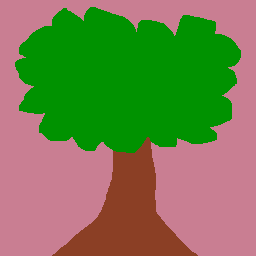
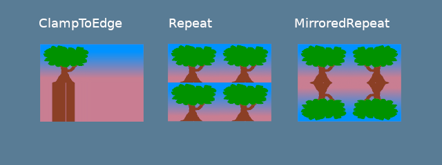
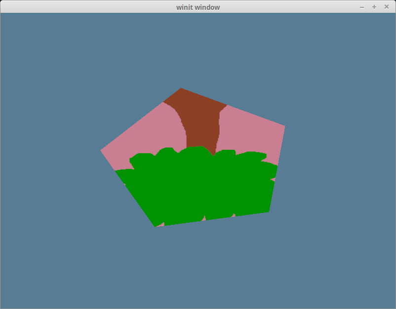
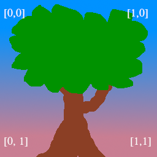
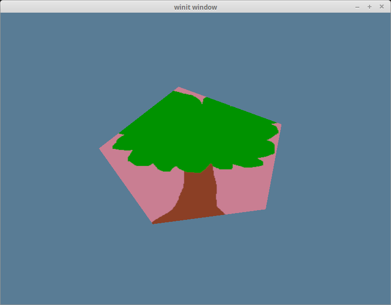

# Textures and bind groups

Up to this point we have been drawing super simple shapes. While we can make a game with just triangles, but trying to draw highly detailed objects would massively limit what devices could even run our game. We can get around this problem with textures. Textures are images overlayed over a triangle mesh to make the mesh seem more detailed. There are multiple types of textures such as normal maps, bump maps, specular maps, and diffuse maps. We're going to talk about diffuse maps, or in laymens terms, the color texture.

## Loading an image from a file

If we want to map an image to our mesh, we first need an image. Let's use this happy little tree.



We'll use the [image crate](https://crates.io/crates/image) to load our tree. In `State`'s `new()` method add the following just after creating the `swap_chain`:

```rust
let diffuse_bytes = include_bytes!("happy-tree.png");
let diffuse_image = image::load_from_memory(diffuse_bytes).unwrap();
let diffuse_rgba = diffuse_image.as_rgba8().unwrap();

use image::GenericImageView;
let dimensions = diffuse_image.dimensions();
```

Here we just grab the bytes from our image file, and load them into an image, which we then convert into a `Vec` of rgba bytes. We also save the image's dimensions for when we create the actual `Texture`. Speaking of creating the actual `Texture`.

```rust
let size = wgpu::Extent3d {
    width: dimensions.0,
    height: dimensions.1,
    depth: 1,
};
let diffuse_texture = device.create_texture(
    &wgpu::TextureDescriptor {
        // All textures are stored as 3d, we represent our 2d texture
        // by setting depth to 1.
        size: wgpu::Extent3d {
            width: dimensions.0,
            height: dimensions.1,
            depth: 1,
        },
        mip_level_count: 1, // We'll talk about this a little later
        sample_count: 1,
        dimension: wgpu::TextureDimension::D2,
        format: wgpu::TextureFormat::Rgba8UnormSrgb,
        // SAMPLED tells wgpu that we want to use this texture in shaders
        // COPY_DST means that we want to copy data to this texture
        usage: wgpu::TextureUsage::SAMPLED | wgpu::TextureUsage::COPY_DST,
        label: Some("diffuse_texture"),
    }
);
```

## Getting data into a Texture

The `Texture` struct has no methods to interact with the data directly. However we can use a method on the `queue` called `write_texture`. Let's take a look at how to use it.

```rust
queue.write_texture(
    // Tells wgpu where to copy the pixel data
    wgpu::TextureCopyView {
        texture: &diffuse_texture,
        mip_level: 0,
        origin: wgpu::Origin3d::ZERO,
    },
    // The actual pixel data
    diffuse_rgba,
    // The layout of the texture
    wgpu::TextureDataLayout {
        offset: 0,
        bytes_per_row: 4 * dimensions.0,
        rows_per_image: dimensions.1,
    },
    size,
);
```

<div class="note">

The old way of writing data to a texture was to copy the pixel data to a buffer, and then copy it to the texture. Using `write_texture` is a bit more efficient as it uses one less buffer. I'll leave it here though in case you need it.

```rust
let buffer = device.create_buffer_init(
    &wgpu::util::BufferInitDescriptor {
        label: Some("Temp Buffer"),
        &diffuse_rgba,
        wgpu::BufferUsage::COPY_SRC,
    }
);

let mut encoder = device.create_command_encoder(&wgpu::CommandEncoderDescriptor {
    label: Some("texture_buffer_copy_encoder"),
});

encoder.copy_buffer_to_texture(
    wgpu::BufferCopyView {
        buffer: &buffer,
        offset: 0,
        bytes_per_row: 4 * dimensions.0,
        rows_per_image: dimensions.1,
    },
    wgpu::TextureCopyView {
        texture: &diffuse_texture,
        mip_level: 0,
        array_layer: 0,
        origin: wgpu::Origin3d::ZERO,
    },
    size,
);

queue.submit(std::iter::once(encoder.finish()));
```

They `bytes_per_row` field needs some consideration. This value needs to be a multiple of 256. Check out [the gif tutorial](../../showcase/gifs/#how-do-we-make-the-frames) for more details.

</div>

## TextureViews and Samplers

Now that our texture has data in it, we need a way to use it. This is where a `TextureView` and a `Sampler` come in. A `TextureView` offers us a *view* into our texture. A `Sampler` controls how the `Texture` is *sampled*. Sampling works similar to the eyedropper tool in Gimp/Photoshop. Our program supplies a coordinate on the texture (known as a texture coordinate), and the sampler then returns a color back based on it's internal parameters.

Let's define our `diffuse_texture_view` and `diffuse_sampler` now.

```rust
// We don't need to configure the texture view much, so let's
// let wgpu define it.
let diffuse_texture_view = diffuse_texture.create_view(&wgpu::TextureViewDescriptor::default());
let diffuse_sampler = device.create_sampler(&wgpu::SamplerDescriptor {
    address_mode_u: wgpu::AddressMode::ClampToEdge,
    address_mode_v: wgpu::AddressMode::ClampToEdge,
    address_mode_w: wgpu::AddressMode::ClampToEdge,
    mag_filter: wgpu::FilterMode::Linear,
    min_filter: wgpu::FilterMode::Nearest,
    mipmap_filter: wgpu::FilterMode::Nearest,
    ..Default::default()
});
```

The `address_mode_*` parameter's determine what to do if the sampler get's a texture coordinate that's outside of the texture. There's a few that we can use.
* `ClampToEdge`: Any texture coordinates outside the texture will return the color of the nearest pixel on the edges of the texture.
* `Repeat`: The texture will repeat as texture coordinates exceed the textures dimensions.
* `MirrorRepeat`: Similar to `Repeat`, but the image will flip when going over boundaries.



The `mag_filter` and `min_filter` options describe what to do when a fragment covers multiple pixels, or there are multiple fragments for one pixel respectively. This often comes into play when viewing a surface from up close, or far away. There are 2 options:
* `Linear`: This option will attempt to blend the in-between fragments so that they seem to flow together.
* `Nearest`: In-between fragments will use the color of the nearest pixel. This creates an image that's crisper from far away, but pixelated when view from close up. This can be desirable however if your textures are designed to be pixelated such is in pixel art games, or voxel games like Minecraft.

Mipmaps are a complex topic, and will require [their own section](/todo). Suffice to say `mipmap_filter` functions similar to `(mag/min)_filter` as it tells the sampler how to blend between mipmaps.

I'm using some defaults for the other fields. If you want to see what they are check [the docs](https://docs.rs/wgpu/0.6.0/wgpu/struct.SamplerDescriptor.html).

All these different resources are nice and all, but they doesn't do us much good if we can't plug them in anywhere. This is where `BindGroup`s and `PipelineLayout`s come in.

## The BindGroup

A `BindGroup` describes a set of resources and how they can be accessed by a shader. We create a `BindGroup` using a `BindGroupLayout`. Let's make one of those first.

```rust
let texture_bind_group_layout = device.create_bind_group_layout(
    &wgpu::BindGroupLayoutDescriptor {
        entries: &[
            wgpu::BindGroupLayoutEntry {
                binding: 0,
                visibility: wgpu::ShaderStage::FRAGMENT,
                ty: wgpu::BindingType::SampledTexture {
                    multisampled: false,
                    dimension: wgpu::TextureViewDimension::D2,
                    component_type: wgpu::TextureComponentType::Uint,
                },
                count: None,
            },
            wgpu::BindGroupLayoutEntry {
                binding: 1,
                visibility: wgpu::ShaderStage::FRAGMENT,
                ty: wgpu::BindingType::Sampler {
                    comparison: false,
                },
                count: None,
            },
        ],
        label: Some("texture_bind_group_layout"),
    }
);
```

Our `texture_bind_group_layout` has two entries: one for a sampled texture at binding 0, and one for a sampler at binding 1. Both of these bindings are visible only to the fragment shader as specified by `FRAGMENT`. The possible values are any bit combination of `NONE`, `VERTEX`, `FRAGMENT`, or `COMPUTE`. Most of the time we'll only use `FRAGMENT` for textures and samplers, but it's good to know what's available.

With `texture_bind_group_layout`, we can now create our `BindGroup`.

```rust
let diffuse_bind_group = device.create_bind_group(
    &wgpu::BindGroupDescriptor {
        layout: &texture_bind_group_layout,
        entries: &[
            wgpu::BindGroupEntry {
                binding: 0,
                resource: wgpu::BindingResource::TextureView(&diffuse_texture_view),
            },
            wgpu::BindGroupEntry {
                binding: 1,
                resource: wgpu::BindingResource::Sampler(&diffuse_sampler),
            }
        ],
        label: Some("diffuse_bind_group"),
    }
);
```

Looking at this you might get a bit of déjà vu. That's because a `BindGroup` is a more specific declaration of the `BindGroupLayout`. The reason why these are separate is to allow us to swap out `BindGroup`s on the fly, so long as they all share the same `BindGroupLayout`. For each texture and sampler we create, we need to create a `BindGroup`.

Now that we have our `diffuse_bind_group`, let's add our texture information to the `State` struct.

```rust
struct State {
    // ...

    diffuse_texture: wgpu::Texture,
    diffuse_texture_view: wgpu::TextureView,
    diffuse_sampler: wgpu::Sampler,
    diffuse_bind_group: wgpu::BindGroup,

    // ...
}

// ...
impl State {
    async fn new() -> Self {
        // ...
        Self {
            surface,
            device,
            queue,
            sc_desc,
            swap_chain,
            render_pipeline,
            vertex_buffer,
            index_buffer,
            num_indices,
            diffuse_texture,
            diffuse_texture_view,
            diffuse_sampler,
            diffuse_bind_group,
            size,
        }
    }
}

```

We actually use the bind group in the `render()` function.

```rust
// render()
render_pass.set_pipeline(&self.render_pipeline);
render_pass.set_bind_group(0, &self.diffuse_bind_group, &[]); // NEW!
render_pass.set_vertex_buffer(0, &self.vertex_buffer.slice(..));
render_pass.set_index_buffer(&self.index_buffer.slice(..));
render_pass.draw_indexed(0..self.num_indices, 0, 0..1);
```

## PipelineLayout

Remember the `PipelineLayout` we created back in [the pipeline section](/beginner/tutorial3-pipeline#how-do-we-use-the-shaders)? This is finally the time when we get to actually use it. The `PipelineLayout` contains a list of `BindGroupLayout`s that the pipeline can use. Modify `render_pipeline_layout` to use our `texture_bind_group_layout`.

```rust
let render_pipeline_layout = device.create_pipeline_layout(
    &wgpu::PipelineLayoutDescriptor {
        label: Some("Render Pipeline Layout"),
        bind_group_layouts: &[&texture_bind_group_layout],
        push_constant_ranges: &[],
    }
);
```

## A change to the VERTICES
There's a few things we need to change about our `Vertex` definition. Up to now we've been using a `color` attribute to dictate the color of our mesh. Now that we're using a texture we want to replace our `color` with `tex_coords`, which is only two floats instead of three.

```rust
#[repr(C)]
#[derive(Copy, Clone, Debug)]
struct Vertex {
    position: [f32; 3],
    tex_coords: [f32; 2],
}
```

We need to reflect these changes in the `VertexBufferDescriptor`.

```rust
impl Vertex {
    fn desc<'a>() -> wgpu::VertexBufferDescriptor<'a> {
        use std::mem;
        wgpu::VertexBufferDescriptor {
            stride: mem::size_of::<Vertex>() as wgpu::BufferAddress,
            step_mode: wgpu::InputStepMode::Vertex,
            attributes: &[
                wgpu::VertexAttributeDescriptor {
                    offset: 0,
                    shader_location: 0,
                    format: wgpu::VertexFormat::Float3,
                },
                wgpu::VertexAttributeDescriptor {
                    offset: mem::size_of::<[f32; 3]>() as wgpu::BufferAddress,
                    shader_location: 1,
                    format: wgpu::VertexFormat::Float2,
                },
            ]
        }
    }
}
```

Lastly we need to change `VERTICES` itself.

```rust
const VERTICES: &[Vertex] = &[
    Vertex { position: [-0.0868241, 0.49240386, 0.0], tex_coords: [0.4131759, 0.99240386], }, // A
    Vertex { position: [-0.49513406, 0.06958647, 0.0], tex_coords: [0.0048659444, 0.56958646], }, // B
    Vertex { position: [-0.21918549, -0.44939706, 0.0], tex_coords: [0.28081453, 0.050602943], }, // C
    Vertex { position: [0.35966998, -0.3473291, 0.0], tex_coords: [0.85967, 0.15267089], }, // D
    Vertex { position: [0.44147372, 0.2347359, 0.0], tex_coords: [0.9414737, 0.7347359], }, // E
];
```

## Shader time

Our shaders will need to change inorder to support textures as well. We'll also need to remove any reference to the `color` attribute we used to have. Let's start with the vertex shader.

```glsl
// shader.vert
#version 450

layout(location=0) in vec3 a_position;
// Changed
layout(location=1) in vec2 a_tex_coords;

// Changed
layout(location=0) out vec2 v_tex_coords;

void main() {
    // Changed
    v_tex_coords = a_tex_coords;
    gl_Position = vec4(a_position, 1.0);
}
```

We need to change the fragment shader to take in `v_tex_coords`. We also need to add a reference to our texture and sampler.

```glsl
// shader.frag
#version 450

// Changed
layout(location=0) in vec2 v_tex_coords;
layout(location=0) out vec4 f_color;

// New
layout(set = 0, binding = 0) uniform texture2D t_diffuse;
layout(set = 0, binding = 1) uniform sampler s_diffuse;

void main() {
    // Changed
    f_color = texture(sampler2D(t_diffuse, s_diffuse), v_tex_coords);
}
```

You'll notice that `t_diffuse` and `s_diffuse` are defined with the `uniform` keyword, they don't have `in` nor `out`, and the layout definition uses `set` and `binding` instead of `location`. This is because `t_diffuse` and `s_diffuse` are what we call uniforms. We won't go too deep into what a uniform is, until we talk about uniform buffers in the [cameras section](/beginner/tutorial6-uniforms/). What we need to know, for now, is that `set = 0` corresponds to the 1st parameter in `set_bind_group()`, `binding = 0` relates the the `binding` specified when we create the `BindGroupLayout` and `BindGroup`.

## The results

If we run our program now we should get the following result.



That's weird, our tree is upside down! This is because wgpu's world coordinates have the y-axis pointing up, while texture coordinates have the y-axis pointing down. In other words, (0, 0) in texture coordinates coresponds to the top-left of the image, while (1, 1) is the bottom right.



We can get our triangle right-side up by inverting the y coord of each texture coord.

```rust
const VERTICES: &[Vertex] = &[
    Vertex { position: [-0.0868241, 0.49240386, 0.0], tex_coords: [0.4131759, 1.0 - 0.99240386], }, // A
    Vertex { position: [-0.49513406, 0.06958647, 0.0], tex_coords: [0.0048659444, 1.0 - 0.56958646], }, // B
    Vertex { position: [-0.21918549, -0.44939706, 0.0], tex_coords: [0.28081453, 1.0 - 0.050602943], }, // C
    Vertex { position: [0.35966998, -0.3473291, 0.0], tex_coords: [0.85967, 1.0 - 0.15267089], }, // D
    Vertex { position: [0.44147372, 0.2347359, 0.0], tex_coords: [0.9414737, 1.0 - 0.7347359], }, // E
];
```

Simplifying that gives us.

```rust
const VERTICES: &[Vertex] = &[
    Vertex { position: [-0.0868241, 0.49240386, 0.0], tex_coords: [0.4131759, 0.00759614], }, // A
    Vertex { position: [-0.49513406, 0.06958647, 0.0], tex_coords: [0.0048659444, 0.43041354], }, // B
    Vertex { position: [-0.21918549, -0.44939706, 0.0], tex_coords: [0.28081453, 0.949397057], }, // C
    Vertex { position: [0.35966998, -0.3473291, 0.0], tex_coords: [0.85967, 0.84732911], }, // D
    Vertex { position: [0.44147372, 0.2347359, 0.0], tex_coords: [0.9414737, 0.2652641], }, // E
];
```

With that in place we now have our tree subscribed right-side up on our hexagon.



## Cleaning things up

For convenience sake, let's pull our texture code into its own file called `texture.rs`.

```rust
use image::GenericImageView;
use anyhow::*;

pub struct Texture {
    pub texture: wgpu::Texture,
    pub view: wgpu::TextureView,
    pub sampler: wgpu::Sampler,
}

impl Texture {
    pub fn from_bytes(
        device: &wgpu::Device,
        queue: &wgpu::Queue,
        bytes: &[u8], 
        label: &str
    ) -> Result<Self> {
        let img = image::load_from_memory(bytes)?;
        Self::from_image(device, queue, &img, Some(label))
    }

    pub fn from_image(
        device: &wgpu::Device,
        queue: &wgpu::Queue,
        img: &image::DynamicImage,
        label: Option<&str>
    ) -> Result<Self> {
        let rgba = img.as_rgba8().unwrap();
        let dimensions = img.dimensions();

        let size = wgpu::Extent3d {
            width: dimensions.0,
            height: dimensions.1,
            depth: 1,
        };
        let texture = device.create_texture(
            &wgpu::TextureDescriptor {
                label,
                size,
                mip_level_count: 1,
                sample_count: 1,
                dimension: wgpu::TextureDimension::D2,
                format: wgpu::TextureFormat::Rgba8UnormSrgb,
                usage: wgpu::TextureUsage::SAMPLED | wgpu::TextureUsage::COPY_DST,
            }
        );

        queue.write_texture(
            wgpu::TextureCopyView {
                texture: &texture,
                mip_level: 0,
                origin: wgpu::Origin3d::ZERO,
            },
            rgba,
            wgpu::TextureDataLayout {
                offset: 0,
                bytes_per_row: 4 * dimensions.0,
                rows_per_image: dimensions.1,
            },
            size,
        );

        let view = texture.create_view(&wgpu::TextureViewDescriptor::default());
        let sampler = device.create_sampler(
            &wgpu::SamplerDescriptor {
                address_mode_u: wgpu::AddressMode::ClampToEdge,
                address_mode_v: wgpu::AddressMode::ClampToEdge,
                address_mode_w: wgpu::AddressMode::ClampToEdge,
                mag_filter: wgpu::FilterMode::Linear,
                min_filter: wgpu::FilterMode::Nearest,
                mipmap_filter: wgpu::FilterMode::Nearest,
                ..Default::default()
            }
        );
        
        Ok(Self { texture, view, sampler })
    }
}
```

1. We're using the [anyhow](https://docs.rs/anyhow/) crate to simplify error handling.
2. We're returning a `CommandBuffer` with our texture. This means we could load multiple textures at the same time, and then submit all there command buffers at once.

We need to import `texture.rs` as a module, so somewhere at the top of `main.rs` add the following.

```rust
mod texture;
```

Then we need to change `State` to use the `Texture` struct.

```rust
struct State {
    diffuse_texture: texture::Texture,
    diffuse_bind_group: wgpu::BindGroup,
}
```

We're storing the bind group separately so that `Texture` doesn't need know how the `BindGroup` is layed out.

The texture creation code in `new()` gets a lot simpler.

```rust
let diffuse_bytes = include_bytes!("happy-tree.png");
let diffuse_texture = texture::Texture::from_bytes(&device, &queue, diffuse_bytes, "happy-tree.png").unwrap();
```

Creating the `diffuse_bind_group` changes slightly to use the `view` and `sampler` fields of our `diffuse_texture`.

```rust
let diffuse_bind_group = device.create_bind_group(
    &wgpu::BindGroupDescriptor {
        layout: &texture_bind_group_layout,
        entries: &[
            wgpu::BindGroupEntry {
                binding: 0,
                resource: wgpu::BindingResource::TextureView(&diffuse_texture.view),
            },
            wgpu::BindGroupEntry {
                binding: 1,
                resource: wgpu::BindingResource::Sampler(&diffuse_texture.sampler),
            }
        ],
        label: Some("diffuse_bind_group"),
    }
);
```

The code should be working the same as it was before, but now have an easier way to create textures.

## Challenge

Create another texture and swap it out when you press the space key.

<AutoGithubLink/>
