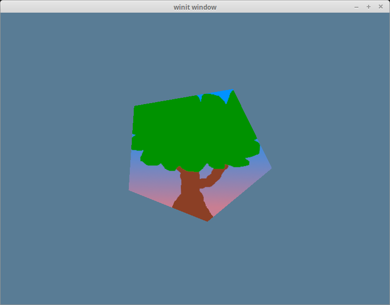

# Uniform buffers and a 3d camera

While all of our previous work has seemed to be in 2D, we've actually been working in 3d the entire time! That's part of the reason why our `Vertex` structure has `position` as an array of 3 floats instead of just 2. We can't really see the 3d-ness of our scene because we're viewing things head-on. We're going to change our point of view by creating a `Camera`.

## A perspective camera

This tutorial is more about learning to use wgpu and less about linear algebra, so I'm going to gloss over a lot of the math involved. There's plenty of reading material online if you're interested in what's going on under the hood. We're going to use the [cgmath](https://docs.rs/cgmath) to handle all the math for us. Add the following to your `Cargo.toml`.

```toml
[dependencies]
# other deps...
cgmath = "0.18"
```

Now that we have a math library let's put it to use! Create a `Camera` struct above the `State` struct.

```rust
struct Camera {
    eye: cgmath::Point3<f32>,
    target: cgmath::Point3<f32>,
    up: cgmath::Vector3<f32>,
    aspect: f32,
    fovy: f32,
    znear: f32,
    zfar: f32,
}

impl Camera {
    fn build_view_projection_matrix(&self) -> cgmath::Matrix4<f32> {
        // 1.
        let view = cgmath::Matrix4::look_at_rh(self.eye, self.target, self.up);
        // 2.
        let proj = cgmath::perspective(cgmath::Deg(self.fovy), self.aspect, self.znear, self.zfar);

        // 3.
        return OPENGL_TO_WGPU_MATRIX * proj * view;
    }
}
```

The `build_view_projection_matrix` is where the magic happens.
1. The `view` matrix moves the world to be at the position and rotation of the camera. It's essentially an inverse of whatever the transform matrix of the camera would be.
2. The `proj` matrix warps the scene to give the effect of depth. Without this, objects up close would be the same size as objects far away.
3. The coordinate system in Wgpu is based on DirectX and Metal's coordinate systems. That means that in [normalized device coordinates](https://github.com/gfx-rs/gfx/tree/master/src/backend/dx12#normalized-coordinates), the x-axis and y-axis are in the range of -1.0 to +1.0, and the z-axis is 0.0 to +1.0. The `cgmath` crate (as well as most game math crates) is built for OpenGL's coordinate system. This matrix will scale and translate our scene from OpenGL's coordinate system to WGPU's. We'll define it as follows.

```rust
#[rustfmt::skip]
pub const OPENGL_TO_WGPU_MATRIX: cgmath::Matrix4<f32> = cgmath::Matrix4::new(
    1.0, 0.0, 0.0, 0.0,
    0.0, 1.0, 0.0, 0.0,
    0.0, 0.0, 0.5, 0.5,
    0.0, 0.0, 0.0, 1.0,
);
```

* Note: We don't explicitly **need** the `OPENGL_TO_WGPU_MATRIX`, but models centered on (0, 0, 0) will be halfway inside the clipping area. This is only an issue if you aren't using a camera matrix.

Now let's add a `camera` field to `State`.

```rust
struct State {
    // ...
    camera: Camera,
    // ...
}

async fn new(window: Window) -> Self {
    // let diffuse_bind_group ...

    let camera = Camera {
        // position the camera 1 unit up and 2 units back
        // +z is out of the screen
        eye: (0.0, 1.0, 2.0).into(),
        // have it look at the origin
        target: (0.0, 0.0, 0.0).into(),
        // which way is "up"
        up: cgmath::Vector3::unit_y(),
        aspect: config.width as f32 / config.height as f32,
        fovy: 45.0,
        znear: 0.1,
        zfar: 100.0,
    };

    Self {
        // ...
        camera,
        // ...
    }
}
```

Now that we have our camera, and it can make us a view projection matrix, we need somewhere to put it. We also need some way of getting it into our shaders.

## The uniform buffer

Up to this point, we've used `Buffer`s to store our vertex and index data, and even to load our textures. We are going to use them again to create what's known as a uniform buffer. A uniform is a blob of data available to every invocation of a set of shaders. Technically, we've already used uniforms for our texture and sampler. We're going to use them again to store our view projection matrix. To start, let's create a struct to hold our uniform.

```rust
// We need this for Rust to store our data correctly for the shaders
#[repr(C)]
// This is so we can store this in a buffer
#[derive(Debug, Copy, Clone, bytemuck::Pod, bytemuck::Zeroable)]
struct CameraUniform {
    // We can't use cgmath with bytemuck directly, so we'll have
    // to convert the Matrix4 into a 4x4 f32 array
    view_proj: [[f32; 4]; 4],
}

impl CameraUniform {
    fn new() -> Self {
        use cgmath::SquareMatrix;
        Self {
            view_proj: cgmath::Matrix4::identity().into(),
        }
    }

    fn update_view_proj(&mut self, camera: &Camera) {
        self.view_proj = camera.build_view_projection_matrix().into();
    }
}
```

Now that we have our data structured, let's make our `camera_buffer`.

```rust
// in new() after creating `camera`

let mut camera_uniform = CameraUniform::new();
camera_uniform.update_view_proj(&camera);

let camera_buffer = device.create_buffer_init(
    &wgpu::util::BufferInitDescriptor {
        label: Some("Camera Buffer"),
        contents: bytemuck::cast_slice(&[camera_uniform]),
        usage: wgpu::BufferUsages::UNIFORM | wgpu::BufferUsages::COPY_DST,
    }
);
```

## Uniform buffers and bind groups

Cool! Now that we have a uniform buffer, what do we do with it? The answer is we create a bind group for it. First, we have to create the bind group layout.

```rust
let camera_bind_group_layout = device.create_bind_group_layout(&wgpu::BindGroupLayoutDescriptor {
    entries: &[
        wgpu::BindGroupLayoutEntry {
            binding: 0,
            visibility: wgpu::ShaderStages::VERTEX,
            ty: wgpu::BindingType::Buffer {
                ty: wgpu::BufferBindingType::Uniform,
                has_dynamic_offset: false,
                min_binding_size: None,
            },
            count: None,
        }
    ],
    label: Some("camera_bind_group_layout"),
});
```

Some things to note:

1. We set `visibility` to `ShaderStages::VERTEX` as we only really need camera information in the vertex shader, as
    that's what we'll use to manipulate our vertices.
2. The `has_dynamic_offset` means that the location of the data in the buffer may change. This will be the case if you
    store multiple data sets that vary in size in a single buffer. If you set this to true, you'll have to supply the
    offsets later.
3. `min_binding_size` specifies the smallest size the buffer can be. You don't have to specify this, so we
    leave it `None`. If you want to know more, you can check [the docs](https://docs.rs/wgpu/latest/wgpu/enum.BindingType.html#variant.Buffer.field.min_binding_size).

Now, we can create the actual bind group.

```rust
let camera_bind_group = device.create_bind_group(&wgpu::BindGroupDescriptor {
    layout: &camera_bind_group_layout,
    entries: &[
        wgpu::BindGroupEntry {
            binding: 0,
            resource: camera_buffer.as_entire_binding(),
        }
    ],
    label: Some("camera_bind_group"),
});
```

Like with our texture, we need to register our `camera_bind_group_layout` with the render pipeline.

```rust
let render_pipeline_layout = device.create_pipeline_layout(
    &wgpu::PipelineLayoutDescriptor {
        label: Some("Render Pipeline Layout"),
        bind_group_layouts: &[
            &texture_bind_group_layout,
            &camera_bind_group_layout,
        ],
        push_constant_ranges: &[],
    }
);
```

Now we need to add `camera_buffer` and `camera_bind_group` to `State`

```rust
struct State {
    // ...
    camera: Camera,
    camera_uniform: CameraUniform,
    camera_buffer: wgpu::Buffer,
    camera_bind_group: wgpu::BindGroup,
}

async fn new(window: Window) -> Self {
    // ...
    Self {
        // ...
        camera,
        camera_uniform,
        camera_buffer,
        camera_bind_group,
    }
}
```

The final thing we need to do before we get into shaders is use the bind group in `render()`.

```rust
render_pass.set_pipeline(&self.render_pipeline);
render_pass.set_bind_group(0, &self.diffuse_bind_group, &[]);
// NEW!
render_pass.set_bind_group(1, &self.camera_bind_group, &[]);
render_pass.set_vertex_buffer(0, self.vertex_buffer.slice(..));
render_pass.set_index_buffer(self.index_buffer.slice(..), wgpu::IndexFormat::Uint16);

render_pass.draw_indexed(0..self.num_indices, 0, 0..1);
```

## Using the uniform in the vertex shader

Modify the vertex shader to include the following.

```wgsl
// Vertex shader
struct CameraUniform {
    view_proj: mat4x4<f32>,
};
@group(1) @binding(0) // 1.
var<uniform> camera: CameraUniform;

struct VertexInput {
    @location(0) position: vec3<f32>,
    @location(1) tex_coords: vec2<f32>,
}

struct VertexOutput {
    @builtin(position) clip_position: vec4<f32>,
    @location(0) tex_coords: vec2<f32>,
}

@vertex
fn vs_main(
    model: VertexInput,
) -> VertexOutput {
    var out: VertexOutput;
    out.tex_coords = model.tex_coords;
    out.clip_position = camera.view_proj * vec4<f32>(model.position, 1.0); // 2.
    return out;
}
```

1. Because we've created a new bind group, we need to specify which one we're using in the shader. The number is determined by our `render_pipeline_layout`. The `texture_bind_group_layout` is listed first, thus it's `group(0)`, and `camera_bind_group` is second, so it's `group(1)`.
2. Multiplication order is important when it comes to matrices. The vector goes on the right, and the matrices go on the left in order of importance.

## A controller for our camera

If you run the code right now, you should get something like this.



The shape's less stretched now, but it's still pretty static. You can experiment with moving the camera position around, but most cameras in games move around. Since this tutorial is about using wgpu and not how to process user input, I'm just going to post the `CameraController` code below.

```rust
struct CameraController {
    speed: f32,
    is_forward_pressed: bool,
    is_backward_pressed: bool,
    is_left_pressed: bool,
    is_right_pressed: bool,
}

impl CameraController {
    fn new(speed: f32) -> Self {
        Self {
            speed,
            is_forward_pressed: false,
            is_backward_pressed: false,
            is_left_pressed: false,
            is_right_pressed: false,
        }
    }

    fn process_events(&mut self, event: &WindowEvent) -> bool {
        match event {
            WindowEvent::KeyboardInput {
                event:
                    KeyEvent {
                        state,
                        physical_key: PhysicalKey::Code(keycode),
                        ..
                    },
                ..
            } => {
                let is_pressed = *state == ElementState::Pressed;
                match keycode {KeyCode::KeyW | KeyCode::ArrowUp => {
                        self.is_forward_pressed = is_pressed;
                        true
                    }
                    KeyCode::KeyA | KeyCode::ArrowLeft => {
                        self.is_left_pressed = is_pressed;
                        true
                    }
                    KeyCode::KeyS | KeyCode::ArrowDown => {
                        self.is_backward_pressed = is_pressed;
                        true
                    }
                    KeyCode::KeyD | KeyCode::ArrowRight => {
                        self.is_right_pressed = is_pressed;
                        true
                    }
                    _ => false,
                }
            }
            _ => false,
        }
    }

    fn update_camera(&self, camera: &mut Camera) {
        use cgmath::InnerSpace;
        let forward = camera.target - camera.eye;
        let forward_norm = forward.normalize();
        let forward_mag = forward.magnitude();

        // Prevents glitching when the camera gets too close to the
        // center of the scene.
        if self.is_forward_pressed && forward_mag > self.speed {
            camera.eye += forward_norm * self.speed;
        }
        if self.is_backward_pressed {
            camera.eye -= forward_norm * self.speed;
        }

        let right = forward_norm.cross(camera.up);

        // Redo radius calc in case the forward/backward is pressed.
        let forward = camera.target - camera.eye;
        let forward_mag = forward.magnitude();

        if self.is_right_pressed {
            // Rescale the distance between the target and the eye so 
            // that it doesn't change. The eye, therefore, still 
            // lies on the circle made by the target and eye.
            camera.eye = camera.target - (forward + right * self.speed).normalize() * forward_mag;
        }
        if self.is_left_pressed {
            camera.eye = camera.target - (forward - right * self.speed).normalize() * forward_mag;
        }
    }
}
```

This code is not perfect. The camera slowly moves back when you rotate it. It works for our purposes, though. Feel free to improve it!

We still need to plug this into our existing code to make it do anything. Add the controller to `State` and create it in `new()`.

```rust
struct State {
    // ...
    camera: Camera,
    // NEW!
    camera_controller: CameraController,
    // ...
}
// ...
impl<'a> State<'a> {
    async fn new(window: &'a Window) -> State<'a> {
        // ...
        let camera_controller = CameraController::new(0.2);
        // ...

        Self {
            // ...
            camera_controller,
            // ...
        }
    }
}
```

We're finally going to add some code to `input()` (assuming you haven't already)!

```rust
fn input(&mut self, event: &WindowEvent) -> bool {
    self.camera_controller.process_events(event)
}
```

Up to this point, the camera controller isn't actually doing anything. The values in our uniform buffer need to be updated. There are a few main methods to do that.
1. We can create a separate buffer and copy its contents to our `camera_buffer`. The new buffer is known as a staging buffer. This method is usually how it's done as it allows the contents of the main buffer (in this case, `camera_buffer`) to be accessible only by the GPU. The GPU can do some speed optimizations, which it couldn't if we could access the buffer via the CPU.
2. We can call one of the mapping methods `map_read_async`, and `map_write_async` on the buffer itself. These allow us to access a buffer's contents directly but require us to deal with the `async` aspect of these methods. This also requires our buffer to use the `BufferUsages::MAP_READ` and/or `BufferUsages::MAP_WRITE`. We won't talk about it here, but check out the [Wgpu without a window](../../showcase/windowless) tutorial if you want to know more.
3. We can use `write_buffer` on `queue`.

We're going to use option number 3.

```rust
fn update(&mut self) {
    self.camera_controller.update_camera(&mut self.camera);
    self.camera_uniform.update_view_proj(&self.camera);
    self.queue.write_buffer(&self.camera_buffer, 0, bytemuck::cast_slice(&[self.camera_uniform]));
}
```

That's all we need to do. If you run the code now, you should see a pentagon with our tree texture that you can rotate around and zoom into with the wasd/arrow keys.

## Challenge

Have our model rotate on its own independently of the camera. *Hint: you'll need another matrix for this.*


<WasmExample example="tutorial6_uniforms"></WasmExample>

<AutoGithubLink/>
