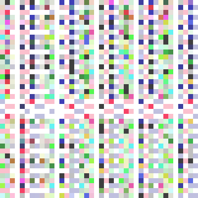

# Instancing

Up to this point we've been drawing just one object. Most games have hundreds of objects on screen at the same time. If we wanted to draw multiple instances of our model, we could copy the vertex buffer and modify it's vertices to be in the right place, but this would be hilariously inefficient. We have our model, and we now how to position it in 3d space with a matrix, like we did the camera, so all we have to do is change the matrix we're using when we draw.

## The naive method

First let's modify `Uniforms` to include a `model` property.

```rust
#[repr(C)]
#[derive(Debug, Copy, Clone)]
struct Uniforms {
    view_proj: cgmath::Matrix4<f32>,
    model: cgmath::Matrix4<f32>, // NEW!
}

unsafe impl bytemuck::Pod for Uniforms {}
unsafe impl bytemuck::Zeroable for Uniforms {}

impl Uniforms {
    fn new() -> Self {
        use cgmath::SquareMatrix;
        Self {
            view_proj: cgmath::Matrix4::identity(),
            model: cgmath::Matrix4::identity(), // NEW!
        }
    }

    fn update_view_proj(&mut self, camera: &Camera) {
        self.view_proj = OPENGL_TO_WGPU_MATRIX * camera.build_view_projection_matrix();
    }
}
```

With that let's introduce another struct for our instances. We'll use it to store the position and rotation of our instances. We'll also have a method to convert our instance data into a matrix that we can give to `Uniforms`.

```rust
struct Instance {
    position: cgmath::Vector3<f32>,
    rotation: cgmath::Quaternion<f32>,
}

impl Instance {
    fn to_matrix(&self) -> cgmath::Matrix4<f32> {
        cgmath::Matrix4::from_translation(self.position)
            * cgmath::Matrix4::from(self.rotation)
    }
}
```

Next we'll add `instances: Vec<Instance>,` to `State` and create our instances with the following in `new()`.

```rust
// ...

// add these at the top of the file
const NUM_INSTANCES_PER_ROW: u32 = 10;
const NUM_INSTANCES: u32 = NUM_INSTANCES_PER_ROW * NUM_INSTANCES_PER_ROW;
const INSTANCE_DISPLACEMENT: cgmath::Vector3<f32> = cgmath::Vector3::new(NUM_INSTANCES_PER_ROW as f32 * 0.5, 0.0, NUM_INSTANCES_PER_ROW as f32 * 0.5);

// make a 10 by 10 grid of objects
let instances = (0..NUM_INSTANCES_PER_ROW).flat_map(|z| {
    (0..NUM_INSTANCES_PER_ROW).map(move |x| {
        let position = cgmath::Vector3 { x: x as f32, y: 0.0, z: z as f32 } - INSTANCE_DISPLACEMENT;

        let rotation = if position.is_zero() {
            // this is needed so an object at (0, 0, 0) won't get scaled to zero
            // as Quaternions can effect scale if they're not create correctly
            cgmath::Quaternion::from_axis_angle(cgmath::Vector3::unit_z(), cgmath::Deg(0.0))
        } else {
            cgmath::Quaternion::from_axis_angle(position.clone().normalize(), cgmath::Deg(45.0))
        };

        Instance {
            position, rotation,
        }
    })
}).collect();

// ...

Self {
    // ...
    instances,
}
```

Now that that's done, we need to update `shader.vert` to use the model matrix passed in through `Uniforms`.

```glsl
#version 450

layout(location=0) in vec3 a_position;
layout(location=1) in vec2 a_tex_coords;

layout(location=0) out vec2 v_tex_coords;

layout(set=1, binding=0)
uniform Uniforms {
    mat4 u_view_proj;
    mat4 u_model; // NEW!
};

void main() {
    v_tex_coords = a_tex_coords;
    gl_Position = u_view_proj * u_model * vec4(a_position, 1.0); // UPDATED!
}
```

If you run the program now, you won't see anything different. That's because we aren't actually updating the uniform buffer at all. Using our current method, we need to update the uniform buffer for every instance we draw. We'll do this in `render()` with something like the following.

```rust
for instance in &self.instances {
    // 1.
    self.uniforms.model = instance.to_matrix();
    let staging_buffer = self.device.create_buffer_with_data(
        bytemuck::cast_slice(&[self.uniforms]),
        wgpu::BufferUsage::COPY_SRC,
    );
    encoder.copy_buffer_to_buffer(&staging_buffer, 0, &self.uniform_buffer, 0, std::mem::size_of::<Uniforms>() as wgpu::BufferAddress);

    // 2.
    let mut render_pass = encoder.begin_render_pass(&wgpu::RenderPassDescriptor {
        color_attachments: &[
            wgpu::RenderPassColorAttachmentDescriptor {
                attachment: &frame.view,
                resolve_target: None,
                load_op: wgpu::LoadOp::Load, // 3.
                store_op: wgpu::StoreOp::Store,
                clear_color: wgpu::Color {
                    r: 0.1,
                    g: 0.2,
                    b: 0.3,
                    a: 1.0,
                },
            }
        ],
        depth_stencil_attachment: None,
    });

    render_pass.set_pipeline(&self.render_pipeline);
    render_pass.set_bind_group(0, &self.diffuse_bind_group, &[]);
    render_pass.set_bind_group(1, &self.uniform_bind_group, &[]);
    render_pass.set_vertex_buffer(0, &self.vertex_buffer, 0, 0);
    render_pass.set_index_buffer(&self.index_buffer, 0, 0);
    render_pass.draw_indexed(0..self.num_indices, 0, 0..1);
}
```

Some things to note:
1. We're creating a hundred buffers a frame. This is inefficent, but we'll cover better ways of doing this later in this tutorial.
2. We have to create a new render pass per instance, as we can't modify the uniform buffer while we have one active.
3. We use `LoadOp::Load` here to prevent the render pass from clearing the entire screen after each draw. This means we lose our clear color. This makes the background black on my machine, but it may be filled with garbage data on yours. We can fix this by added another render pass before the loop.

```rust
{
    encoder.begin_render_pass(&wgpu::RenderPassDescriptor {
        color_attachments: &[
            wgpu::RenderPassColorAttachmentDescriptor {
                attachment: &frame.view,
                resolve_target: None,
                load_op: wgpu::LoadOp::Clear,
                store_op: wgpu::StoreOp::Store,
                clear_color: wgpu::Color {
                    r: 0.1,
                    g: 0.2,
                    b: 0.3,
                    a: 1.0,
                },
            }
        ],
        depth_stencil_attachment: None,
    });
}
```

We should get something that looks like this when we're done.


If you haven't guessed already, this way of instancing is not the best. It requires hundreds of render passes, hundereds of staging buffers, and an extra render pass just to get the clear color working again. Cleary there must be a better way.

## A better way - uniform arrays

Since GLSL is based on C, it supports arrays. We can leverage this by store *all* of the instance matrices in the `Uniforms` struct. We need to make this change on the Rust side, as well as in our shader.

```rust
#[repr(C)]
#[derive(Copy, Clone)]
struct Uniforms {
    view_proj: cgmath::Matrix4<f32>,
    model: [cgmath::Matrix4<f32>; NUM_INSTANCES as usize],
}
```

```glsl
#version 450

layout(location=0) in vec3 a_position;
layout(location=1) in vec2 a_tex_coords;

layout(location=0) out vec2 v_tex_coords;

layout(set=1, binding=0)
uniform Uniforms {
    mat4 u_view_proj;
    mat4 u_model[100];
};

void main() {
    v_tex_coords = a_tex_coords;
    // gl_InstanceIndex what index we're currently on
    gl_Position = u_view_proj * u_model[gl_InstanceIndex] * vec4(a_position, 1.0);
}
```

Note that we're using an array, *not a `Vec`*. `Vec`s are basically pointers to an array on the heap. Our graphics card doesn't know how follow a pointer to the heap, so our data needs to be stored inline.

`Uniforms::new()` will change slightly as well.

```rust
fn new() -> Self {
    Self {
        view_proj: cgmath::Matrix4::identity(),
        model: [cgmath::Matrix4::identity(); NUM_INSTANCES as usize],
    }
}
```

We need to update our model matrices in `State::update()` before we create the `staging_buffer`.

```rust
for (i, instance) in self.instances.iter().enumerate() {
    self.uniforms.model[i] = instance.to_matrix();
}
```

Lastly we need to change our render code. Fortunately, it's a lot simpler than the before. In fact we can use the code from last tutorial and just change our draw call.

```rust
render_pass.draw_indexed(0..self.num_indices, 0, 0..NUM_INSTANCES);
```

You'll remember that the 3rd parameter in `draw_indexed` is the instance range. This controls how many times our object will be drawn. This is where our shader gets the value for `gl_InstanceIndex`.

Running the program now won't change anything visually from our last example, but the framerate will be better.

This technique has its drawbacks.
1. We can't use a `Vec` like we've mentioned before
2. We're limited in the number of instances we can process at a time requiring use to cap it at some abitrary number, or render things in "batches". If we want to increase the size of instances, we have to recompile our code.

## Another better way - storage buffers

A storage buffer gives us the flexibility that arrays did not. We don't have to specify it's size in the shader, and we can even use a `Vec` to create it!

Since we're using `bytemuck` for casting our data to `&[u8]`, we're going to need to define a custom scruct to store the `cgmath::Matrix4`s. We need to do this because we can't implement `bytemuck::Pod`, and `bytemuck::Zeroable`, on `cgmath::Matrix4` as it is an external type.

```rust
// UPDATED!
impl Instance {
    // This is changed from `to_matrix()`
    fn to_raw(&self) -> InstanceRaw {
        InstanceRaw {
            model: cgmath::Matrix4::from_translation(self.position) * cgmath::Matrix4::from(self.rotation),
        }
    }
}

// NEW!
#[repr(C)]
#[derive(Copy, Clone)]
struct InstanceRaw {
    model: cgmath::Matrix4<f32>,
}

unsafe impl bytemuck::Pod for InstanceRaw {}
unsafe impl bytemuck::Zeroable for InstanceRaw {}
```

We create a storage buffer in a similar way as any other buffer.

```rust
let instance_data = instances.iter().map(Instance::to_raw).collect::<Vec<_>>();
// we'll need the size for later
let instance_buffer_size = instance_data.len() * std::mem::size_of::<cgmath::Matrix4<f32>>();
let instance_buffer = device.create_buffer_with_data(
    bytemuck::cast_slice(&instance_data),
    wgpu::BufferUsage::STORAGE_READ,
);
```

To get this buffer into the shader, we'll need to attach it to a bind group. We'll use `uniform_bind_group` just to keep things simple.

```rust
let uniform_bind_group_layout = device.create_bind_group_layout(&wgpu::BindGroupLayoutDescriptor {
    bindings: &[
        // ...
        wgpu::BindGroupLayoutEntry {
            binding: 1,
            visibility: wgpu::ShaderStage::VERTEX,
            ty: wgpu::BindingType::StorageBuffer {
                dynamic: false,
                readonly: true,
            },
        },
    ],
    // ...
});

let uniform_bind_group = device.create_bind_group(&wgpu::BindGroupDescriptor {
    layout: &uniform_bind_group_layout,
    bindings: &[
        // ...
        wgpu::Binding {
            binding: 1,
            resource: wgpu::BindingResource::Buffer {
                buffer: &instance_buffer,
                range: 0..instance_buffer_size as wgpu::BufferAddress,
            }
        },
    ],
});
```

*Note you'll probably need to shift your `instance_buffer` creation above the `uniform_bind_group` creation.*

We'll want to put `instance_buffer` into the `State` struct.

You don't need to change the draw call at all from the previous example, but we'll need to change the vertex shader.

```glsl
#version 450

layout(location=0) in vec3 a_position;
layout(location=1) in vec2 a_tex_coords;

layout(location=0) out vec2 v_tex_coords;

layout(set=1, binding=0)
uniform Uniforms {
    mat4 u_view_proj;
};

layout(set=1, binding=1)
buffer Instances {
    mat4 s_models[];
};

void main() {
    v_tex_coords = a_tex_coords;
    gl_Position = u_view_proj * s_models[gl_InstanceIndex] * vec4(a_position, 1.0);
}
```

You can see that we got rid of the `u_model` field from the `Uniforms` block and create a new `Instances` located at `set=1, binding=1` corresponding with our bind group layout. Another thing to notice is that we use the `buffer` keyword for the block instead of `uniform`. The details of the `buffer` can be found on [the OpenGL wiki](https://www.khronos.org/opengl/wiki/Shader_Storage_Buffer_Object).

This method is nice because it allows us to store more data overall as storage buffers can theoretically store as much data as the GPU can handle, where uniform buffers are capped. This does mean that storage buffers are slower that uniform buffers as they are stored like other buffers such as textures as and therefore aren't as close in memory, but that usually won't matter much if you're dealing with large amounts of data.

Another benefit to storage buffers is that they can be written to by the shader, unlike uniform buffers. If we want to mutate a large amount of data with a compute shader, we'd use a writeable storage buffer for our output (and potentially input as well).

## Another better way - vertex buffers

When we created the `VertexBufferDescriptor` for our model, it required a `step_mode` field. We used `InputStepMode::Vertex`, this time we'll create a `VertexBufferDescriptor` for our `instance_buffer`.

We'll take the code from the previous example and then create a trait called `VBDesc`, and implement it for `Vertex` (replacing the old `impl`), and a newly created `InstanceRaw` class. *Note: we could just `impl VBDesc for cgmath::Matrix4<f32>` instead, but instances could have more data in the future, so it's better to create a new struct.*

Here's our new trait.

```rust
trait VBDesc {
    fn desc<'a>() -> wgpu::VertexBufferDescriptor<'a>;
}
```

To change `Vertex` to use this, we just have to swap `impl Vertex`, for `impl VBDesc for Vertex`.

With that done we can implement `VBDesc` for `InstanceRaw`. Since we're using 2 slots for our `Vertex` struct, we need to start the `shader_location` at 2.

```rust
impl VBDesc for InstanceRaw {
    fn desc<'a>() -> wgpu::VertexBufferDescriptor<'a> {
        wgpu::VertexBufferDescriptor {
            stride: std::mem::size_of::<InstanceRaw>() as wgpu::BufferAddress,
            step_mode: wgpu::InputStepMode::Instance, // 1.
            attributes: &wgpu::vertex_attr_array![
                2 => Float4, // 2.
                3 => Float4,
                4 => Float4,
                5 => Float4
            ],
        }
    }
}
```

Let's unpack this a bit.
1. This line makes what would be a vertex buffer into and index buffer. If we didn't specify this, the shader would loop through the elements in this list for every vertex.
2. Vertex attributes have a limited size: `Float4` or the equivalent. This means that our instance buffer will take up multiple attribute slots. 4 in our case.

Now we need to add a `VertexBufferDescriptor` to our `render_pipeline`.

```rust
let render_pipeline = device.create_render_pipeline(&wgpu::RenderPipelineDescriptor {
    // ...
    vertex_state: wgpu::VertexStateDescriptor {
        index_format: wgpu::IndexFormat::Uint16,
        vertex_buffers: &[
            Vertex::desc(),
            InstanceRaw::desc(), // NEW!
        ],
    },
    // ...
});
```

*You'll probably want to remove the `BindGroupLayoutBinding` and `Binding` from `uniform_bind_group_layout` and `uniform_bind_group` respectively, as we won't be accessing our buffer from there.*

We'll also want to change `instance_buffer`'s `BufferUsage` to `VERTEX`.

```rust
let instance_data = instances.iter().map(Instance::to_raw).collect::<Vec<_>>();
let instance_buffer = device.create_buffer_with_data(
    bytemuck::cast_slice(&instance_data),
    wgpu::BufferUsage::VERTEX,
);
```

This last thing we'll need to do from Rust is use our `instance_buffer` in the `render()` method.

```rust
render_pass.set_vertex_buffer(0, &self.vertex_buffer, 0, 0);
render_pass.set_vertex_buffer(1, &self.instance_buffer, 0, 0); // NEW!
```

Now we get to the shader. We don't have to change much, we just make our shader reference our `instance_buffer` through the attributes rather than a uniform/buffer block.

```glsl
#version 450

layout(location=0) in vec3 a_position;
layout(location=1) in vec2 a_tex_coords;

layout(location=2) in mat4 a_model; // NEW!

layout(location=0) out vec2 v_tex_coords;

layout(set=1, binding=0)
uniform Uniforms {
    mat4 u_view_proj;
};

void main() {
    v_tex_coords = a_tex_coords;
    gl_Position = u_view_proj * a_model * vec4(a_position, 1.0); // UPDATED!
}
```

That's all you need to get an instance buffer working! There's a bit of overhead to get things working, and there are a few quirks, but it gets the job.

## A different way - textures

This seems like a really backwards way to do instancing. Storing non image data in a texture seems really bizarre even though it's a perfectly valid thing to do. After all, a texture is just an array of bytes, and that could theoretically be anything. In our case, we're going to cram our matrix data into that array of bytes.

If you're following along, it'd be best to start from the storage buffer example. We're going to modify it to take our `instance_buffer`, and copy it into a 1D `instance_texture`. First we need to create the texture.

* We won't use our `texture` module for this, though we could refactor it to store random data as a texture.

```rust
let instance_extent = wgpu::Extent3d {
    width: instance_data.len() as u32 * 4,
    height: 1,
    depth: 1,
};

let instance_texture = device.create_texture(&wgpu::TextureDescriptor {
    size: instance_extent,
    array_layer_count: 1,
    mip_level_count: 1,
    sample_count: 1,
    dimension: wgpu::TextureDimension::D1,
    format: wgpu::TextureFormat::Rgba32Float,
    usage: wgpu::TextureUsage::SAMPLED | wgpu::TextureUsage::COPY_DST,
    label: Some("instance_texture"),
});
```

All of this is fairly normal texture creation stuff, save two things:
1. We specify the height of the texture as 1. While you could theoretically use a height greater than 1, keeping the texture 1D simplifies things a bit. This also means that we need to use `TextureDimension::D1` for our `dimension`.
2. We're using `TextureFormat::Rgba32Float` for the texture format. Since our matrices are 32bit floats, this makes sense. We could use lower memory formats such as `Rgba16Float`, or even `Rgba8UnormSrgb`, but we loose precision when we do that. We might not need that precision for basic rendering, but applications that need to model reality definetly do.

With that said, let's create our texture view and sampler for our `instance_texture`.

```rust
let instance_texture_view = instance_texture.create_default_view();
let instance_sampler = device.create_sampler(&wgpu::SamplerDescriptor {
    address_mode_u: wgpu::AddressMode::ClampToEdge,
    address_mode_v: wgpu::AddressMode::ClampToEdge,
    address_mode_w: wgpu::AddressMode::ClampToEdge,
    mag_filter: wgpu::FilterMode::Nearest,
    min_filter: wgpu::FilterMode::Nearest,
    mipmap_filter: wgpu::FilterMode::Nearest,
    lod_min_clamp: -100.0,
    lod_max_clamp: 100.0,
            compare: wgpu::CompareFunction::Always,
});
```

Then we need to copy the `instance_buffer` to our `instance_texture`.

```rust
let mut encoder = device.create_command_encoder(&wgpu::CommandEncoderDescriptor {
    label: Some("instance_texture_encoder"),
});
encoder.copy_buffer_to_texture(
    wgpu::BufferCopyView {
        buffer: &instance_buffer,
        offset: 0,
        bytes_per_row: std::mem::size_of::<f32>() as u32 * 4,
        rows_per_image: instance_data.len() as u32 * 4,
    },
    wgpu::TextureCopyView {
        texture: &instance_texture,
        mip_level: 0,
        array_layer: 0,
        origin: wgpu::Origin3d::ZERO,
    },
    instance_extent,
);
queue.submit(&[encoder.finish()]);
```

Now we need to add our texture and sampler to a bind group. Let with the storage buffer example, we'll use `uniform_bind_group` and its corresponding layout.

```rust
let uniform_bind_group_layout = device.create_bind_group_layout(&wgpu::BindGroupLayoutDescriptor {
    bindings: &[
        // ...
        wgpu::BindGroupLayoutEntry {
            binding: 1,
            visibility: wgpu::ShaderStage::VERTEX,
            ty: wgpu::BindingType::SampledTexture {
                multisampled: false,
                component_type: wgpu::TextureComponentType::Uint,
                dimension: wgpu::TextureViewDimension::D1,
            }
        },
        wgpu::BindGroupLayoutEntry {
            binding: 2,
            visibility: wgpu::ShaderStage::VERTEX,
            ty: wgpu::BindingType::Sampler { comparison: false },
        },
    ],
    // ...
});

let uniform_bind_group = device.create_bind_group(&wgpu::BindGroupDescriptor {
    layout: &uniform_bind_group_layout,
    bindings: &[
        // ...
        wgpu::Binding {
            binding: 1,
            resource: wgpu::BindingResource::TextureView(&instance_texture_view),
        },
        wgpu::Binding {
            binding: 2,
            resource: wgpu::BindingResource::Sampler(&instance_sampler),
        },
    ],
    // ...
});
```

With all that done we can now move onto the vertex shader. Let's start with the new uniforms. *Don't forget to delete the old `buffer` block.*

```glsl
// we use a texture1D instead of texture2d because our texture is 1D
layout(set = 1, binding = 1) uniform texture1D t_model;
layout(set = 1, binding = 2) uniform sampler s_model;
```

The next part is a little more intensive, as there's now built in way to process our texture data as matrix data. We'll have to write a function to do that.

```glsl
mat4 get_matrix(int index) {
    return mat4(
        texelFetch(sampler1D(t_model, s_model), index * 4, 0),
        texelFetch(sampler1D(t_model, s_model), index * 4 + 1, 0),
        texelFetch(sampler1D(t_model, s_model), index * 4 + 2, 0),
        texelFetch(sampler1D(t_model, s_model), index * 4 + 3, 0)
    );
}
```

This function takes in the index of the instance of the model we are rendering, and pulls our 4 pixels from the image corresponding to to 4 sets of floats that make up that instance's matrix. It then packs them into a `mat4` and returns that.

Now we need to change our `main()` function to use `get_matrix()`.

```glsl
void main() {
    v_tex_coords = a_tex_coords;
    mat4 transform = get_matrix(gl_InstanceIndex);
    gl_Position = u_view_proj * transform * vec4(a_position, 1.0);
}
```

There's a couple of things we need to do before this method will work. First `instance_buffer` we'll need to be `BufferUsage::COPY_SRC`.

```rust
let instance_buffer = device.create_buffer_with_data(
    bytemuck::cast_slice(&instance_data),
    wgpu::BufferUsage::COPY_SRC, // UPDATED!
);
```

You'll need is to remove `InstanceRaw::desc()` from the `render_pipeline`'s `vertex_state`.

```rust
let render_pipeline = device.create_render_pipeline(&wgpu::RenderPipelineDescriptor {
    // ...
    vertex_state: wgpu::VertexStateDescriptor {
        index_format: wgpu::IndexFormat::Uint16,
        vertex_buffers: &[
            Vertex::desc(),
        ],
    },
    // ...
});
```

Lastly you'll want to store `instance_texture` in `State` to prevent it from being disposed of.

```rust
// new()
Self {
    // ...
    instance_texture,
}
```

That's a lot more work than the other method's, but it's still good to know that you can use textures store things other then color. This technique does come in handy when other solutions are not available, or not as performant. It's good to be aware of the possibilities!

For fun, here's what our matrix data looks like when converted into a texture (scaled up 10 times)!



## Recap

 <table style="width:100%">
    <tr>
        <th>Technique</th>
        <th>Pros</th>
        <th>Cons</th>
    </tr>
    <tr>
        <td>Naive Approach</td>
        <td><ul><li>Super simple</li></ul></td>
        <td><ul><li>Super slow with lots of instances</li></ul></td>
    </tr>
    <tr>
        <td>Uniform Buffer</td>
        <td><ul>
            <li>Quicker then other techniques</li>
        </ul></td>
        <td><ul>
            <li>Requires using fixed size array</li>
            <li>Limited size</li>
            <li>Requires a bind group</li>
        </ul></td>
    </tr>
    <tr>
        <td>Storage Buffer</td>
        <td><ul>
            <li>Larger size</li>
            <li>Allows modifying data</li>
            <li>We can use <code>Vec</code></li>
        </ul></td>
        <td><ul>
            <li>Slower than uniform buffers</li>
            <li>Requires a bind group</li>
        </ul></td>
    </tr>
    <tr>
        <td>Instance Buffer</td>
        <td><ul>
            <li>Larger size</li>
            <li>Doesn't need <code>gl_InstanceIndex</code></li>
        </ul></td>
        <td><ul>
            <li>Requires <code>VertexBufferDescriptor</code></li>
            <li>Requires passing in the vertex buffer to the render pass</li>
            <li>Vertex attributes are limited in size (4 floats)</li>
        </ul></td>
    </tr>
    <tr>
        <td>Textures</td>
        <td><ul>
            <li>Universally supported</li>
            <li>Faster than naive approach</li>
        </ul></td>
        <td><ul>
            <li>Requires decoding data manually</li>
            <li>Limited to by pixel format</li>
            <li>Requires a copying data to the texture via buffer</li>
            <li>Requires a bind group</li>
        </ul></td>
    </tr>
</table>

## About the depth issues...

You may have noticed that some of the back pentagons are rendering in front of the ones in the front. This is a draw order issue. We could solve this by sorting the instances from back to front, that would only work from certain camera angles. A more flexible approach would be to use a *depth buffer*. We'll talk about those [next time](/todo).

## Challenge

Modify the position and/or rotation of the instances every frame.

<AutoGithubLink/>
