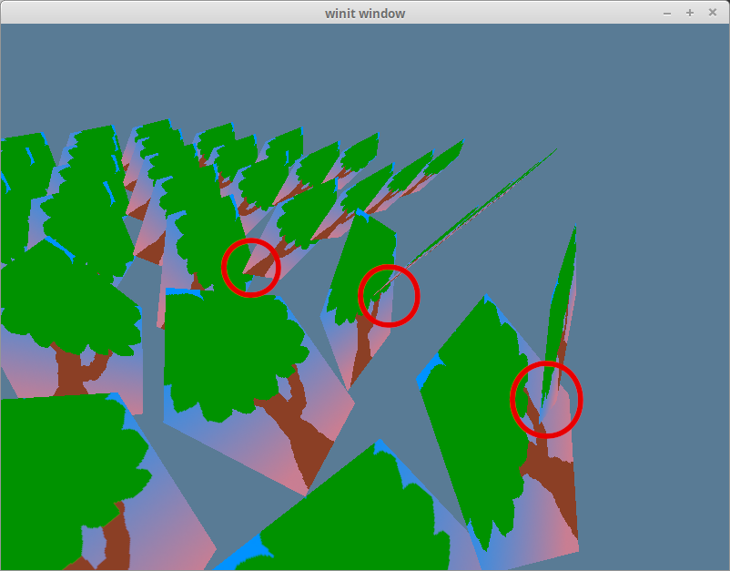

# The Depth Buffer

Let's take a closer look at the last example from an angle.



Models that should be in the back are getting rendered ahead of those in the front. This is caused by the draw order. By default, pixel data from a new object will replace old pixel data.

There are two ways to solve this: sort the data from back to front or use what's known as a depth buffer.

## Sorting from back to front

This is the go-to method for 2D rendering as it's pretty easy to know what's supposed to go in front of what. You can just use the z-order. In 3d rendering, it gets a little trickier because the order of the objects changes based on the camera angle.

A simple way of doing this is to sort all the objects by their distance from the camera's position. There are flaws with this method, though, as when a large object is behind a small object, parts of the large object that should be in front of the small object will be rendered behind it. We'll also run into issues with objects that overlap *themselves*.

If we want to do this properly, we need to have pixel-level precision. That's where a *depth buffer* comes in.

## A pixels depth

A depth buffer is a black and white texture that stores the z-coordinate of rendered pixels. Wgpu can use this when drawing new pixels to determine whether to replace or keep the data. This technique is called depth testing. This will fix our draw order problem without needing us to sort our objects!

Let's make a function to create the depth texture in `texture.rs`.

```rust
impl Texture {
    pub const DEPTH_FORMAT: wgpu::TextureFormat = wgpu::TextureFormat::Depth32Float; // 1.
    
    pub fn create_depth_texture(device: &wgpu::Device, config: &wgpu::SurfaceConfiguration, label: &str) -> Self {
        let size = wgpu::Extent3d { // 2.
            width: config.width.max(1),
            height: config.height.max(1),
            depth_or_array_layers: 1,
        };
        let desc = wgpu::TextureDescriptor {
            label: Some(label),
            size,
            mip_level_count: 1,
            sample_count: 1,
            dimension: wgpu::TextureDimension::D2,
            format: Self::DEPTH_FORMAT,
            usage: wgpu::TextureUsages::RENDER_ATTACHMENT // 3.
                | wgpu::TextureUsages::TEXTURE_BINDING,
            view_formats: &[],
        };
        let texture = device.create_texture(&desc);

        let view = texture.create_view(&wgpu::TextureViewDescriptor::default());
        let sampler = device.create_sampler(
            &wgpu::SamplerDescriptor { // 4.
                address_mode_u: wgpu::AddressMode::ClampToEdge,
                address_mode_v: wgpu::AddressMode::ClampToEdge,
                address_mode_w: wgpu::AddressMode::ClampToEdge,
                mag_filter: wgpu::FilterMode::Linear,
                min_filter: wgpu::FilterMode::Linear,
                mipmap_filter: wgpu::FilterMode::Nearest,
                compare: Some(wgpu::CompareFunction::LessEqual), // 5.
                lod_min_clamp: 0.0,
                lod_max_clamp: 100.0,
                ..Default::default()
            }
        );

        Self { texture, view, sampler }
    }
}
```

1. We need the DEPTH_FORMAT for creating the depth stage of the `render_pipeline` and for creating the depth texture itself.
2. Our depth texture needs to be the same size as our screen if we want things to render correctly. We can use our `config` to ensure our depth texture is the same size as our surface textures.
3. Since we are rendering to this texture, we need to add the `RENDER_ATTACHMENT` flag to it.
4. We technically don't *need* a sampler for a depth texture, but our `Texture` struct requires it, and we need one if we ever want to sample it.
5. If we do decide to render our depth texture, we need to use `CompareFunction::LessEqual`. This is due to how the `sampler_comparison` and `textureSampleCompare()` interact with the `texture()` function in GLSL.

We create our `depth_texture` in `State::new()`.

```rust
let depth_texture = texture::Texture::create_depth_texture(&device, &config, "depth_texture");
```

We need to modify our `render_pipeline` to allow depth testing.

```rust
let render_pipeline = device.create_render_pipeline(&wgpu::RenderPipelineDescriptor {
    // ...
    depth_stencil: Some(wgpu::DepthStencilState {
        format: texture::Texture::DEPTH_FORMAT,
        depth_write_enabled: true,
        depth_compare: wgpu::CompareFunction::Less, // 1.
        stencil: wgpu::StencilState::default(), // 2.
        bias: wgpu::DepthBiasState::default(),
    }),
    // ...
});
```

1. The `depth_compare` function tells us when to discard a new pixel. Using `LESS` means pixels will be drawn front to back. Here are the other possible values for a [CompareFunction](https://docs.rs/wgpu/latest/wgpu/enum.CompareFunction.html) that you can use:

```rust
#[repr(C)]
#[derive(Copy, Clone, Debug, Hash, Eq, PartialEq)]
#[cfg_attr(feature = "serde", derive(Serialize, Deserialize))]
pub enum CompareFunction {
    Undefined = 0,
    Never = 1,
    Less = 2,
    Equal = 3,
    LessEqual = 4,
    Greater = 5,
    NotEqual = 6,
    GreaterEqual = 7,
    Always = 8,
}
```

2. There's another type of buffer called a stencil buffer. It's common practice to store the stencil buffer and depth buffer in the same texture. These fields control values for stencil testing. We'll use default values since we aren't using a stencil buffer. We'll cover stencil buffers [later](../../todo).

Don't forget to store the `depth_texture` in `State`.

```rust
struct State {
    // ...
    depth_texture: Texture,
    // ...
}

async fn new(window: Window) -> Self {
    // ...
    
    Self {
        // ...
        depth_texture,
        // ...
    }
}
```

We need to remember to change the `resize()` method to create a new `depth_texture` and `depth_texture_view`.

```rust
fn resize(&mut self, new_size: winit::dpi::PhysicalSize<u32>) {
    // ...

    self.depth_texture = texture::Texture::create_depth_texture(&self.device, &self.config, "depth_texture");

    // ...
}
```

Make sure you update the `depth_texture` *after* you update `config`. If you don't, your program will crash as the `depth_texture` will be a different size than the `surface` texture.

The last change we need to make is in the `render()` function. We've created the `depth_texture`, but we're not currently using it. We use it by attaching it to the `depth_stencil_attachment` of a render pass.

```rust
let mut render_pass = encoder.begin_render_pass(&wgpu::RenderPassDescriptor {
    // ...
    depth_stencil_attachment: Some(wgpu::RenderPassDepthStencilAttachment {
        view: &self.depth_texture.view,
        depth_ops: Some(wgpu::Operations {
            load: wgpu::LoadOp::Clear(1.0),
            store: wgpu::StoreOp::Store,
        }),
        stencil_ops: None,
    }),
});
```

And that's all we have to do! No shader code is needed! If you run the application, the depth issues will be fixed.


## Challenge

Since the depth buffer is a texture, we can sample it in the shader. Because it's a depth texture, we'll have to use the `sampler_comparison` uniform type and the `textureSampleCompare` function instead of `sampler` and `sampler2D` respectively. Create a bind group for the depth texture (or reuse an existing one), and render it to the screen.

<WasmExample example="tutorial8_depth"></WasmExample>

<AutoGithubLink/>
