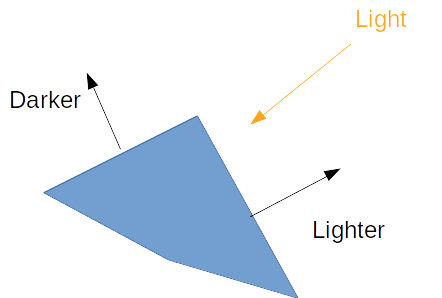
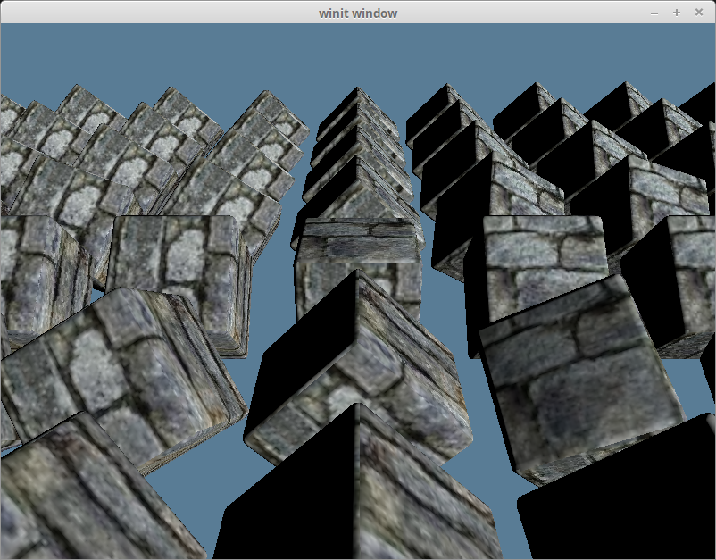
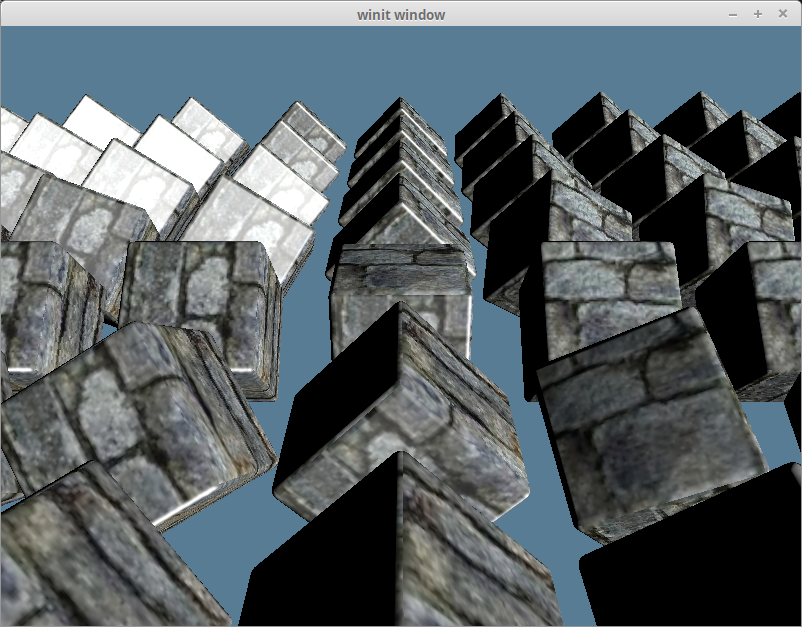

# Working with Lights

While we can tell that our scene is 3d because of our camera, it still feels very flat. That's because our model stays the same color regardless of how it's oriented. If we want to change that we need to add lighting to our scene.

In the real world, a light source emits photons which bounce around until they enter into our eyes. The color we see is the light's original color minus whatever energy it lost while it was bouncing around.

In the computer graphics world, modeling individual photons would be hilariously computationally expensive. A single 100 Watt light bulb emits about 3.27 x 10^20 photons *per second*. Just imagine that for the sun! To get around this, we're gonna use math to cheat.

Let's discuss a few options.

## Ray/Path Tracing

This is an *advanced* topic, and we won't be covering it in depth here. It's the closest model to the way light really works so I felt I had to mention it. Check out the [ray tracing tutorial](../../todo/) if you want to learn more.

## Gouraud Shading

### Testing sub-sub-headers

Named after [Henri Gourad](https://en.wikipedia.org/wiki/Gouraud_shading), Gourad shading uses a surface normal vector per vertex to determine what direction the surface is facing and then compares that normal to the light's direction to calculate how bright the surface should be. Normals indicate what direction a surface is facing. We compare the normal to light vector to calculate how bright a given part of the model should be.



Fortunately for use our cube already has normals that we can use. We can get straight to changing our vertex shader to use our normals.

```glsl
#version 450

layout(location=0) in vec3 a_position;
layout(location=1) in vec2 a_tex_coords;
layout(location=2) in vec3 a_normal; // NEW

layout(location=0) out vec2 v_tex_coords;
layout(location=1) out vec3 v_normal; // NEW

layout(set=1, binding=0) 
uniform Uniforms {
    mat4 u_view_proj;
};

layout(set=1, binding=1) 
buffer Instances {
    mat4 s_models[];
};

void main() {
    v_tex_coords = a_tex_coords;

    // UPDATED
    mat4 model = s_models[gl_InstanceIndex];
    v_normal = transpose(inverse(mat3(model))) * a_normal;
    gl_Position = u_view_proj * model * vec4(a_position, 1.0);
}
```

We pull out the model-view-projection matrix that we use to transform our model, because we are going to need it transform our normals. Because a normal is just a direction, not a position, we need to pull out the rotational part of the `model` matrix. That's why we convert it to `mat3`. I'm not sure why the `transpose` and `invert` bit are needed, but they are.

The fragment shader will take that normal, and a new `u_light` uniform, and perform the calculation.

```glsl
#version 450

layout(location=0) in vec2 v_tex_coords;
layout(location=1) in vec3 v_normal;

layout(location=0) out vec4 f_color;

layout(set = 0, binding = 0) uniform texture2D t_diffuse;
layout(set = 0, binding = 1) uniform sampler s_diffuse;

layout(set=1, binding=2) 
uniform Lights {
    vec3 u_light;
};

void main() {
    vec4 diffuse = texture(sampler2D(t_diffuse, s_diffuse), v_tex_coords);
    float brightness = dot(normalize(v_normal), normalize(u_light)); // 1.
    vec4 ambient = vec4(0.0, 0.0, 0.0, 1.0); // 2.
    f_color = mix(ambient, diffuse, brightness); // 3.
}
```

1. The dot product gives us the cosine of the angle between the two vectors multiplied by the magnitude of each vector. Normalizing the vectors gives them a magnitude of one, so we get just the cosine of the angle between the two. We can use this value to determine how "similar" they are. A value of 1.0 means that the vectors are the same. A value of -1.0 means that they point in opposite directions.
2. The ambient value is the color the object would be in the dark.
3. We get the final color by mixing the ambient and diffuse colors using our brightness value.

Before we can see the results, we need to create the uniform buffer to hold the light data. We're going to create a new buffer to make it easier to store multiple lights.

```rust
#[repr(C)]
#[derive(Copy, Clone)]
struct Light {
    direction: cgmath::Vector3<f32>,
}

let light = Light {
    direction: (-1.0, 0.4, -0.9).into(),
};
let light_buffer = device
    .create_buffer_mapped(1, wgpu::BufferUsage::UNIFORM)
    .fill_from_slice(&[light]);
```

We need to update the uniform bind group as well.

```rust
let uniform_bind_group_layout = device.create_bind_group_layout(&wgpu::BindGroupLayoutDescriptor {
    bindings: &[
        // ...
        wgpu::BindGroupLayoutBinding {
            binding: 2,
            visibility: wgpu::ShaderStage::FRAGMENT,
            ty: wgpu::BindingType::UniformBuffer {
                dynamic: false,
            },
        },
    ]
});

let uniform_bind_group = device.create_bind_group(&wgpu::BindGroupDescriptor {
    layout: &uniform_bind_group_layout,
    bindings: &[
        // ...
        wgpu::Binding {
            binding: 2,
            resource: wgpu::BindingResource::Buffer {
                buffer: &light_buffer,
                range: 0..std::mem::size_of_val(&light) as wgpu::BufferAddress,
            }
        },
    ],
});
```

With all that you should get something that looks like this.



You can see they cubes now have a light side and a dark side.

## Blinn-Phong Shading

Gouraud shading works, but it's not super accurate. It's missing specular reflection.

Specular reflection is the light that's reflected of surface without getting scattered as the diffuse reflection. It's the bright spots you see on s shiny surface such as an apple.

Fortunately we only have to change the shader code to get this new effect.

```glsl
// shader.vert
#version 450

layout(location=0) in vec3 a_position;
layout(location=1) in vec2 a_tex_coords;
layout(location=2) in vec3 a_normal;

layout(location=0) out vec2 v_tex_coords;
layout(location=1) out vec3 v_normal;
layout(location=2) out vec3 v_position;

layout(set=1, binding=0) 
uniform Uniforms {
    mat4 u_view_proj;
};

layout(set=1, binding=1) 
buffer Instances {
    mat4 s_models[];
};

void main() {
    v_tex_coords = a_tex_coords;

    mat4 model = s_models[gl_InstanceIndex];

    // Rotate the normals with respect to the model, ignoring scaling
    mat3 normal_matrix = mat3(transpose(inverse(mat3(model))));
    v_normal = normal_matrix * a_normal;

    gl_Position = u_view_proj * model * vec4(a_position, 1.0);

    // Get the position relative to the view for the lighting calc
    v_position = gl_Position.xyz / gl_Position.w;
}
```

```glsl
// shader.frag
#version 450

layout(location=0) in vec2 v_tex_coords;
layout(location=1) in vec3 v_normal;
layout(location=2) in vec3 v_position;

layout(location=0) out vec4 f_color;

layout(set = 0, binding = 0) uniform texture2D t_diffuse;
layout(set = 0, binding = 1) uniform sampler s_diffuse;

layout(set=1, binding=2) 
uniform Lights {
    vec3 u_light;
};

const vec3 ambient_color = vec3(0.0, 0.0, 0.0);
const vec3 specular_color = vec3(1.0, 1.0, 1.0);

const float shininess = 32;

void main() {
    vec4 diffuse_color = texture(sampler2D(t_diffuse, s_diffuse), v_tex_coords);
    float diffuse_term = max(dot(normalize(v_normal), normalize(u_light)), 0);

    vec3 camera_dir = normalize(-v_position);

    // This is an aproximation of the actual reflection vector, aka what
    // angle you have to look at the object to be blinded by the light
    vec3 half_direction = normalize(normalize(u_light) + camera_dir);
    float specular_term = pow(max(dot(normalize(v_normal), half_direction), 0.0), shininess);

    f_color = vec4(ambient_color, 1.0) + vec4(specular_term * specular_color, 1.0) + diffuse_term * diffuse_color;
    
}
```

With that we should get something like this.



This is a bit bright for a brick texture though. You can modify the `shininess` value if you want to reduce the brightness. I'm going to leave it as is though. The lighting calculations will change as we get into [Normal Mapping](../tutorial11-normals).

<AutoGithubLink/>