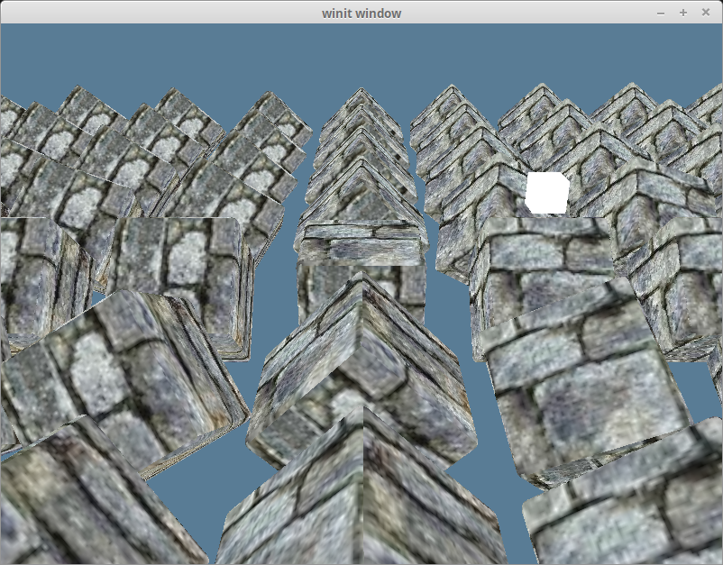
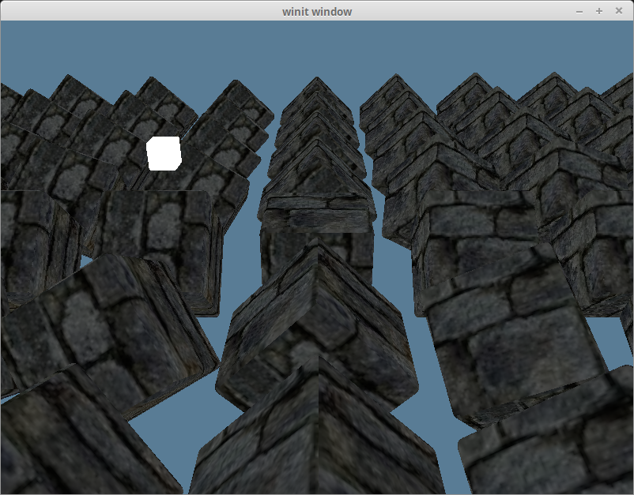
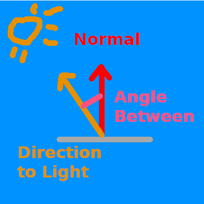
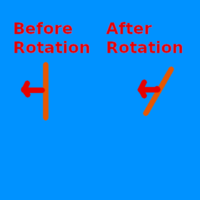
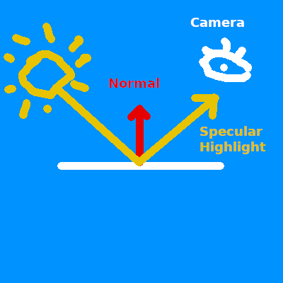
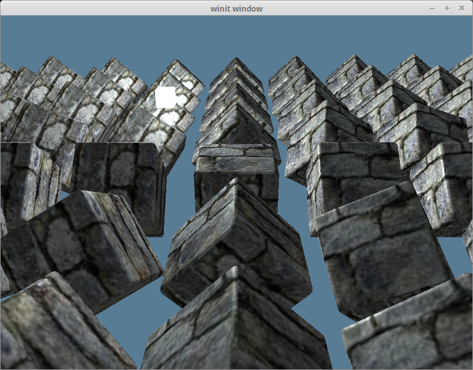

# Working with Lights

While we can tell that our scene is 3d because of our camera, it still feels very flat. That's because our model stays the same color regardless of how it's oriented. If we want to change that we need to add lighting to our scene.

In the real world, a light source emits photons which bounce around until they enter into our eyes. The color we see is the light's original color minus whatever energy it lost while it was bouncing around.

In the computer graphics world, modeling individual photons would be hilariously computationally expensive. A single 100 Watt light bulb emits about 3.27 x 10^20 photons *per second*. Just imagine that for the sun! To get around this, we're gonna use math to cheat.

Let's discuss a few options.

## Ray/Path Tracing

This is an *advanced* topic, and we won't be covering it in depth here. It's the closest model to the way light really works so I felt I had to mention it. Check out the [ray tracing tutorial](../../todo/) if you want to learn more.

## The Blinn-Phong Model

Ray/path tracing is often too computationally expensive for most realtime applications (though that is starting to change), so a more efficient, if less accurate method based on the [Phong reflection model](https://en.wikipedia.org/wiki/Phong_shading) is often used. It splits up the lighting calculation into three (3) parts: ambient lighting, diffuse lighting, and specular lighting. We're going to be learning the [Blinn-Phong model](https://en.wikipedia.org/wiki/Blinn%E2%80%93Phong_reflection_model), which cheats a bit at the specular calculation to speed things up.

Before we can get into that though, we need to add a light to our scene.

```rust
// main.rs
#[repr(C)]
#[derive(Debug, Copy, Clone)]
struct Light {
    position: cgmath::Vector3<f32>,
    // Due to uniforms requiring 16 byte (4 float) spacing, we need to use a padding field here
    _padding: u32,
    color: cgmath::Vector3<f32>,
}

unsafe impl bytemuck::Zeroable for Light {}
unsafe impl bytemuck::Pod for Light {}
```

Our `Light` represents a colored point in space. We're just going to use pure white light, but it's good to allow different colors of light.

We're going to create another buffer to store our light in. 

```rust
let light = Light {
    position: (2.0, 2.0, 2.0).into(),
    _padding: 0,
    color: (1.0, 1.0, 1.0).into(),
};

 // We'll want to update our lights position, so we use COPY_DST
let light_buffer = device.create_buffer_init(
    &wgpu::util::BufferInitDescriptor {
        label: Some("Light VB"),
        contents: bytemuck::cast_slice(&[light]),
        usage: wgpu::BufferUsage::UNIFORM | wgpu::BufferUsage::COPY_DST,
    }
);
```

Don't forget to add the `light` and `light_buffer` to `State`. After that we need to create a bind group layout and bind group for our light.

```rust
let light_bind_group_layout =
    device.create_bind_group_layout(&wgpu::BindGroupLayoutDescriptor {
        entries: &[wgpu::BindGroupLayoutEntry {
        binding: 0,
            visibility: wgpu::ShaderStage::VERTEX | wgpu::ShaderStage::FRAGMENT,
            ty: wgpu::BindingType::UniformBuffer {
                dynamic: false,
                min_binding_size: None,
            },
            count: None,
        }],
        label: None,
    });

let light_bind_group = device.create_bind_group(&wgpu::BindGroupDescriptor {
    layout: &light_bind_group_layout,
    bindings: &[wgpu::Binding {
        binding: 0,
        resource: wgpu::BindingResource::Buffer {
            buffer: &light_buffer,
            range: 0..std::mem::size_of_val(&light) as wgpu::BufferAddress,
        },
    }],
    label: None,
});
```

Add those to `State`, and also update the `render_pipeline_layout`.

```rust
let render_pipeline_layout = device.create_pipeline_layout(&wgpu::PipelineLayoutDescriptor {
    bind_group_layouts: &[
        &texture_bind_group_layout, 
        &uniform_bind_group_layout,
        &light_bind_group_layout,
    ],
});
```

Let's also update the lights position in the `update()` method, so we can see what our objects look like from different angles.

```rust
// Update the light
let old_position = self.light.position;
self.light.position =
    cgmath::Quaternion::from_axis_angle((0.0, 1.0, 0.0).into(), cgmath::Deg(1.0))
        * old_position;
self.queue.write_buffer(&self.light_buffer, 0, bytemuck::cast_slice(&[self.light]));
```

This will have the light rotate around the origin one degree every frame.

## Seeing the light

For debugging purposes, it would be nice if we could see where the light is to make sure that the scene looks correct. We could adapt our existing render pipeline to draw the light, but it will likely get in the way. Instead we are going to extract our render pipeline creation code into a new function called `create_render_pipeline()`.


```rust
fn create_render_pipeline(
    device: &wgpu::Device,
    layout: &wgpu::PipelineLayout,
    color_format: wgpu::TextureFormat,
    depth_format: Option<wgpu::TextureFormat>,
    vertex_descs: &[wgpu::VertexBufferDescriptor],
    vs_src: &str,
    fs_src: &str,
) -> wgpu::RenderPipeline {
    let mut compiler = shaderc::Compiler::new().unwrap();
    let vs_spirv = compiler.compile_into_spirv(vs_src, shaderc::ShaderKind::Vertex, "shader.vert", "main", None).unwrap();
    let fs_spirv = compiler.compile_into_spirv(fs_src, shaderc::ShaderKind::Fragment, "shader.frag", "main", None).unwrap();

    let vs_data = wgpu::read_spirv(std::io::Cursor::new(vs_spirv.as_binary_u8())).unwrap();
    let fs_data = wgpu::read_spirv(std::io::Cursor::new(fs_spirv.as_binary_u8())).unwrap();

    let vs_module = device.create_shader_module(&vs_data);
    let fs_module = device.create_shader_module(&fs_data);

    device.create_render_pipeline(&wgpu::RenderPipelineDescriptor {
        layout: &layout,
        vertex_stage: wgpu::ProgrammableStageDescriptor {
            module: &vs_module,
            entry_point: "main",
        },
        fragment_stage: Some(wgpu::ProgrammableStageDescriptor {
            module: &fs_module,
            entry_point: "main",
        }),
        rasterization_state: Some(wgpu::RasterizationStateDescriptor {
            front_face: wgpu::FrontFace::Ccw,
            cull_mode: wgpu::CullMode::Back,
            depth_bias: 0,
            depth_bias_slope_scale: 0.0,
            depth_bias_clamp: 0.0,
        }),
        primitive_topology: wgpu::PrimitiveTopology::TriangleList,
        color_states: &[
            wgpu::ColorStateDescriptor {
                format: color_format,
                color_blend: wgpu::BlendDescriptor::REPLACE,
                alpha_blend: wgpu::BlendDescriptor::REPLACE,
                write_mask: wgpu::ColorWrite::ALL,
            },
        ],
        depth_stencil_state: depth_format.map(|format| {
            wgpu::DepthStencilStateDescriptor {
                format,
                depth_write_enabled: true,
                depth_compare: wgpu::CompareFunction::Less,
                stencil_front: wgpu::StencilStateFaceDescriptor::IGNORE,
                stencil_back: wgpu::StencilStateFaceDescriptor::IGNORE,
                stencil_read_mask: 0,
                stencil_write_mask: 0,
            }
        }),
        sample_count: 1,
        sample_mask: !0,
        alpha_to_coverage_enabled: false,
        vertex_state: wgpu::VertexStateDescriptor {
            index_format: wgpu::IndexFormat::Uint32,
            vertex_buffers: vertex_descs,
        },
    })
}
```

We also need to change `State::new()` to use this function.

```rust
let render_pipeline = {
    let vs_src = include_str!("shader.vert");
    let fs_src = include_str!("shader.frag");

    create_render_pipeline(
        &device, 
        &render_pipeline_layout, 
        sc_desc.format,
        Some(texture::Texture::DEPTH_FORMAT),
        &[model::ModelVertex::desc()],
        vs_src, 
        fs_src
    )
};
```

We're going to need to modify `model::DrawModel` to use our `light_bind_group`.

```rust
pub trait DrawModel<'a, 'b>
where
    'b: 'a,
{
    fn draw_mesh(
        &mut self,
        mesh: &'b Mesh,
        material: &'b Material,
        uniforms: &'b wgpu::BindGroup,
        light: &'b wgpu::BindGroup,
    );
    fn draw_mesh_instanced(
        &mut self,
        mesh: &'b Mesh,
        material: &'b Material,
        instances: Range<u32>,
        uniforms: &'b wgpu::BindGroup,
        light: &'b wgpu::BindGroup,
    );

    fn draw_model(
        &mut self,
        model: &'b Model,
        uniforms: &'b wgpu::BindGroup,
        light: &'b wgpu::BindGroup,
    );
    fn draw_model_instanced(
        &mut self,
        model: &'b Model,
        instances: Range<u32>,
        uniforms: &'b wgpu::BindGroup,
        light: &'b wgpu::BindGroup,
    );
}

impl<'a, 'b> DrawModel<'a, 'b> for wgpu::RenderPass<'a>
where
    'b: 'a,
{
    fn draw_mesh(
        &mut self,
        mesh: &'b Mesh,
        material: &'b Material,
        uniforms: &'b wgpu::BindGroup,
        light: &'b wgpu::BindGroup,
    ) {
        self.draw_mesh_instanced(mesh, material, 0..1, uniforms, light);
    }

    fn draw_mesh_instanced(
        &mut self,
        mesh: &'b Mesh,
        material: &'b Material,
        instances: Range<u32>,
        uniforms: &'b wgpu::BindGroup,
        light: &'b wgpu::BindGroup,
    ) {
        self.set_vertex_buffer(0, &mesh.vertex_buffer, 0, 0);
        self.set_index_buffer(&mesh.index_buffer, 0, 0);
        self.set_bind_group(0, &material.bind_group, &[]);
        self.set_bind_group(1, &uniforms, &[]);
        self.set_bind_group(2, &light, &[]);
        self.draw_indexed(0..mesh.num_elements, 0, instances);
    }

    fn draw_model(
        &mut self,
        model: &'b Model,
        uniforms: &'b wgpu::BindGroup,
        light: &'b wgpu::BindGroup,
    ) {
        self.draw_model_instanced(model, 0..1, uniforms, light);
    }

    fn draw_model_instanced(
        &mut self,
        model: &'b Model,
        instances: Range<u32>,
        uniforms: &'b wgpu::BindGroup,
        light: &'b wgpu::BindGroup,
    ) {
        for mesh in &model.meshes {
            let material = &model.materials[mesh.material];
            self.draw_mesh_instanced(mesh, material, instances.clone(), uniforms, light);
        }
    }
}
```

With that done we can create another render pipeline for our light.

```rust
let light_render_pipeline = {
    let layout = device.create_pipeline_layout(&wgpu::PipelineLayoutDescriptor {
        bind_group_layouts: &[
            &uniform_bind_group_layout,
            &light_bind_group_layout,
        ]
    });

    let vs_src = include_str!("light.vert");
    let fs_src = include_str!("light.frag");

    create_render_pipeline(
        &device, 
        &layout, 
        sc_desc.format, 
        Some(texture::Texture::DEPTH_FORMAT), 
        &[model::ModelVertex::desc()], 
        vs_src, 
        fs_src,
    )
};
```

I chose to create a seperate layout for the `light_render_pipeline`, as it doesn't need all the resources that the regular `render_pipeline` needs (main just the textures).

With that in place we need to write the actual shaders.

```glsl
// light.vert
#version 450

layout(location=0) in vec3 a_position;

layout(location=0) out vec3 v_color;

layout(set=0, binding=0)
uniform Uniforms {
    mat4 u_view_proj;
};

layout(set=1, binding=0)
uniform Light {
    vec3 u_position;
    vec3 u_color;
};

// Let's keep our light smaller than our other objects
float scale = 0.25;

void main() {
    vec3 v_position = a_position * scale + u_position;
    gl_Position = u_view_proj * vec4(v_position, 1);

    v_color = u_color;
}
```

```glsl
// light.frag
#version 450

layout(location=0) in vec3 v_color;
layout(location=0) out vec4 f_color;

void main() {
    f_color = vec4(v_color, 1.0);
}
```

Now we could manually implement the draw code for the light in `render()`, but to keep with the pattern we developed, let's create a new trait called `DrawLight`.

```rust
pub trait DrawLight<'a, 'b>
where
    'b: 'a,
{
    fn draw_light_mesh(
        &mut self,
        mesh: &'b Mesh,
        uniforms: &'b wgpu::BindGroup,
        light: &'b wgpu::BindGroup,
    );
    fn draw_light_mesh_instanced(
        &mut self,
        mesh: &'b Mesh,
        instances: Range<u32>,
        uniforms: &'b wgpu::BindGroup,
        light: &'b wgpu::BindGroup,
    ) where
        'b: 'a;

    fn draw_light_model(
        &mut self,
        model: &'b Model,
        uniforms: &'b wgpu::BindGroup,
        light: &'b wgpu::BindGroup,
    );
    fn draw_light_model_instanced(
        &mut self,
        model: &'b Model,
        instances: Range<u32>,
        uniforms: &'b wgpu::BindGroup,
        light: &'b wgpu::BindGroup,
    );
}

impl<'a, 'b> DrawLight<'a, 'b> for wgpu::RenderPass<'a>
where
    'b: 'a,
{
    fn draw_light_mesh(
        &mut self,
        mesh: &'b Mesh,
        uniforms: &'b wgpu::BindGroup,
        light: &'b wgpu::BindGroup,
    ) {
        self.draw_light_mesh_instanced(mesh, 0..1, uniforms, light);
    }

    fn draw_light_mesh_instanced(
        &mut self,
        mesh: &'b Mesh,
        instances: Range<u32>,
        uniforms: &'b wgpu::BindGroup,
        light: &'b wgpu::BindGroup,
    ) {
        self.set_vertex_buffer(0, mesh.vertex_buffer.slice(..));
        self.set_index_buffer(mesh.index_buffer.slice(..));
        self.set_bind_group(0, uniforms, &[]);
        self.set_bind_group(1, light, &[]);
        self.draw_indexed(0..mesh.num_elements, 0, instances);
    }

    fn draw_light_model(
        &mut self,
        model: &'b Model,
        uniforms: &'b wgpu::BindGroup,
        light: &'b wgpu::BindGroup,
    ) {
        self.draw_light_model_instanced(model, 0..1, uniforms, light);
    }
    fn draw_light_model_instanced(
        &mut self,
        model: &'b Model,
        instances: Range<u32>,
        uniforms: &'b wgpu::BindGroup,
        light: &'b wgpu::BindGroup,
    ) {
        for mesh in &model.meshes {
            self.draw_light_mesh_instanced(mesh, instances.clone(), uniforms, light);
        }
    }
}
```

With all that we'll end up with something like this.



## Ambient Lighting

Light has a tendency to bounce around before entering our eyes. That's why you can see in areas that are in shadow. Actually modeling this interaction is computationally expensive, so we cheat. We define an ambient lighting value that stands in for the light bouncing of other parts of the scene to light our objects.

The ambient part is based on the light color as well as the object color. We've already added our `light_bind_group`, so we just need to use it in our shader. In `shader.frag`, add the following below the texture uniforms.

```glsl
layout(set = 2, binding = 0) uniform Light {
    vec3 light_position;
    vec3 light_color;
};
```

Then we need to update our main shader code to calculate and use the ambient color value.

```glsl
void main() {
    vec4 object_color = texture(sampler2D(t_diffuse, s_diffuse), v_tex_coords);

    // We don't need (or want) much ambient light, so 0.1 is fine
    float ambient_strength = 0.1;
    vec3 ambient_color = light_color * ambient_strength;

    vec3 result = ambient_color * object_color.xyz;

    // Since lights don't typically (afaik) cast transparency, so we use
    // the alpha here at the end.
    f_color = vec4(result, object_color.a);
}
```

With that we should get something like the this.



## Diffuse Lighting

Remember the normal vectors that were included with our model? We're finally going to use them. Normals represent the direction a surface is facing. By comparing the normal of a fragment with a vector pointing to a light source, we get a value of how light/dark that fragment should be. We compare the vector be using the dot product to get the cosine of the angle between them.



If the dot product of the normal and light vector is 1.0, that means that the current fragment is directly inline with the light source and will receive the lights full intensity. A value of 0.0 or lower means that the surface is perpendicular or facing away from the light, and therefore will be dark.

We're going to need to pull in the normal vector into our `shader.vert`.

```glsl
layout(location=0) in vec3 a_position;
layout(location=1) in vec2 a_tex_coords;
layout(location=2) in vec3 a_normal; // NEW!
```

We're also going to want to pass that value, as well as the vertex's position to the fragment shader.

```glsl
layout(location=1) out vec3 v_normal;
layout(location=2) out vec3 v_position;
```

For now let's just pass the normal directly as is. This is wrong, but we'll fix it later.

```glsl
void main() {
    v_tex_coords = a_tex_coords;
    v_normal = a_normal; // NEW!
    vec4 model_space = s_models[gl_InstanceIndex] * vec4(a_position, 1.0); // NEW!
    v_position = model_space.xyz; // NEW!
    gl_Position = u_view_proj * model_space; // UPDATED!
}
```

Now in `shader.frag` we'll take in the vertex's normal and position.

```glsl
layout(location=0) in vec2 v_tex_coords;
layout(location=1) in vec3 v_normal; // NEW!
layout(location=2) in vec3 v_position; // NEW!
```

With that we can do the actual calculation. Below the `ambient_color` calculation, but above `result`, add the following.

```glsl
vec3 normal = normalize(v_normal);
vec3 light_dir = normalize(light_position - v_position);

float diffuse_strength = max(dot(normal, light_dir), 0.0);
vec3 diffuse_color = light_color * diffuse_strength;
```

Now we can include the `diffuse_color` in the `result`.

```glsl
vec3 result = (ambient_color + diffuse_color) * object_color.xyz;
```

With that we get something like this.


## The normal matrix

Remember when I said passing the vertex normal directly to the fragment shader was wrong? Let's explore that by removing all the cubes from the scene except one that will be rotated 180 degrees on the y-axis.

```rust
const NUM_INSTANCES_PER_ROW: u32 = 1;

// In the loop we create the instances in
let rotation = cgmath::Quaternion::from_axis_angle((0.0, 1.0, 0.0).into(), cgmath::Deg(180.0));
```

We'll also remove the `ambient_color` from our lighting `result`.

```glsl
vec3 result = (diffuse_color) * object_color.xyz;
```

That should give us something that looks like this.


This is clearly wrong as the light is illuminating the wrong side of the cube. This is because we aren't rotating our normals with our object, so no matter what direction the object faces, the normals will always face the same way.



We need to use the model matrix to transform the normals to be in the right direction. We only want the rotation data though. A normal represents a direction, and should be a unit vector throughout the calculation. We can get our normals into the right direction using what is called a normal matrix. We can calculate the normal matrix with the following.

```glsl
// shader.vert
mat4 model_matrix = s_models[gl_InstanceIndex];
mat3 normal_matrix = mat3(transpose(inverse(model_matrix)));
v_normal = normal_matrix * a_normal;
```

This takes the `model_matrix` from our `instance_buffer`, inverts it, transposes it and then pulls out the top left 3x3 to just get the rotation data. This is all necessary because because normals are technically not vectors, there bivectors. The explanation is beyond me, but I do know that it means we have to treat them differently.

* Note: I'm currently doing things in [world space](https://gamedev.stackexchange.com/questions/65783/what-are-world-space-and-eye-space-in-game-development). Doing things in view-space also known as eye-space, is more standard as objects can have lighting issues when they are further away from the origin. If we wanted to use view-space, we would use something along the lines of `mat3(transpose(inverse(view_matrix * model_matrix)))`. Currently we are combining the view matrix and projection matrix before we draw, so we'd have to pass those in separately. We'd also have to transform our light's position using something like `view_matrix * model_matrix * light_position` to keep the calculation from getting messed up when the camera moves.
* Another Note: I'm calculating the `normal_matrix` in the vertex shader currently. This is rather expensive, so it is often suggested that you compute the `normal_matrix` on the CPU and pass it in with the other uniforms.

With that change our lighting now looks correct.


Bringing back our other objects, and adding the ambient lighting gives us this.

;

## Specular Lighting

Specular lighting describes the highlights that appear on objects when viewed from certain angles. If you've ever looked at a car, it's the super bright parts. Basically, some of the light can reflect of the surface like a mirror. The location of the hightlight shifts depending on what angle you view it at.



Because this is relative to the view angle, we are going to need to pass in the camera's position both into the fragment shader and into the vertex shader.

```glsl
// shader.frag
layout(set=1, binding=0) 
uniform Uniforms {
    vec3 u_view_position;
    mat4 u_view_proj; // unused
};
```

```glsl
// shader.vert & light.vert
layout(set=1, binding=0) 
uniform Uniforms {
    vec3 u_view_position; // unused
    mat4 u_view_proj;
};
```


We're going to need to update the `Uniforms` struct as well.

```rust
// main.rs
#[repr(C)]
#[derive(Copy, Clone)]
struct Uniforms {
    view_position: cgmath::Vector4<f32>,
    view_proj: cgmath::Matrix4<f32>,
}
//If we want to use bytemuck, we must first implement these two traits
unsafe impl bytemuck::Zeroable for Uniforms {}
unsafe impl bytemuck::Pod for Uniforms {}
impl Uniforms {
    fn new() -> Self {
        Self {
            view_position: Zero::zero(),
            view_proj: cgmath::Matrix4::identity(),
        }
    }

    fn update_view_proj(&mut self, camera: &Camera) {
        // We don't specifically need homogeneous coordinates since we're just using
        // a vec3 in the shader. We're using Point3 for the camera.eye, and this is
        // the easiest way to convert to Vector4. We're using Vector4 because of
        // the uniforms 16 byte spacing requirement
        self.view_position = camera.eye.to_homogeneous();
        self.view_proj = OPENGL_TO_WGPU_MATRIX * camera.build_view_projection_matrix();
    }
}
```

Since we want to use our uniforms in the fragment shader now, we need to change it's visibility.

```rust
// main.rs
let uniform_bind_group_layout = device.create_bind_group_layout(&wgpu::BindGroupLayoutDescriptor {
    bindings: &[
        wgpu::BindGroupLayoutBinding {
            binding: 0,
            visibility: wgpu::ShaderStage::VERTEX | wgpu::ShaderStage::FRAGMENT, // Updated!
            ty: wgpu::BindingType::UniformBuffer {
                dynamic: false,
            },
        },
        // ...
    ],
    label: None,
});
```

We're going to get the direction from the fragment's position to the camera, and use that with the normal to calculate the `reflect_dir`.

```glsl
vec3 view_dir = normalize(u_view_position - v_position);
vec3 reflect_dir = reflect(-light_dir, normal);
```

Then we use the dot product to calculate the `specular_strength` and use that to compute the `specular_color`.

```glsl
float specular_strength = pow(max(dot(view_dir, reflect_dir), 0.0), 32);
vec3 specular_color = specular_strength * light_color;
```

Finally we add that to the result.

```glsl
vec3 result = (ambient_color + diffuse_color + specular_color) * object_color.xyz;
```

With that you should have something like this.


If we just look at the `specular_color` on it's own we get this.


## The half direction

Up to this point we've actually only implemented the Phong part of Blinn-Phong. The Phong reflection model works well, but it can break down under [certain circumstances](https://learnopengl.com/Advanced-Lighting/Advanced-Lighting). The Blinn part of Blinn-Phong comes from the realization that if you add the `view_dir`, and `light_dir` together, normalize the result and use the dot product of that and the `normal`, you get roughly the same results without the issues that using `reflect_dir` had.

```glsl
vec3 view_dir = normalize(u_view_position - v_position);
vec3 half_dir = normalize(view_dir + light_dir);

float specular_strength = pow(max(dot(normal, half_dir), 0.0), 32);
```

It's hard to tell the difference, but here's the results.



<AutoGithubLink/>
