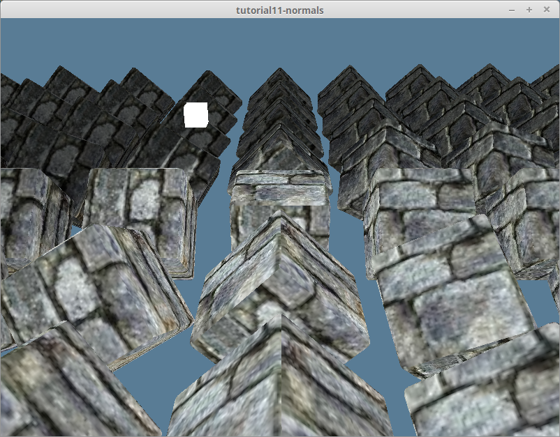
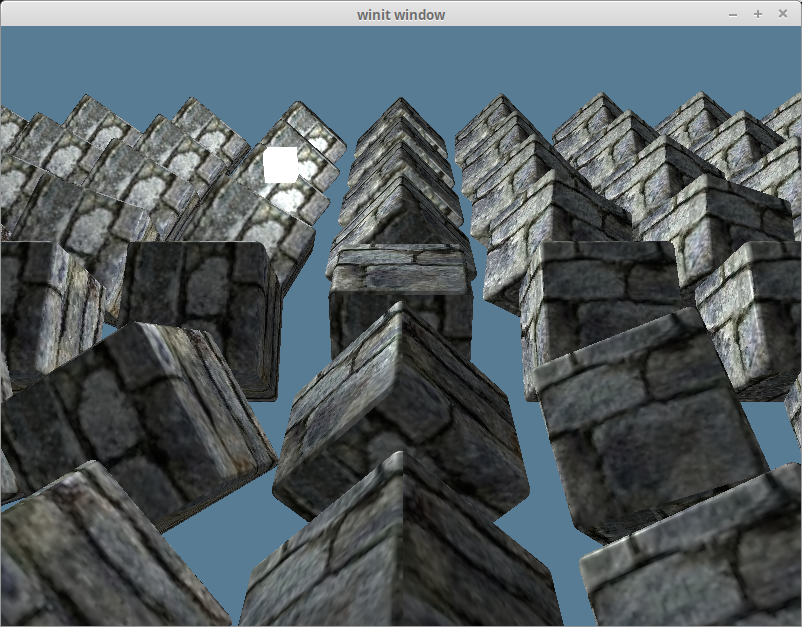
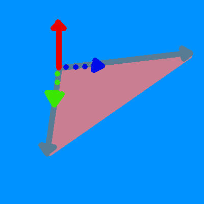
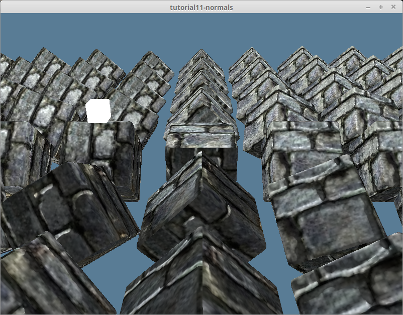
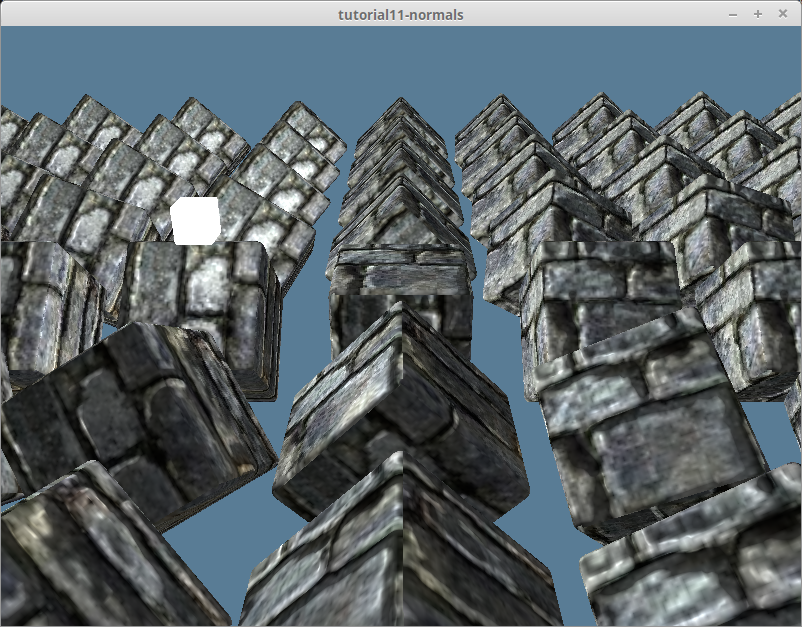
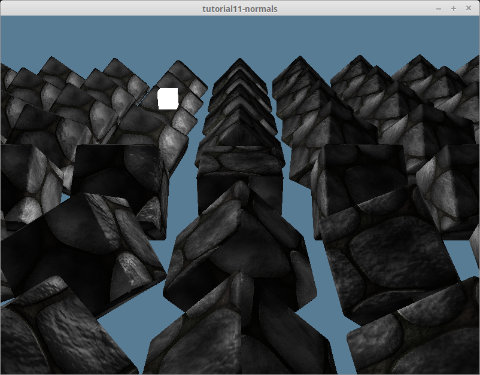

# Normal Mapping

With just lighting, our scene is already looking pretty good. Still, our models are still overly smooth. This is understandable because we are using a very simple model. If we were using a texture that was supposed to be smooth, this wouldn't be a problem, but our brick texture is supposed to be rougher. We could solve this by adding more geometry, but that would slow our scene down, and it would be hard to know where to add new polygons. This is where normal mapping comes in.

Remember when we experimented with storing instance data in a texture in [the instancing tutorial](/beginner/tutorial7-instancing/#a-different-way-textures)? A normal map is doing just that with normal data! We'll use the normals in the normal map in our lighting calculation in addition to the vertex normal.

The brick texture I found came with a normal map. Let's take a look at it!


The r, g, and b components of the texture correspond to the x, y, and z components or the normals. All the z values should be positive. That's why the normal map has a bluish tint.

We'll need to modify our `Material` struct in `model.rs` to include a `normal_texture`.

```rust
pub struct Material {
    pub name: String,
    pub diffuse_texture: texture::Texture,
    pub normal_texture: texture::Texture, // UPDATED!
    pub bind_group: wgpu::BindGroup,
}
```

We'll have to update the `texture_bind_group_layout` to include the normal map as well.

```rust
let texture_bind_group_layout = device.create_bind_group_layout(&wgpu::BindGroupLayoutDescriptor {
    entries: &[
        // ...
        // normal map
        wgpu::BindGroupLayoutEntry {
            binding: 2,
            visibility: wgpu::ShaderStages::FRAGMENT,
            ty: wgpu::BindingType::Texture {
                multisampled: false,
                sample_type: wgpu::TextureSampleType::Float { filterable: true },
                view_dimension: wgpu::TextureViewDimension::D2,
            },
            count: None,
        },
        wgpu::BindGroupLayoutEntry {
            binding: 3,
            visibility: wgpu::ShaderStages::FRAGMENT,
            ty: wgpu::BindingType::Sampler(wgpu::SamplerBindingType::Filtering),
            count: None,
        },
    ],
    label: Some("texture_bind_group_layout"),
});
```

We'll need to load the normal map. We'll do this in the loop where we create the materials in the `load_model()` function in `resources.rs`.

```rust
// resources.rs
let mut materials = Vec::new();
for m in obj_materials? {
    let diffuse_texture = load_texture(&m.diffuse_texture, device, queue).await?;
    // NEW!
    let normal_texture = load_texture(&m.normal_texture, device, queue).await?;

    materials.push(model::Material::new(
        device,
        &m.name,
        diffuse_texture,
        normal_texture, // NEW!
        layout,
    ));
}
```

You'll notice I'm using a `Material::new()` function we didn't have previously. Here's the code for that:

```rust
impl Material {
    pub fn new(
        device: &wgpu::Device,
        name: &str,
        diffuse_texture: texture::Texture,
        normal_texture: texture::Texture, // NEW!
        layout: &wgpu::BindGroupLayout,
    ) -> Self {
        let bind_group = device.create_bind_group(&wgpu::BindGroupDescriptor {
            layout,
            entries: &[
                wgpu::BindGroupEntry {
                    binding: 0,
                    resource: wgpu::BindingResource::TextureView(&diffuse_texture.view),
                },
                wgpu::BindGroupEntry {
                    binding: 1,
                    resource: wgpu::BindingResource::Sampler(&diffuse_texture.sampler),
                },
                // NEW!
                wgpu::BindGroupEntry {
                    binding: 2,
                    resource: wgpu::BindingResource::TextureView(&normal_texture.view),
                },
                wgpu::BindGroupEntry {
                    binding: 3,
                    resource: wgpu::BindingResource::Sampler(&normal_texture.sampler),
                },
            ],
            label: Some(name),
        });

        Self {
            name: String::from(name),
            diffuse_texture,
            normal_texture, // NEW!
            bind_group,
        }
    }
}
```

Now, we can use the texture in the fragment shader.

```wgsl
// Fragment shader

@group(0) @binding(0)
var t_diffuse: texture_2d<f32>;
@group(0)@binding(1)
var s_diffuse: sampler;
@group(0)@binding(2)
var t_normal: texture_2d<f32>;
@group(0) @binding(3)
var s_normal: sampler;

@fragment
fn fs_main(in: VertexOutput) -> @location(0) vec4<f32> {
    let object_color: vec4<f32> = textureSample(t_diffuse, s_diffuse, in.tex_coords);
    let object_normal: vec4<f32> = textureSample(t_normal, s_normal, in.tex_coords);
    
    // We don't need (or want) much ambient light, so 0.1 is fine
    let ambient_strength = 0.1;
    let ambient_color = light.color * ambient_strength;

    // Create the lighting vectors
    let tangent_normal = object_normal.xyz * 2.0 - 1.0;
    let light_dir = normalize(light.position - in.world_position);
    let view_dir = normalize(camera.view_pos.xyz - in.world_position);
    let half_dir = normalize(view_dir + light_dir);

    let diffuse_strength = max(dot(tangent_normal, light_dir), 0.0);
    let diffuse_color = light.color * diffuse_strength;

    let specular_strength = pow(max(dot(tangent_normal, half_dir), 0.0), 32.0);
    let specular_color = specular_strength * light.color;

    let result = (ambient_color + diffuse_color + specular_color) * object_color.xyz;

    return vec4<f32>(result, object_color.a);
}
```

If we run the code now, you'll notice things don't look quite right. Let's compare our results with the last tutorial.




Parts of the scene are dark when they should be lit up, and vice versa.

## Tangent Space to World Space

I mentioned briefly in the [lighting tutorial](/intermediate/tutorial10-lighting/#the-normal-matrix) that we were doing our lighting calculation in "world space". This meant that the entire scene was oriented with respect to the *world's* coordinate system. When we pull the normal data from our normal texture, all the normals are in what's known as pointing roughly in the positive z direction. That means that our lighting calculation thinks all of the surfaces of our models are facing in roughly the same direction. This is referred to as `tangent space`.

If we remember the [lighting-tutorial](/intermediate/tutorial10-lighting/#), we used the vertex normal to indicate the direction of the surface. It turns out we can use that to transform our normals from `tangent space` into `world space`. In order to do that, we need to draw from the depths of linear algebra.

We can create a matrix that represents a coordinate system using three vectors that are perpendicular (or orthonormal) to each other. Basically, we define the x, y, and z axes of our coordinate system.

```wgsl
let coordinate_system = mat3x3<f32>(
    vec3(1, 0, 0), // x-axis (right)
    vec3(0, 1, 0), // y-axis (up)
    vec3(0, 0, 1)  // z-axis (forward)
);
```

We're going to create a matrix that will represent the coordinate space relative to our vertex normals. We're then going to use that to transform our normal map data to be in world space.

## The tangent and the bitangent

We have one of the three vectors we need, the normal. What about the others? These are the tangent and bitangent vectors. A tangent represents any vector parallel with a surface (aka. doesn't intersect with it). The tangent is always perpendicular to the normal vector. The bitangent is a tangent vector that is perpendicular to the other tangent vector. Together, the tangent, bitangent, and normal represent the x, y, and z axes, respectively.

Some model formats include the tangent and bitangent (sometimes called the binormal) in the vertex data, but OBJ does not. We'll have to calculate them manually. Luckily, we can derive our tangent and bitangent from our existing vertex data. Take a look at the following diagram.



Basically, we can use the edges of our triangles and our normal to calculate the tangent and bitangent. But first, we need to update our `ModelVertex` struct in `model.rs`.

```rust
#[repr(C)]
#[derive(Copy, Clone, Debug, bytemuck::Pod, bytemuck::Zeroable)]
pub struct ModelVertex {
    pub position: [f32; 3],
    pub tex_coords: [f32; 2],
    pub normal: [f32; 3],
    // NEW!
    pub tangent: [f32; 3],
    pub bitangent: [f32; 3],
}
```

We'll need to upgrade our `VertexBufferLayout` as well.

```rust
impl Vertex for ModelVertex {
    fn desc() -> wgpu::VertexBufferLayout<'static> {
        use std::mem;
        wgpu::VertexBufferLayout {
            array_stride: mem::size_of::<ModelVertex>() as wgpu::BufferAddress,
            step_mode: wgpu::VertexStepMode::Vertex,
            attributes: &[
                // ...

                // Tangent and bitangent
                wgpu::VertexAttribute {
                    offset: mem::size_of::<[f32; 8]>() as wgpu::BufferAddress,
                    shader_location: 3,
                    format: wgpu::VertexFormat::Float32x3,
                },
                wgpu::VertexAttribute {
                    offset: mem::size_of::<[f32; 11]>() as wgpu::BufferAddress,
                    shader_location: 4,
                    format: wgpu::VertexFormat::Float32x3,
                },
            ],
        }
    }
}
```

Now, we can calculate the new tangent and bitangent vectors. Update the mesh generation in `load_model()` in `resource.rs` to use the following code:

```rust
let meshes = models
    .into_iter()
    .map(|m| {
        let mut vertices = (0..m.mesh.positions.len() / 3)
            .map(|i| model::ModelVertex {
                position: [
                    m.mesh.positions[i * 3],
                    m.mesh.positions[i * 3 + 1],
                    m.mesh.positions[i * 3 + 2],
                ],
                tex_coords: [m.mesh.texcoords[i * 2], 1.0 - m.mesh.texcoords[i * 2 + 1]],
                normal: [
                    m.mesh.normals[i * 3],
                    m.mesh.normals[i * 3 + 1],
                    m.mesh.normals[i * 3 + 2],
                ],
                // We'll calculate these later
                tangent: [0.0; 3],
                bitangent: [0.0; 3],
            })
            .collect::<Vec<_>>();

        let indices = &m.mesh.indices;
        let mut triangles_included = vec![0; vertices.len()];

        // Calculate tangents and bitangets. We're going to
        // use the triangles, so we need to loop through the
        // indices in chunks of 3
        for c in indices.chunks(3) {
            let v0 = vertices[c[0] as usize];
            let v1 = vertices[c[1] as usize];
            let v2 = vertices[c[2] as usize];

            let pos0: cgmath::Vector3<_> = v0.position.into();
            let pos1: cgmath::Vector3<_> = v1.position.into();
            let pos2: cgmath::Vector3<_> = v2.position.into();

            let uv0: cgmath::Vector2<_> = v0.tex_coords.into();
            let uv1: cgmath::Vector2<_> = v1.tex_coords.into();
            let uv2: cgmath::Vector2<_> = v2.tex_coords.into();

            // Calculate the edges of the triangle
            let delta_pos1 = pos1 - pos0;
            let delta_pos2 = pos2 - pos0;

            // This will give us a direction to calculate the
            // tangent and bitangent
            let delta_uv1 = uv1 - uv0;
            let delta_uv2 = uv2 - uv0;

            // Solving the following system of equations will
            // give us the tangent and bitangent.
            //     delta_pos1 = delta_uv1.x * T + delta_u.y * B
            //     delta_pos2 = delta_uv2.x * T + delta_uv2.y * B
            // Luckily, the place I found this equation provided
            // the solution!
            let r = 1.0 / (delta_uv1.x * delta_uv2.y - delta_uv1.y * delta_uv2.x);
            let tangent = (delta_pos1 * delta_uv2.y - delta_pos2 * delta_uv1.y) * r;
            // We flip the bitangent to enable right-handed normal
            // maps with wgpu texture coordinate system
            let bitangent = (delta_pos2 * delta_uv1.x - delta_pos1 * delta_uv2.x) * -r;

            // We'll use the same tangent/bitangent for each vertex in the triangle
            vertices[c[0] as usize].tangent =
                (tangent + cgmath::Vector3::from(vertices[c[0] as usize].tangent)).into();
            vertices[c[1] as usize].tangent =
                (tangent + cgmath::Vector3::from(vertices[c[1] as usize].tangent)).into();
            vertices[c[2] as usize].tangent =
                (tangent + cgmath::Vector3::from(vertices[c[2] as usize].tangent)).into();
            vertices[c[0] as usize].bitangent =
                (bitangent + cgmath::Vector3::from(vertices[c[0] as usize].bitangent)).into();
            vertices[c[1] as usize].bitangent =
                (bitangent + cgmath::Vector3::from(vertices[c[1] as usize].bitangent)).into();
            vertices[c[2] as usize].bitangent =
                (bitangent + cgmath::Vector3::from(vertices[c[2] as usize].bitangent)).into();

            // Used to average the tangents/bitangents
            triangles_included[c[0] as usize] += 1;
            triangles_included[c[1] as usize] += 1;
            triangles_included[c[2] as usize] += 1;
        }

        // Average the tangents/bitangents
        for (i, n) in triangles_included.into_iter().enumerate() {
            let denom = 1.0 / n as f32;
            let mut v = &mut vertices[i];
            v.tangent = (cgmath::Vector3::from(v.tangent) * denom).into();
            v.bitangent = (cgmath::Vector3::from(v.bitangent) * denom).into();
        }

        let vertex_buffer = device.create_buffer_init(&wgpu::util::BufferInitDescriptor {
            label: Some(&format!("{:?} Vertex Buffer", file_name)),
            contents: bytemuck::cast_slice(&vertices),
            usage: wgpu::BufferUsages::VERTEX,
        });
        let index_buffer = device.create_buffer_init(&wgpu::util::BufferInitDescriptor {
            label: Some(&format!("{:?} Index Buffer", file_name)),
            contents: bytemuck::cast_slice(&m.mesh.indices),
            usage: wgpu::BufferUsages::INDEX,
        });

        model::Mesh {
            name: file_name.to_string(),
            vertex_buffer,
            index_buffer,
            num_elements: m.mesh.indices.len() as u32,
            material: m.mesh.material_id.unwrap_or(0),
        }
    })
    .collect::<Vec<_>>();
```

## World Space to Tangent Space

Since the normal map, by default, is in tangent space, we need to transform all the other variables used in that calculation to tangent space as well. We'll need to construct the tangent matrix in the vertex shader. First, we need our `VertexInput` to include the tangent and bitangents we calculated earlier.

```wgsl
struct VertexInput {
    @location(0) position: vec3<f32>,
    @location(1) tex_coords: vec2<f32>,
    @location(2) normal: vec3<f32>,
    @location(3) tangent: vec3<f32>,
    @location(4) bitangent: vec3<f32>,
};
```

Next, we'll construct the `tangent_matrix` and then transform the vertex's light and view position into tangent space.

```wgsl
struct VertexOutput {
    @builtin(position) clip_position: vec4<f32>,
    @location(0) tex_coords: vec2<f32>,
    // UPDATED!
    @location(1) tangent_position: vec3<f32>,
    @location(2) tangent_light_position: vec3<f32>,
    @location(3) tangent_view_position: vec3<f32>,
};

@vertex
fn vs_main(
    model: VertexInput,
    instance: InstanceInput,
) -> VertexOutput {
    // ...
    let normal_matrix = mat3x3<f32>(
        instance.normal_matrix_0,
        instance.normal_matrix_1,
        instance.normal_matrix_2,
    );

    // Construct the tangent matrix
    let world_normal = normalize(normal_matrix * model.normal);
    let world_tangent = normalize(normal_matrix * model.tangent);
    let world_bitangent = normalize(normal_matrix * model.bitangent);
    let tangent_matrix = transpose(mat3x3<f32>(
        world_tangent,
        world_bitangent,
        world_normal,
    ));

    let world_position = model_matrix * vec4<f32>(model.position, 1.0);

    var out: VertexOutput;
    out.clip_position = camera.view_proj * world_position;
    out.tex_coords = model.tex_coords;
    out.tangent_position = tangent_matrix * world_position.xyz;
    out.tangent_view_position = tangent_matrix * camera.view_pos.xyz;
    out.tangent_light_position = tangent_matrix * light.position;
    return out;
}
```

Finally, we'll update the fragment shader to use these transformed lighting values.

```wgsl
@fragment
fn fs_main(in: VertexOutput) -> @location(0) vec4<f32> {
    // Sample textures..

    // Create the lighting vectors
    let tangent_normal = object_normal.xyz * 2.0 - 1.0;
    let light_dir = normalize(in.tangent_light_position - in.tangent_position);
    let view_dir = normalize(in.tangent_view_position - in.tangent_position);

    // Perform lighting calculations...
}
```

We get the following from this calculation.



## Srgb and normal textures

We've been using `Rgba8UnormSrgb` for all our textures. Srgb is a non-linear color space. It is ideal for monitors because human color perception isn't linear either and Srgb was designed to match the quirkiness of our human color perception.

But Srgb is an inappropriate color space for data that must be operated on mathematically. Such data should be in a linear (not gamma-corrected) color space. When a GPU samples a texture with Srgb in the name, it converts the data from non-linear gamma-corrected Srgb to a linear non-gamma-corrected color space first so that you can do math on it (and it does the opposite conversion if you write back to a Srgb texture).

Normal maps are already stored in a linear format. So we should be specifying the linear space for the texture so it doesn't do an inappropriate conversion when we read from it.

We need to specify `Rgba8Unorm` when we create the texture. Let's add an `is_normal_map` method to our Texture struct.

```rust
pub fn from_image(
    device: &wgpu::Device,
    queue: &wgpu::Queue,
    img: &image::DynamicImage,
    label: Option<&str>,
    is_normal_map: bool, // NEW!
) -> Result<Self> {
    // ...
    // NEW!
    let format = if is_normal_map {
        wgpu::TextureFormat::Rgba8Unorm
    } else {
        wgpu::TextureFormat::Rgba8UnormSrgb
    };
    let texture = device.create_texture(&wgpu::TextureDescriptor {
        label,
        size,
        mip_level_count: 1,
        sample_count: 1,
        dimension: wgpu::TextureDimension::D2,
        // UPDATED!
        format,
        usage: wgpu::TextureUsages::TEXTURE_BINDING | wgpu::TextureUsages::COPY_DST,
        view_formats: &[],
    });

    // ...
    
    Ok(Self {
        texture,
        view,
        sampler,
    })
}
```

We'll need to propagate this change to the other methods that use this.

```rust
pub fn from_bytes(
    device: &wgpu::Device,
    queue: &wgpu::Queue,
    bytes: &[u8],
    label: &str,
    is_normal_map: bool, // NEW!
) -> Result<Self> {
    let img = image::load_from_memory(bytes)?;
    Self::from_image(device, queue, &img, Some(label), is_normal_map) // UPDATED!
}
```

We need to update `resource.rs` as well.

```rust
pub async fn load_texture(
    file_name: &str,
    is_normal_map: bool,
    device: &wgpu::Device,
    queue: &wgpu::Queue,
) -> anyhow::Result<texture::Texture> {
    let data = load_binary(file_name).await?;
    texture::Texture::from_bytes(device, queue, &data, file_name, is_normal_map)
}

pub async fn load_model(
    file_name: &str,
    device: &wgpu::Device,
    queue: &wgpu::Queue,
    layout: &wgpu::BindGroupLayout,
) -> anyhow::Result<model::Model> {
    // ...

    let mut materials = Vec::new();
    for m in obj_materials? {
        let diffuse_texture = load_texture(&m.diffuse_texture, false, device, queue).await?; // UDPATED!
        let normal_texture = load_texture(&m.normal_texture, true, device, queue).await?; // UPDATED!

        materials.push(model::Material::new(
            device,
            &m.name,
            diffuse_texture,
            normal_texture,
            layout,
        ));
    }
}

```

That gives us the following.



## Unrelated stuff

I wanted to mess around with other materials so I added a `draw_model_instanced_with_material()` to the `DrawModel` trait.

```rust
pub trait DrawModel<'a> {
    // ...
    fn draw_model_instanced_with_material(
        &mut self,
        model: &'a Model,
        material: &'a Material,
        instances: Range<u32>,
        camera_bind_group: &'a wgpu::BindGroup,
        light_bind_group: &'a wgpu::BindGroup,
    );
}

impl<'a, 'b> DrawModel<'b> for wgpu::RenderPass<'a>
where
    'b: 'a,
{
    // ...
    fn draw_model_instanced_with_material(
        &mut self,
        model: &'b Model,
        material: &'b Material,
        instances: Range<u32>,
        camera_bind_group: &'b wgpu::BindGroup,
        light_bind_group: &'b wgpu::BindGroup,
    ) {
        for mesh in &model.meshes {
            self.draw_mesh_instanced(mesh, material, instances.clone(), camera_bind_group, light_bind_group);
        }
    }
}
```

I found a cobblestone texture with a matching normal map and created a `debug_material` for that.

```rust
// lib.rs
impl<'a> State<'a> {
    async fn new(window: &Window) -> Result<Self> {
        // ...
        let debug_material = {
            let diffuse_bytes = include_bytes!("../res/cobble-diffuse.png");
            let normal_bytes = include_bytes!("../res/cobble-normal.png");

            let diffuse_texture = texture::Texture::from_bytes(&device, &queue, diffuse_bytes, "res/alt-diffuse.png", false).unwrap();
            let normal_texture = texture::Texture::from_bytes(&device, &queue, normal_bytes, "res/alt-normal.png", true).unwrap();
            
            model::Material::new(&device, "alt-material", diffuse_texture, normal_texture, &texture_bind_group_layout)
        };
        Self {
            // ...
            #[allow(dead_code)]
            debug_material,
        }
    }
}
```

Then, to render with the `debug_material`, I used the `draw_model_instanced_with_material()` that I created.

```rust
render_pass.set_pipeline(&self.render_pipeline);
render_pass.draw_model_instanced_with_material(
    &self.obj_model,
    &self.debug_material,
    0..self.instances.len() as u32,
    &self.camera_bind_group,
    &self.light_bind_group,
);
```

That gives us something like this.



You can find the textures I use in the GitHub Repository.

<WasmExample example="tutorial11_normals"></WasmExample>

<AutoGithubLink/>
