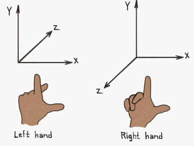

# A Better Camera

I've been putting this off for a while. Implementing a camera isn't specifically related to using WGPU properly, but it's been bugging me so let's do it.

`main.rs` is getting a little crowded, so let's create a `camera.rs` file to put our camera code. The first thing we're going to put in it in is some imports and our `OPENGL_TO_WGPU_MATRIX`.

```rust
use cgmath::*;
use winit::event::*;
use winit::dpi::PhysicalPosition;
use std::time::Duration;
use std::f32::consts::FRAC_PI_2;

#[rustfmt::skip]
pub const OPENGL_TO_WGPU_MATRIX: cgmath::Matrix4<f32> = cgmath::Matrix4::new(
    1.0, 0.0, 0.0, 0.0,
    0.0, 1.0, 0.0, 0.0,
    0.0, 0.0, 0.5, 0.0,
    0.0, 0.0, 0.5, 1.0,
);
```

## The Camera

Next we need create a new `Camera` struct. We're going to be using a FPS style camera, so we'll store the position and the yaw (horizontal rotation), and pitch (vertical rotation). We'll have a `calc_matrix` method to create our view matrix.

```rust
#[derive(Debug)]
pub struct Camera {
    pub position: Point3<f32>,
    yaw: Rad<f32>,
    pitch: Rad<f32>,
}

impl Camera {
    pub fn new<
        V: Into<Point3<f32>>,
        Y: Into<Rad<f32>>,
        P: Into<Rad<f32>>,
    >(
        position: V,
        yaw: Y,
        pitch: P,
    ) -> Self {
        Self {
            position: position.into(),
            yaw: yaw.into(),
            pitch: pitch.into(),
        }
    }

    pub fn calc_matrix(&self) -> Matrix4<f32> {
        Matrix4::look_at_dir(
            self.position,
            Vector3::new(
                self.yaw.0.cos(),
                self.pitch.0.sin(),
                self.yaw.0.sin(),
            ).normalize(),
            Vector3::unit_y(),
        )
    }
}
```

## The Projection

I've decided to split the projection from the camera. The projection only really needs to change if the window resizes, so let's create a `Projection` struct.

```rust
pub struct Projection {
    aspect: f32,
    fovy: Rad<f32>,
    znear: f32,
    zfar: f32,
}

impl Projection {
    pub fn new<F: Into<Rad<f32>>>(
        width: u32,
        height: u32,
        fovy: F,
        znear: f32,
        zfar: f32,
    ) -> Self {
        Self {
            aspect: width as f32 / height as f32,
            fovy: fovy.into(),
            znear,
            zfar,
        }
    }

    pub fn resize(&mut self, width: u32, height: u32) {
        self.aspect = width as f32 / height as f32;
    }

    pub fn calc_matrix(&self) -> Matrix4<f32> {
        OPENGL_TO_WGPU_MATRIX * perspective(self.fovy, self.aspect, self.znear, self.zfar)
    }
}
```

On thing to note: `cgmath` currently returns a right-handed projection matrix from the `perspective` function. This means that the z-axis points out of the screen. If you want the z-axis to be *into* the screen (aka. a left-handed projection matrix), you'll have to code your own.

You can tell the difference between a right-handed coordinate system and a left-handed one by using your hands. Point your thumb to the right. This is the x-axis. Point your pointer finger up. This is the y-axis. Extend your middle finger. This is the z-axis. On your right hand your middle finger should be pointing towards you. On your left hand it should be pointing away.



# The Camera Controller

As our camera is different, so we'll need a new camera controller. Add the following to `camera.rs`.

```rust
#[derive(Debug)]
pub struct CameraController {
    amount_left: f32,
    amount_right: f32,
    amount_forward: f32,
    amount_backward: f32,
    amount_up: f32,
    amount_down: f32,
    rotate_horizontal: f32,
    rotate_vertical: f32,
    scroll: f32,
    speed: f32,
    sensitivity: f32,
}

impl CameraController {
    pub fn new(speed: f32, sensitivity: f32) -> Self {
        Self {
            amount_left: 0.0,
            amount_right: 0.0,
            amount_forward: 0.0,
            amount_backward: 0.0,
            amount_up: 0.0,
            amount_down: 0.0,
            rotate_horizontal: 0.0,
            rotate_vertical: 0.0,
            scroll: 0.0,
            speed,
            sensitivity,
        }
    }

    pub fn process_keyboard(&mut self, key: VirtualKeyCode, state: ElementState) -> bool{
        let amount = if state == ElementState::Pressed { 1.0 } else { 0.0 };
        match key {
            VirtualKeyCode::W | VirtualKeyCode::Up => {
                self.amount_forward = amount;
                true
            }
            VirtualKeyCode::S | VirtualKeyCode::Down => {
                self.amount_backward = amount;
                true
            }
            VirtualKeyCode::A | VirtualKeyCode::Left => {
                self.amount_left = amount;
                true
            }
            VirtualKeyCode::D | VirtualKeyCode::Right => {
                self.amount_right = amount;
                true
            }
            VirtualKeyCode::Space => {
                self.amount_up = amount;
                true
            }
            VirtualKeyCode::LShift => {
                self.amount_down = amount;
                true
            }
            _ => false,
        }
    }

    pub fn process_mouse(&mut self, mouse_dx: f64, mouse_dy: f64) {
        self.rotate_horizontal = mouse_dx as f32;
        self.rotate_vertical = mouse_dy as f32;
    }

    pub fn process_scroll(&mut self, delta: &MouseScrollDelta) {
        self.scroll = -match delta {
            // I'm assuming a line is about 100 pixels
            MouseScrollDelta::LineDelta(_, scroll) => scroll * 100.0,
            MouseScrollDelta::PixelDelta(PhysicalPosition {
                y: scroll,
                ..
            }) => *scroll as f32,
        };
    }

    pub fn update_camera(&mut self, camera: &mut Camera, dt: Duration) {
        let dt = dt.as_secs_f32();

        // Move forward/backward and left/right
        let (yaw_sin, yaw_cos) = camera.yaw.0.sin_cos();
        let forward = Vector3::new(yaw_cos, 0.0, yaw_sin).normalize();
        let right = Vector3::new(-yaw_sin, 0.0, yaw_cos).normalize();
        camera.position += forward * (self.amount_forward - self.amount_backward) * self.speed * dt;
        camera.position += right * (self.amount_right - self.amount_left) * self.speed * dt;

        // Move in/out (aka. "zoom")
        // Note: this isn't an actual zoom. The camera's position
        // changes when zooming. I've added this to make it easier
        // to get closer to an object you want to focus on.
        let (pitch_sin, pitch_cos) = camera.pitch.0.sin_cos();
        let scrollward = Vector3::new(pitch_cos * yaw_cos, pitch_sin, pitch_cos * yaw_sin).normalize();
        camera.position += scrollward * self.scroll * self.speed * self.sensitivity * dt;
        self.scroll = 0.0;

        // Move up/down. Since we don't use roll, we can just
        // modify the y coordinate directly.
        camera.position.y += (self.amount_up - self.amount_down) * self.speed * dt;

        // Rotate
        camera.yaw += Rad(self.rotate_horizontal) * self.sensitivity * dt;
        camera.pitch += Rad(-self.rotate_vertical) * self.sensitivity * dt;

        // If process_mouse isn't called every frame, these values
        // will not get set to zero, and the camera will rotate
        // when moving in a non cardinal direction.
        self.rotate_horizontal = 0.0;
        self.rotate_vertical = 0.0;

        // Keep the camera's angle from going too high/low.
        if camera.pitch < -Rad(FRAC_PI_2) {
            camera.pitch = -Rad(FRAC_PI_2);
        } else if camera.pitch > Rad(FRAC_PI_2) {
            camera.pitch = Rad(FRAC_PI_2);
        }
    }
}
```

## Cleaning up `main.rs`

First things first we need to delete `Camera` and `CameraController` as well as the extra `OPENGL_TO_WGPU_MATRIX` from `main.rs`. Once you've done that import `camera.rs`.

```rust
mod model;
mod texture;
mod camera; // NEW!
```

We need to update `update_view_proj` to use our new `Camera` and `Projection`.

```rust

impl Uniforms {
    // ...

    // UPDATED!
    fn update_view_proj(&mut self, camera: &camera::Camera, projection: &camera::Projection) {
        self.view_position = camera.position.to_homogeneous();
        self.view_proj = projection.calc_matrix() * camera.calc_matrix()
    }
}
```

We need to change our `State` to use our `Camera`, `CameraProjection` and `Projection` as well. We'll also add two fields for later: `last_mouse_pos`, and `mouse_pressed`.

```rust
struct State {
    // ...
    camera: camera::Camera, // UPDATED!
    projection: camera::Projection, // NEW!
    camera_controller: camera::CameraController, // UPDATED!
    // ...
    // NEW!
    last_mouse_pos: PhysicalPosition<f64>,
    mouse_pressed: bool,
}
```

You'll need to import `winit::dpi::PhysicalPosition` if you haven't already.

We need to update `new()` as well.

```rust
impl State {
    async fn new(window: &Window) -> Self {
        // ...

        // UPDATED!
        let camera = camera::Camera::new((0.0, 5.0, 10.0), cgmath::Deg(-90.0), cgmath::Deg(-20.0));
        let projection = camera::Projection::new(sc_desc.width, sc_desc.height, cgmath::Deg(45.0), 0.1, 100.0);
        let camera_controller = camera::CameraController::new(4.0, 0.4);

        // ...

        Self {
            // ...
            camera,
            projection,
            camera_controller,
            // ...
            // NEW!
            last_mouse_pos: (0.0, 0.0).into(),
            mouse_pressed: false,
        }
    }
}
```

We need to change our `projection` in `resize` as well.

```rust
fn resize(&mut self, new_size: winit::dpi::PhysicalSize<u32>) {
    // UPDATED!
    self.projection.resize(new_size.width, new_size.height);
    // ...
}
```

`input` will need to be updated as well.

```rust
// UPDATED!
fn input(&mut self, event: &WindowEvent) -> bool {
    match event {
        WindowEvent::KeyboardInput {
            input: KeyboardInput {
                virtual_keycode: Some(key),
                state,
                ..
            },
            ..
        } => self.camera_controller.process_keyboard(*key, *state),
        WindowEvent::MouseWheel {
            delta,
            ..
        } => {
            self.camera_controller.process_scroll(delta);
            true
        }
        WindowEvent::MouseInput {
            button: MouseButton::Left,
            state,
            ..
        } => {
            self.mouse_pressed = *state == ElementState::Pressed;
            true
        }
        WindowEvent::CursorMoved {
            position,
            ..
        } => {
            let mouse_dx = position.x - self.last_mouse_pos.x;
            let mouse_dy = position.y - self.last_mouse_pos.y;
            self.last_mouse_pos = *position;
            if self.mouse_pressed {
                self.camera_controller.process_mouse(mouse_dx, mouse_dy);
            }
            true
        }
        _ => false,
    }
}
```

The `update` function requires a bit more explanation. The `update_camera` function on the `CameraController` has a parameter `dt: Duration` which is the delta time or time between frames. This is to help smooth out the camera movement so that it's not locked be the framerate. Currently we aren't calculating `dt`, so I decided to pass it into `update` as a parameter.

```rust
fn update(&mut self, dt: std::time::Duration) {
    // UPDATED!
    self.camera_controller.update_camera(&mut self.camera, dt);
    self.uniforms.update_view_proj(&self.camera, &self.projection);

    // ..
}
```

While we're at it, let's use `dt` for the light's rotation as well.

```rust
self.light.position =
    cgmath::Quaternion::from_axis_angle((0.0, 1.0, 0.0).into(), cgmath::Deg(60.0 * dt.as_secs_f32()))
        * old_position; // UPDATED!
```

We still need to calculate `dt`. Let's do that in the `main` function. 

```rust
fn main() {
    // ..
    let mut state = block_on(State::new(&window));
    let mut last_render_time = std::time::Instant::now();
    event_loop.run(move |event, _, control_flow| {
        *control_flow = ControlFlow::Poll;
        match event {
            // ...
            // UPDATED!
            Event::RedrawRequested(_) => {
                let now = std::time::Instant::now();
                let dt = now - last_render_time;
                last_render_time = now;
                state.update(dt);
                state.render();
            }
            _ => {}
        }
    });
}
```

With that we should be able to move our camera wherever we want.


<AutoGithubLink/>
