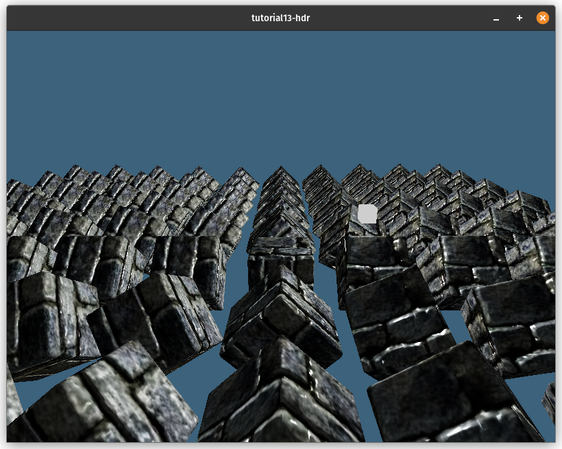
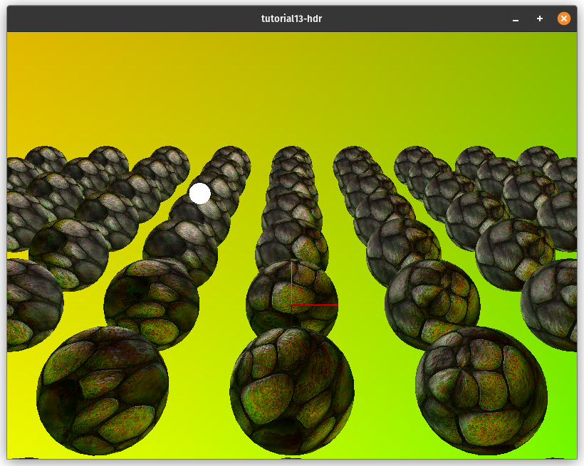
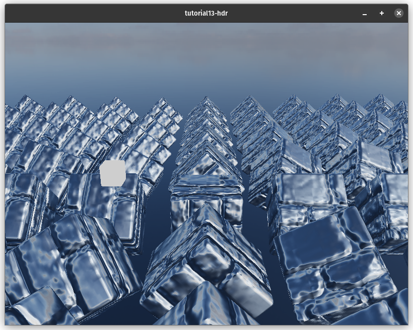
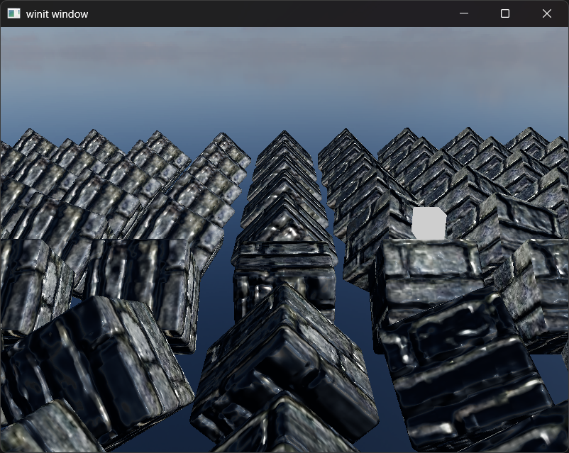

# High Dynamic Range Rendering

Up to this point, we've been using the sRGB colorspace to render our scene. While this is fine, it limits what we can do with our lighting. We are using `TextureFormat::Bgra8UnormSrgb` (on most systems) for our surface texture. This means we have 8 bits for each red, green, blue and alpha channel. While the channels are stored as integers between 0 and 255 inclusively, they get converted to and from floating point values between 0.0 and 1.0. The TL:DR of this is that using 8-bit textures, we only get 256 possible values in each channel.

The kicker with this is most of the precision gets used to represent darker values of the scene. This means that bright objects like light bulbs have the same value as exceedingly bright objects like the sun. This inaccuracy makes realistic lighting difficult to do right. Because of this, we are going to switch our rendering system to use high dynamic range in order to give our scene more flexibility and enable us to leverage more advanced techniques such as Physically Based Rendering.

## What is High Dynamic Range?

In layman's terms, a High Dynamic Range texture is a texture with more bits per pixel. In addition to this, HDR textures are stored as floating point values instead of integer values. This means that the texture can have brightness values greater than 1.0, meaning you can have a dynamic range of brighter objects.

## Switching to HDR

As of writing, wgpu doesn't allow us to use a floating point format such as `TextureFormat::Rgba16Float` as the surface texture format (not all monitors support that anyway), so we will have to render our scene in an HDR format, then convert the values to a supported format, such as `TextureFormat::Bgra8UnormSrgb` using a technique called tonemapping.

<div class="note">

There are some talks about implementing HDR surface texture support in wgpu. Here is a GitHub issue if you want to contribute to that effort: https://github.com/gfx-rs/wgpu/issues/2920

</div>

Before we do that, though, we need to switch to using an HDR texture for rendering.

To start, we'll create a file called `hdr.rs` and put some code in it:

```rust
use wgpu::Operations;

use crate::{create_render_pipeline, texture};

/// Owns the render texture and controls tonemapping
pub struct HdrPipeline {
    pipeline: wgpu::RenderPipeline,
    bind_group: wgpu::BindGroup,
    texture: texture::Texture,
    width: u32,
    height: u32,
    format: wgpu::TextureFormat,
    layout: wgpu::BindGroupLayout,
}

impl HdrPipeline {
    pub fn new(device: &wgpu::Device, config: &wgpu::SurfaceConfiguration) -> Self {
        let width = config.width;
        let height = config.height;

        // We could use `Rgba32Float`, but that requires some extra
        // features to be enabled for rendering.
        let format = wgpu::TextureFormat::Rgba16Float;

        let texture = texture::Texture::create_2d_texture(
            device,
            width,
            height,
            format,
            wgpu::TextureUsages::TEXTURE_BINDING | wgpu::TextureUsages::RENDER_ATTACHMENT,
            wgpu::FilterMode::Nearest,
            Some("Hdr::texture"),
        );

        let layout = device.create_bind_group_layout(&wgpu::BindGroupLayoutDescriptor {
            label: Some("Hdr::layout"),
            entries: &[
                // This is the HDR texture
                wgpu::BindGroupLayoutEntry {
                    binding: 0,
                    visibility: wgpu::ShaderStages::FRAGMENT,
                    ty: wgpu::BindingType::Texture {
                        sample_type: wgpu::TextureSampleType::Float { filterable: true },
                        view_dimension: wgpu::TextureViewDimension::D2,
                        multisampled: false,
                    },
                    count: None,
                },
                wgpu::BindGroupLayoutEntry {
                    binding: 1,
                    visibility: wgpu::ShaderStages::FRAGMENT,
                    ty: wgpu::BindingType::Sampler(wgpu::SamplerBindingType::Filtering),
                    count: None,
                },
            ],
        });
        let bind_group = device.create_bind_group(&wgpu::BindGroupDescriptor {
            label: Some("Hdr::bind_group"),
            layout: &layout,
            entries: &[
                wgpu::BindGroupEntry {
                    binding: 0,
                    resource: wgpu::BindingResource::TextureView(&texture.view),
                },
                wgpu::BindGroupEntry {
                    binding: 1,
                    resource: wgpu::BindingResource::Sampler(&texture.sampler),
                },
            ],
        });

        // We'll cover the shader next
        let shader = wgpu::include_wgsl!("hdr.wgsl");
        let pipeline_layout = device.create_pipeline_layout(&wgpu::PipelineLayoutDescriptor {
            label: None,
            bind_group_layouts: &[&layout],
            push_constant_ranges: &[],
        });

        let pipeline = create_render_pipeline(
            device,
            &pipeline_layout,
            config.format.add_srgb_suffix(),
            None,
            // We'll use some math to generate the vertex data in
            // the shader, so we don't need any vertex buffers
            &[],
            wgpu::PrimitiveTopology::TriangleList,
            shader,
        );

        Self {
            pipeline,
            bind_group,
            layout,
            texture,
            width,
            height,
            format,
        }
    }

    /// Resize the HDR texture
    pub fn resize(&mut self, device: &wgpu::Device, width: u32, height: u32) {
        self.texture = texture::Texture::create_2d_texture(
            device,
            width,
            height,
            wgpu::TextureFormat::Rgba16Float,
            wgpu::TextureUsages::TEXTURE_BINDING | wgpu::TextureUsages::RENDER_ATTACHMENT,
            wgpu::FilterMode::Nearest,
            Some("Hdr::texture"),
        );
        self.bind_group = device.create_bind_group(&wgpu::BindGroupDescriptor {
            label: Some("Hdr::bind_group"),
            layout: &self.layout,
            entries: &[
                wgpu::BindGroupEntry {
                    binding: 0,
                    resource: wgpu::BindingResource::TextureView(&self.texture.view),
                },
                wgpu::BindGroupEntry {
                    binding: 1,
                    resource: wgpu::BindingResource::Sampler(&self.texture.sampler),
                },
            ],
        });
        self.width = width;
        self.height = height;
    }

    /// Exposes the HDR texture
    pub fn view(&self) -> &wgpu::TextureView {
        &self.texture.view
    }

    /// The format of the HDR texture
    pub fn format(&self) -> wgpu::TextureFormat {
        self.format
    }

    /// This renders the internal HDR texture to the [TextureView]
    /// supplied as parameter.
    pub fn process(&self, encoder: &mut wgpu::CommandEncoder, output: &wgpu::TextureView) {
        let mut pass = encoder.begin_render_pass(&wgpu::RenderPassDescriptor {
            label: Some("Hdr::process"),
            color_attachments: &[Some(wgpu::RenderPassColorAttachment {
                view: &output,
                resolve_target: None,
                ops: Operations {
                    load: wgpu::LoadOp::Load,
                    store: wgpu::StoreOp::Store,
                },
            })],
            depth_stencil_attachment: None,
        });
        pass.set_pipeline(&self.pipeline);
        pass.set_bind_group(0, &self.bind_group, &[]);
        pass.draw(0..3, 0..1);
    }
}
```

You may have noticed that we added a new parameter to `create_render_pipeline`. Here a the changes to that function:

```rust
fn create_render_pipeline(
    device: &wgpu::Device,
    layout: &wgpu::PipelineLayout,
    color_format: wgpu::TextureFormat,
    depth_format: Option<wgpu::TextureFormat>,
    vertex_layouts: &[wgpu::VertexBufferLayout],
    topology: wgpu::PrimitiveTopology, // NEW!
    shader: wgpu::ShaderModuleDescriptor,
) -> wgpu::RenderPipeline {
    let shader = device.create_shader_module(shader);

    device.create_render_pipeline(&wgpu::RenderPipelineDescriptor {
        // ...
        primitive: wgpu::PrimitiveState {
            topology, // NEW!
            // ...
        },
        // ...
    })
}
```

## Tonemapping

The process of tonemapping is taking an HDR image and converting it to a Standard Dynamic Range (SDR), which is usually sRGB. The exact tonemapping curve you use is ultimately up to your artistic needs, but for this tutorial, we'll use a popular one known as the Academy Color Encoding System or ACES used throughout the game industry as well as the film industry.

With that, let's jump into the the shader. Create a file called `hdr.wgsl` and add the following code:

```wgsl
// Maps HDR values to linear values
// Based on http://www.oscars.org/science-technology/sci-tech-projects/aces
fn aces_tone_map(hdr: vec3<f32>) -> vec3<f32> {
    let m1 = mat3x3(
        0.59719, 0.07600, 0.02840,
        0.35458, 0.90834, 0.13383,
        0.04823, 0.01566, 0.83777,
    );
    let m2 = mat3x3(
        1.60475, -0.10208, -0.00327,
        -0.53108,  1.10813, -0.07276,
        -0.07367, -0.00605,  1.07602,
    );
    let v = m1 * hdr;
    let a = v * (v + 0.0245786) - 0.000090537;
    let b = v * (0.983729 * v + 0.4329510) + 0.238081;
    return clamp(m2 * (a / b), vec3(0.0), vec3(1.0));
}

struct VertexOutput {
    @location(0) uv: vec2<f32>,
    @builtin(position) clip_position: vec4<f32>,
};

@vertex
fn vs_main(
    @builtin(vertex_index) vi: u32,
) -> VertexOutput {
    var out: VertexOutput;
    // Generate a triangle that covers the whole screen
    out.uv = vec2<f32>(
        f32((vi << 1u) & 2u),
        f32(vi & 2u),
    );
    out.clip_position = vec4<f32>(out.uv * 2.0 - 1.0, 0.0, 1.0);
    // We need to invert the y coordinate so the image
    // is not upside down
    out.uv.y = 1.0 - out.uv.y;
    return out;
}

@group(0)
@binding(0)
var hdr_image: texture_2d<f32>;

@group(0)
@binding(1)
var hdr_sampler: sampler;

@fragment
fn fs_main(vs: VertexOutput) -> @location(0) vec4<f32> {
    let hdr = textureSample(hdr_image, hdr_sampler, vs.uv);
    let sdr = aces_tone_map(hdr.rgb);
    return vec4(sdr, hdr.a);
}
```

With those in place, we can start using our HDR texture in our core render pipeline. First, we need to add the new `HdrPipeline` to `State`:

```rust
// lib.rs

mod hdr; // NEW!

// ...

struct State {
    // ...
    // NEW!
    hdr: hdr::HdrPipeline,
}

impl<'a> State<'a> {
    pub fn new(window: Window) -> anyhow::Result<Self> {
        // ...
        // NEW!
        let hdr = hdr::HdrPipeline::new(&device, &config);

        // ...

        Self {
            // ...
            hdr, // NEW!
        }
    }
}
```

Then, when we resize the window, we need to call `resize()` on our `HdrPipeline`:

```rust
fn resize(&mut self, new_size: winit::dpi::PhysicalSize<u32>) {
    // UPDATED!
    if new_size.width > 0 && new_size.height > 0 {
        // ...
        self.hdr
            .resize(&self.device, new_size.width, new_size.height);
        // ...
    }
}
```

Next, in `render()`, we need to switch the `RenderPass` to use our HDR texture instead of the surface texture:

```rust
// render()
let mut render_pass = encoder.begin_render_pass(&wgpu::RenderPassDescriptor {
    label: Some("Render Pass"),
    color_attachments: &[Some(wgpu::RenderPassColorAttachment {
        view: self.hdr.view(), // UPDATED!
        resolve_target: None,
        ops: wgpu::Operations {
            load: wgpu::LoadOp::Clear(wgpu::Color {
                r: 0.1,
                g: 0.2,
                b: 0.3,
                a: 1.0,
            }),
            store: wgpu::StoreOp::Store,
        },
    })],
    depth_stencil_attachment: Some(
        // ...
    ),
});
```

Finally, after we draw all the objects in the frame, we can run our tonemapper with the surface texture as the output:

```rust
// NEW!
// Apply tonemapping
self.hdr.process(&mut encoder, &view);
```

It's a pretty easy switch. Here's the image before using HDR:


Here's what it looks like after implementing HDR:



## Loading HDR textures

Now that we have an HDR render buffer, we can start leveraging HDR textures to their fullest. One of the primary uses for HDR textures is to store lighting information in the form of an environment map.

This map can be used to light objects, display reflections and also to make a skybox. We're going to create a skybox using HDR texture, but first, we need to talk about how environment maps are stored.

## Equirectangular textures

An equirectangular texture is a texture where a sphere is stretched across a rectangular surface using what's known as an equirectangular projection. This map of the Earth is an example of this projection.


This projection maps the latitude values of the sphere to the horizontal coordinates of the texture. The longitude values get mapped to the vertical coordinates. This means that the vertical middle of the texture is the equator (0° longitude) of the sphere, the horizontal middle is the prime meridian (0° latitude) of the sphere, the left and right edges of the texture are the anti-meridian (+180°/-180° latitude) the top and bottom edges of the texture are the north pole (90° longitude) and south pole (-90° longitude), respectively.


This simple projection is easy to use, making it one of the most popular projections for storing spherical textures. You can see the particular environment map we are going to use below.


## Cube Maps

While we can technically use an equirectangular map directly, as long as we do some math to figure out the correct coordinates, it is a lot more convenient to convert our environment map into a cube map.

<div class="info">

A cube map is a special kind of texture that has six layers. Each layer corresponds to a different face of an imaginary cube that is aligned to the X, Y and Z axes. The layers are stored in the following order: +X, -X, +Y, -Y, +Z, -Z. 

</div>

To prepare to store the cube texture, we are going to create a new struct called `CubeTexture` in `texture.rs`.

```rust
pub struct CubeTexture {
    texture: wgpu::Texture,
    sampler: wgpu::Sampler,
    view: wgpu::TextureView,
}

impl CubeTexture {
    pub fn create_2d(
        device: &wgpu::Device,
        width: u32,
        height: u32,
        format: wgpu::TextureFormat,
        mip_level_count: u32,
        usage: wgpu::TextureUsages,
        mag_filter: wgpu::FilterMode,
        label: Option<&str>,
    ) -> Self {
        let texture = device.create_texture(&wgpu::TextureDescriptor {
            label,
            size: wgpu::Extent3d {
                width,
                height,
                // A cube has 6 sides, so we need 6 layers
                depth_or_array_layers: 6,
            },
            mip_level_count,
            sample_count: 1,
            dimension: wgpu::TextureDimension::D2,
            format,
            usage,
            view_formats: &[],
        });

        let view = texture.create_view(&wgpu::TextureViewDescriptor {
            label,
            dimension: Some(wgpu::TextureViewDimension::Cube),
            array_layer_count: Some(6),
            ..Default::default()
        });

        let sampler = device.create_sampler(&wgpu::SamplerDescriptor {
            label,
            address_mode_u: wgpu::AddressMode::ClampToEdge,
            address_mode_v: wgpu::AddressMode::ClampToEdge,
            address_mode_w: wgpu::AddressMode::ClampToEdge,
            mag_filter,
            min_filter: wgpu::FilterMode::Nearest,
            mipmap_filter: wgpu::FilterMode::Nearest,
            ..Default::default()
        });

        Self {
            texture,
            sampler,
            view,
        }
    }

    pub fn texture(&self) -> &wgpu::Texture { &self.texture }
    
    pub fn view(&self) -> &wgpu::TextureView { &self.view }

    pub fn sampler(&self) -> &wgpu::Sampler { &self.sampler }

}
```

With this, we can now write the code to load the HDR into a cube texture.

## Compute shaders

Up to this point, we've been exclusively using render pipelines, but I felt this was a good time to introduce the compute pipelines and, by extension, compute shaders. Compute pipelines are a lot easier to set up. All you need is to tell the pipeline what resources you want to use, what code you want to run, and how many threads you'd like the GPU to use when running your code. We're going to use a compute shader to give each pixel in our cube texture a color from the HDR image.

Before we can use compute shaders, we need to enable them in wgpu. We can do that by changing the line where we specify what features we want to use. In `lib.rs`, change the code where we request a device:

```rust
let (device, queue) = adapter
    .request_device(
        &wgpu::DeviceDescriptor {
            label: None,
            // UPDATED!
            features: wgpu::Features::all_webgpu_mask(),
            // UPDATED!
            required_limits: wgpu::Limits::downlevel_defaults(),
        },
        None, // Trace path
    )
    .await
    .unwrap();
```

<div class="warn">

You may have noted that we have switched from `downlevel_webgl2_defaults()` to `downlevel_defaults()`. This means that we are dropping support for WebGL2. The reason for this is that WebGL2 doesn't support the compute shaders. WebGPU was built with compute shaders in mind. As of writing, the only browser that supports WebGPU is Chrome and some experimental browsers such as Firefox Nightly.

Consequently, we are going to remove the WebGL feature from `Cargo.toml`. This line in particular:

```toml
wgpu = { version = "24.0", features = ["webgl"]}
```

</div>

Now that we've told wgpu that we want to use the compute shaders, let's create a struct in `resource.rs` that we'll use to load the HDR image into our cube map.

```rust
pub struct HdrLoader {
    texture_format: wgpu::TextureFormat,
    equirect_layout: wgpu::BindGroupLayout,
    equirect_to_cubemap: wgpu::ComputePipeline,
}

impl HdrLoader {
    pub fn new(device: &wgpu::Device) -> Self {
        let module = device.create_shader_module(wgpu::include_wgsl!("equirectangular.wgsl"));
        let texture_format = wgpu::TextureFormat::Rgba32Float;
        let equirect_layout = device.create_bind_group_layout(&wgpu::BindGroupLayoutDescriptor {
            label: Some("HdrLoader::equirect_layout"),
            entries: &[
                wgpu::BindGroupLayoutEntry {
                    binding: 0,
                    visibility: wgpu::ShaderStages::COMPUTE,
                    ty: wgpu::BindingType::Texture {
                        sample_type: wgpu::TextureSampleType::Float { filterable: false },
                        view_dimension: wgpu::TextureViewDimension::D2,
                        multisampled: false,
                    },
                    count: None,
                },
                wgpu::BindGroupLayoutEntry {
                    binding: 1,
                    visibility: wgpu::ShaderStages::COMPUTE,
                    ty: wgpu::BindingType::StorageTexture {
                        access: wgpu::StorageTextureAccess::WriteOnly,
                        format: texture_format,
                        view_dimension: wgpu::TextureViewDimension::D2Array,
                    },
                    count: None,
                },
            ],
        });

        let pipeline_layout = device.create_pipeline_layout(&wgpu::PipelineLayoutDescriptor {
            label: None,
            bind_group_layouts: &[&equirect_layout],
            push_constant_ranges: &[],
        });

        let equirect_to_cubemap =
            device.create_compute_pipeline(&wgpu::ComputePipelineDescriptor {
                label: Some("equirect_to_cubemap"),
                layout: Some(&pipeline_layout),
                module: &module,
                entry_point: Some("compute_equirect_to_cubemap"),
                compilation_options: Default::default(),
                cache: None,
            });

        Self {
            equirect_to_cubemap,
            texture_format,
            equirect_layout,
        }
    }

    pub fn from_equirectangular_bytes(
        &self,
        device: &wgpu::Device,
        queue: &wgpu::Queue,
        data: &[u8],
        dst_size: u32,
        label: Option<&str>,
    ) -> anyhow::Result<texture::CubeTexture> {
        let hdr_decoder = HdrDecoder::new(Cursor::new(data))?;
        let meta = hdr_decoder.metadata();
        
        #[cfg(not(target_arch="wasm32"))]
        let pixels = {
            let mut pixels = vec![[0.0, 0.0, 0.0, 0.0]; meta.width as usize * meta.height as usize];
            hdr_decoder.read_image_transform(
                |pix| {
                    let rgb = pix.to_hdr();
                    [rgb.0[0], rgb.0[1], rgb.0[2], 1.0f32]
                },
                &mut pixels[..],
            )?;
            pixels
        };
        #[cfg(target_arch="wasm32")]
        let pixels = hdr_decoder.read_image_native()?
            .into_iter()
            .map(|pix| {
                let rgb = pix.to_hdr();
                [rgb.0[0], rgb.0[1], rgb.0[2], 1.0f32]
            })
            .collect::<Vec<_>>();

        let src = texture::Texture::create_2d_texture(
            device,
            meta.width,
            meta.height,
            self.texture_format,
            wgpu::TextureUsages::TEXTURE_BINDING | wgpu::TextureUsages::COPY_DST,
            wgpu::FilterMode::Linear,
            None,
        );

        queue.write_texture(
            wgpu::TexelCopyTextureInfo {
                texture: &src.texture,
                mip_level: 0,
                origin: wgpu::Origin3d::ZERO,
                aspect: wgpu::TextureAspect::All,
            },
            &bytemuck::cast_slice(&pixels),
            wgpu::TexelCopyBufferLayout {
                offset: 0,
                bytes_per_row: Some(src.size.width * std::mem::size_of::<[f32; 4]>() as u32),
                rows_per_image: Some(src.size.height),
            },
            src.size,
        );

        let dst = texture::CubeTexture::create_2d(
            device,
            dst_size,
            dst_size,
            self.texture_format,
            1,
            // We are going to write to `dst` texture so we
            // need to use a `STORAGE_BINDING`.
            wgpu::TextureUsages::STORAGE_BINDING
                | wgpu::TextureUsages::TEXTURE_BINDING,
            wgpu::FilterMode::Nearest,
            label,
        );

        let dst_view = dst.texture().create_view(&wgpu::TextureViewDescriptor {
            label,
            // Normally, you'd use `TextureViewDimension::Cube`
            // for a cube texture, but we can't use that
            // view dimension with a `STORAGE_BINDING`.
            // We need to access the cube texture layers
            // directly.
            dimension: Some(wgpu::TextureViewDimension::D2Array),
            ..Default::default()
        });

        let bind_group = device.create_bind_group(&wgpu::BindGroupDescriptor {
            label,
            layout: &self.equirect_layout,
            entries: &[
                wgpu::BindGroupEntry {
                    binding: 0,
                    resource: wgpu::BindingResource::TextureView(&src.view),
                },
                wgpu::BindGroupEntry {
                    binding: 1,
                    resource: wgpu::BindingResource::TextureView(&dst_view),
                },
            ],
        });

        let mut encoder = device.create_command_encoder(&Default::default());
        let mut pass = encoder.begin_compute_pass(&wgpu::ComputePassDescriptor { label });

        let num_workgroups = (dst_size + 15) / 16;
        pass.set_pipeline(&self.equirect_to_cubemap);
        pass.set_bind_group(0, &bind_group, &[]);
        pass.dispatch_workgroups(num_workgroups, num_workgroups, 6);

        drop(pass);

        queue.submit([encoder.finish()]);

        Ok(dst)
    }
}
```

The `dispatch_workgroups` call tells the GPU to run our code in batches called workgroups. Each workgroup has a number of worker threads called invocations that run the code in parallel. Workgroups are organized as a 3d grid with the dimensions we pass to `dispatch_workgroups`.

In this example, we have a workgroup grid divided into 16x16 chunks and storing the layer in the z dimension.

## The compute shader

Now, let's write a compute shader that will convert our equirectangular texture to a cube texture. Create a file called `equirectangular.wgsl`. We're going to break it down chunk by chunk.

```wgsl
const PI: f32 = 3.1415926535897932384626433832795;

struct Face {
    forward: vec3<f32>,
    up: vec3<f32>,
    right: vec3<f32>,
}
```

Two things here:

1. WGSL doesn't have a built-in for PI, so we need to specify it ourselves.
2. each face of the cube map has an orientation to it, so we need to store that.

```wgsl
@group(0)
@binding(0)
var src: texture_2d<f32>;

@group(0)
@binding(1)
var dst: texture_storage_2d_array<rgba32float, write>;
```

Here, we have the only two bindings we need. The equirectangular `src` texture and our `dst` cube texture. Some things to note about `dst`:

1. While `dst` is a cube texture, it's stored as an array of 2d textures.
2. The type of binding we're using here is a storage texture. An array storage texture, to be precise. This is a unique binding only available to compute shaders. It allows us to write directly to the texture.
3. When using a storage texture binding, we need to specify the format of the texture. If you try to bind a texture with a different format, wgpu will panic.

```wgsl
@compute
@workgroup_size(16, 16, 1)
fn compute_equirect_to_cubemap(
    @builtin(global_invocation_id)
    gid: vec3<u32>,
) {
    // If texture size is not divisible by 32, we
    // need to make sure we don't try to write to
    // pixels that don't exist.
    if gid.x >= u32(textureDimensions(dst).x) {
        return;
    }

    var FACES: array<Face, 6> = array(
        // FACES +X
        Face(
            vec3(1.0, 0.0, 0.0),  // forward
            vec3(0.0, 1.0, 0.0),  // up
            vec3(0.0, 0.0, -1.0), // right
        ),
        // FACES -X
        Face (
            vec3(-1.0, 0.0, 0.0),
            vec3(0.0, 1.0, 0.0),
            vec3(0.0, 0.0, 1.0),
        ),
        // FACES +Y
        Face (
            vec3(0.0, -1.0, 0.0),
            vec3(0.0, 0.0, 1.0),
            vec3(1.0, 0.0, 0.0),
        ),
        // FACES -Y
        Face (
            vec3(0.0, 1.0, 0.0),
            vec3(0.0, 0.0, -1.0),
            vec3(1.0, 0.0, 0.0),
        ),
        // FACES +Z
        Face (
            vec3(0.0, 0.0, 1.0),
            vec3(0.0, 1.0, 0.0),
            vec3(1.0, 0.0, 0.0),
        ),
        // FACES -Z
        Face (
            vec3(0.0, 0.0, -1.0),
            vec3(0.0, 1.0, 0.0),
            vec3(-1.0, 0.0, 0.0),
        ),
    );

    // Get texture coords relative to cubemap face
    let dst_dimensions = vec2<f32>(textureDimensions(dst));
    let cube_uv = vec2<f32>(gid.xy) / dst_dimensions * 2.0 - 1.0;

    // Get spherical coordinate from cube_uv
    let face = FACES[gid.z];
    let spherical = normalize(face.forward + face.right * cube_uv.x + face.up * cube_uv.y);

    // Get coordinate on the equirectangular texture
    let inv_atan = vec2(0.1591, 0.3183);
    let eq_uv = vec2(atan2(spherical.z, spherical.x), asin(spherical.y)) * inv_atan + 0.5;
    let eq_pixel = vec2<i32>(eq_uv * vec2<f32>(textureDimensions(src)));

    // We use textureLoad() as textureSample() is not allowed in compute shaders
    var sample = textureLoad(src, eq_pixel, 0);

    textureStore(dst, gid.xy, gid.z, sample);
}
```

While I commented in the previous code, there are some things I want to go over that wouldn't fit well in a comment.

The `workgroup_size` decorator tells the dimensions of the workgroup's local grid of invocations. Because we are dispatching one workgroup for every pixel in the texture, we have each workgroup be a 16x16x1 grid. This means that each workgroup can have 256 threads to work with.

<div class="warn">

For WebGPU, each workgroup can only have a max of 256 threads (also called invocations).

</div>

With this, we can load the environment map in the `new()` function:

```rust
let hdr_loader = resources::HdrLoader::new(&device);
let sky_bytes = resources::load_binary("pure-sky.hdr").await?;
let sky_texture = hdr_loader.from_equirectangular_bytes(
    &device,
    &queue,
    &sky_bytes,
    1080,
    Some("Sky Texture"),
)?;
```

## Skybox

Now that we have an environment map to render let's use it to make our skybox. There are different ways to render a skybox. A standard way is to render a cube and map the environment map on it. While that method works, it can have some artifacts in the corners and edges where the cube's faces meet.

Instead, we are going to render to the entire screen, compute the view direction from each pixel and use that to sample the texture. First, we need to create a bindgroup for the environment map so that we can use it for rendering. Add the following to `new()`:

```rust
let environment_layout =
    device.create_bind_group_layout(&wgpu::BindGroupLayoutDescriptor {
        label: Some("environment_layout"),
        entries: &[
            wgpu::BindGroupLayoutEntry {
                binding: 0,
                visibility: wgpu::ShaderStages::FRAGMENT,
                ty: wgpu::BindingType::Texture {
                    sample_type: wgpu::TextureSampleType::Float { filterable: false },
                    view_dimension: wgpu::TextureViewDimension::Cube,
                    multisampled: false,
                },
                count: None,
            },
            wgpu::BindGroupLayoutEntry {
                binding: 1,
                visibility: wgpu::ShaderStages::FRAGMENT,
                ty: wgpu::BindingType::Sampler(wgpu::SamplerBindingType::NonFiltering),
                count: None,
            },
        ],
    });

let environment_bind_group = device.create_bind_group(&wgpu::BindGroupDescriptor {
    label: Some("environment_bind_group"),
    layout: &environment_layout,
    entries: &[
        wgpu::BindGroupEntry {
            binding: 0,
            resource: wgpu::BindingResource::TextureView(&sky_texture.view()),
        },
        wgpu::BindGroupEntry {
            binding: 1,
            resource: wgpu::BindingResource::Sampler(sky_texture.sampler()),
        },
    ],
});
```

Now that we have the bindgroup, we need a render pipeline to render the skybox.

```rust
// NEW!
let sky_pipeline = {
    let layout = device.create_pipeline_layout(&wgpu::PipelineLayoutDescriptor {
        label: Some("Sky Pipeline Layout"),
        bind_group_layouts: &[&camera_bind_group_layout, &environment_layout],
        push_constant_ranges: &[],
    });
    let shader = wgpu::include_wgsl!("sky.wgsl");
    create_render_pipeline(
        &device,
        &layout,
        hdr.format(),
        Some(texture::Texture::DEPTH_FORMAT),
        &[],
        wgpu::PrimitiveTopology::TriangleList,
        shader,
    )
};
```

One thing to note here. We added the primitive format to `create_render_pipeline()`. Also, we changed the depth compare function to `CompareFunction::LessEqual` (we'll discuss why when we go over the sky shader). Here are the changes to that:

```rust
fn create_render_pipeline(
    device: &wgpu::Device,
    layout: &wgpu::PipelineLayout,
    color_format: wgpu::TextureFormat,
    depth_format: Option<wgpu::TextureFormat>,
    vertex_layouts: &[wgpu::VertexBufferLayout],
    topology: wgpu::PrimitiveTopology, // NEW!
    shader: wgpu::ShaderModuleDescriptor,
) -> wgpu::RenderPipeline {
    let shader = device.create_shader_module(shader);

    device.create_render_pipeline(&wgpu::RenderPipelineDescriptor {
        // ...
        primitive: wgpu::PrimitiveState {
            topology, // NEW!
            // ...
        },
        depth_stencil: depth_format.map(|format| wgpu::DepthStencilState {
            format,
            depth_write_enabled: true,
            depth_compare: wgpu::CompareFunction::LessEqual, // UDPATED!
            stencil: wgpu::StencilState::default(),
            bias: wgpu::DepthBiasState::default(),
        }),
        // ...
    })
}
```

Don't forget to add the new bindgroup and pipeline to the to `State`.

```rust
struct State {
    // ...
    // NEW!
    hdr: hdr::HdrPipeline,
    environment_bind_group: wgpu::BindGroup,
    sky_pipeline: wgpu::RenderPipeline,
}

// ...
impl<'a> State<'a> {
    async fn new(window: &'a Window) -> anyhow::Result<State<'a>> {
        // ...
        Ok(Self {
            // ...
            // NEW!
            hdr,
            environment_bind_group,
            sky_pipeline,
            debug,
        })
    }
}
```

Now let's cover `sky.wgsl`.

```wgsl
struct Camera {
    view_pos: vec4<f32>,
    view: mat4x4<f32>,
    view_proj: mat4x4<f32>,
    inv_proj: mat4x4<f32>,
    inv_view: mat4x4<f32>,
}
@group(0) @binding(0)
var<uniform> camera: Camera;

@group(1)
@binding(0)
var env_map: texture_cube<f32>;
@group(1)
@binding(1)
var env_sampler: sampler;

struct VertexOutput {
    @builtin(position) frag_position: vec4<f32>,
    @location(0) clip_position: vec4<f32>,
}

@vertex
fn vs_main(
    @builtin(vertex_index) id: u32,
) -> VertexOutput {
    let uv = vec2<f32>(vec2<u32>(
        id & 1u,
        (id >> 1u) & 1u,
    ));
    var out: VertexOutput;
    // out.clip_position = vec4(uv * vec2(4.0, -4.0) + vec2(-1.0, 1.0), 0.0, 1.0);
    out.clip_position = vec4(uv * 4.0 - 1.0, 1.0, 1.0);
    out.frag_position = vec4(uv * 4.0 - 1.0, 1.0, 1.0);
    return out;
}

@fragment
fn fs_main(in: VertexOutput) -> @location(0) vec4<f32> {
    let view_pos_homogeneous = camera.inv_proj * in.clip_position;
    let view_ray_direction = view_pos_homogeneous.xyz / view_pos_homogeneous.w;
    var ray_direction = normalize((camera.inv_view * vec4(view_ray_direction, 0.0)).xyz);

    let sample = textureSample(env_map, env_sampler, ray_direction);
    return sample;
}
```

Let's break this down:

1. We create a triangle twice the size of the screen.
2. In the fragment shader, we get the view direction from the clip position. We use the inverse projection matrix to convert the clip coordinates to view direction. Then, we use the inverse view matrix to get the direction into world space, as that's what we need to sample the sky box correctly.
3. We then sample the sky texture with the view direction.

<!--  -->

For this to work, we need to change our camera uniforms a bit. We need to add the inverse view matrix and inverse projection matrix to `CameraUniform` struct.

```rust
#[repr(C)]
#[derive(Copy, Clone, bytemuck::Pod, bytemuck::Zeroable)]
struct CameraUniform {
    view_position: [f32; 4],
    view: [[f32; 4]; 4], // NEW!
    view_proj: [[f32; 4]; 4],
    inv_proj: [[f32; 4]; 4], // NEW!
    inv_view: [[f32; 4]; 4], // NEW!
}

impl CameraUniform {
    fn new() -> Self {
        Self {
            view_position: [0.0; 4],
            view: cgmath::Matrix4::identity().into(),
            view_proj: cgmath::Matrix4::identity().into(),
            inv_proj: cgmath::Matrix4::identity().into(), // NEW!
            inv_view: cgmath::Matrix4::identity().into(), // NEW!
        }
    }

    // UPDATED!
    fn update_view_proj(&mut self, camera: &camera::Camera, projection: &camera::Projection) {
        self.view_position = camera.position.to_homogeneous().into();
        let proj = projection.calc_matrix();
        let view = camera.calc_matrix();
        let view_proj = proj * view;
        self.view = view.into();
        self.view_proj = view_proj.into();
        self.inv_proj = proj.invert().unwrap().into();
        self.inv_view = view.transpose().into();
    }
}
```

Make sure to change the `Camera` definition in `shader.wgsl`, and `light.wgsl`. Just as a reminder, it looks like this:

```wgsl
struct Camera {
    view_pos: vec4<f32>,
    view: mat4x4<f32>,
    view_proj: mat4x4<f32>,
    inv_proj: mat4x4<f32>,
    inv_view: mat4x4<f32>,
}
var<uniform> camera: Camera;
```

<div class="info">

You may have noticed that we removed the `OPENGL_TO_WGPU_MATRIX`. The reason for this is that it was messing with the projection of the skybox.


Technically, it wasn't needed, so I felt fine removing it.

</div>

## Reflections

Now that we have a sky, we can mess around with using it for lighting. This won't be physically accurate (we'll look into that later). That being said, we have the environment map, so we might as well use it.

In order to do that though, we need to change our shader to do lighting in world space instead of tangent space because our environment map is in world space. Because there are a lot of changes I'll post the whole shader here:

```wgsl
// Vertex shader

struct Camera {
    view_pos: vec4<f32>,
    view: mat4x4<f32>,
    view_proj: mat4x4<f32>,
    inv_proj: mat4x4<f32>,
    inv_view: mat4x4<f32>,
}
@group(0) @binding(0)
var<uniform> camera: Camera;

struct Light {
    position: vec3<f32>,
    color: vec3<f32>,
}
@group(2) @binding(0)
var<uniform> light: Light;

struct VertexInput {
    @location(0) position: vec3<f32>,
    @location(1) tex_coords: vec2<f32>,
    @location(2) normal: vec3<f32>,
    @location(3) tangent: vec3<f32>,
    @location(4) bitangent: vec3<f32>,
}
struct InstanceInput {
    @location(5) model_matrix_0: vec4<f32>,
    @location(6) model_matrix_1: vec4<f32>,
    @location(7) model_matrix_2: vec4<f32>,
    @location(8) model_matrix_3: vec4<f32>,
    @location(9) normal_matrix_0: vec3<f32>,
    @location(10) normal_matrix_1: vec3<f32>,
    @location(11) normal_matrix_2: vec3<f32>,
}

struct VertexOutput {
    @builtin(position) clip_position: vec4<f32>,
    @location(0) tex_coords: vec2<f32>,
    // Updated!
    @location(1) world_position: vec3<f32>,
    @location(2) world_view_position: vec3<f32>,
    @location(3) world_light_position: vec3<f32>,
    @location(4) world_normal: vec3<f32>,
    @location(5) world_tangent: vec3<f32>,
    @location(6) world_bitangent: vec3<f32>,
}

@vertex
fn vs_main(
    model: VertexInput,
    instance: InstanceInput,
) -> VertexOutput {
    let model_matrix = mat4x4<f32>(
        instance.model_matrix_0,
        instance.model_matrix_1,
        instance.model_matrix_2,
        instance.model_matrix_3,
    );
    let normal_matrix = mat3x3<f32>(
        instance.normal_matrix_0,
        instance.normal_matrix_1,
        instance.normal_matrix_2,
    );

    // UPDATED!
    let world_position = model_matrix * vec4<f32>(model.position, 1.0);

    var out: VertexOutput;
    out.clip_position = camera.view_proj * world_position;
    out.tex_coords = model.tex_coords;
    out.world_normal = normalize(normal_matrix * model.normal);
    out.world_tangent = normalize(normal_matrix * model.tangent);
    out.world_bitangent = normalize(normal_matrix * model.bitangent);
    out.world_position = world_position.xyz;
    out.world_view_position = camera.view_pos.xyz;
    return out;
}

// Fragment shader

@group(0) @binding(0)
var t_diffuse: texture_2d<f32>;
@group(0)@binding(1)
var s_diffuse: sampler;
@group(0)@binding(2)
var t_normal: texture_2d<f32>;
@group(0) @binding(3)
var s_normal: sampler;

@group(3)
@binding(0)
var env_map: texture_cube<f32>;
@group(3)
@binding(1)
var env_sampler: sampler;

@fragment
fn fs_main(in: VertexOutput) -> @location(0) vec4<f32> {
    let object_color: vec4<f32> = textureSample(t_diffuse, s_diffuse, in.tex_coords);
    let object_normal: vec4<f32> = textureSample(t_normal, s_normal, in.tex_coords);

    // NEW!
    // Adjust the tangent and bitangent using the Gramm-Schmidt process
    // This makes sure that they are perpendicular to each other and the
    // normal of the surface.
    let world_tangent = normalize(in.world_tangent - dot(in.world_tangent, in.world_normal) * in.world_normal);
    let world_bitangent = cross(world_tangent, in.world_normal);

    // Convert the normal sample to world space
    let TBN = mat3x3(
        world_tangent,
        world_bitangent,
        in.world_normal,
    );
    let tangent_normal = object_normal.xyz * 2.0 - 1.0;
    let world_normal = TBN * tangent_normal;

    // Create the lighting vectors
    let light_dir = normalize(light.position - in.world_position);
    let view_dir = normalize(in.world_view_position - in.world_position);
    let half_dir = normalize(view_dir + light_dir);

    let diffuse_strength = max(dot(world_normal, light_dir), 0.0);
    let diffuse_color = light.color * diffuse_strength;

    let specular_strength = pow(max(dot(world_normal, half_dir), 0.0), 32.0);
    let specular_color = specular_strength * light.color;

    // NEW!
    // Calculate reflections
    let world_reflect = reflect(-view_dir, world_normal);
    let reflection = textureSample(env_map, env_sampler, world_reflect).rgb;
    let shininess = 0.1;

    let result = (diffuse_color + specular_color) * object_color.xyz + reflection * shininess;

    return vec4<f32>(result, object_color.a);
}
```

A little note on the reflection math. The `view_dir` gives us the direction to the camera from the surface. The reflection math needs the direction from the camera to the surface, so we negate `view_dir`. We then use `wgsl`'s built-in `reflect` function to reflect the inverted `view_dir` about the `world_normal`. This gives us a direction that we can use to sample the environment map and get the color of the sky in that direction. Just looking at the reflection component gives us the following:



Here's the finished scene:



## Output too dark on WebGPU?

WebGPU doesn't support using sRGB texture formats as the
output for a surface. We can get around this by making the
texture view used to render use the sRGB version of the
format. To do this we need to change the surface config
we use to allow view formats with sRGB.

```rust
let config = wgpu::SurfaceConfiguration {
    usage: wgpu::TextureUsages::RENDER_ATTACHMENT,
    format: surface_format,
    width: size.width,
    height: size.height,
    present_mode: surface_caps.present_modes[0],
    alpha_mode: surface_caps.alpha_modes[0],
    // NEW!
    view_formats: vec![surface_format.add_srgb_suffix()],
    desired_maximum_frame_latency: 2,
};
```

Then we need to create a view with sRGB enabled in
`State::render()`.

```rust
let view = output
    .texture
    .create_view(&wgpu::TextureViewDescriptor {
        format: Some(self.config.format.add_srgb_suffix()),
        ..Default::default()
    });
```

You may have noticed as well that in `HdrPipeline::new()`
we use `config.format.add_srgb_suffix()` when creating
the render pipeline. This is required as if we don't
the sRGB enabled `TextureView` won't work with the
render pipeline.

With that you should get the sRGB output as expected.

## Demo

<div class="warn">

If your browser doesn't support WebGPU, this example won't work for you.

</div>

<WasmExample example="tutorial13_hdr"></WasmExample>

<AutoGithubLink/>
