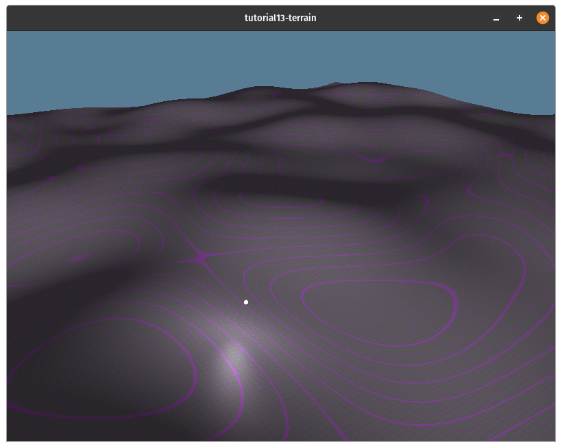
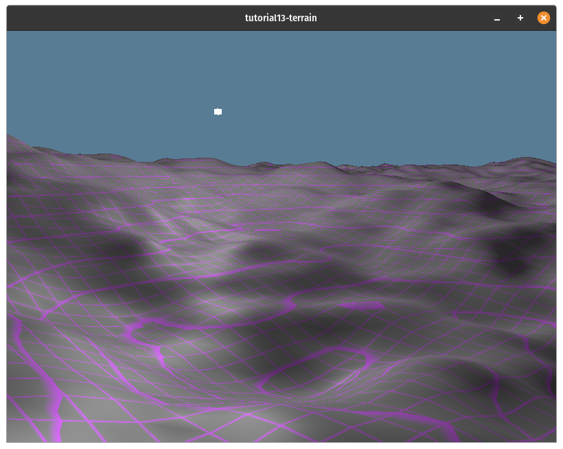
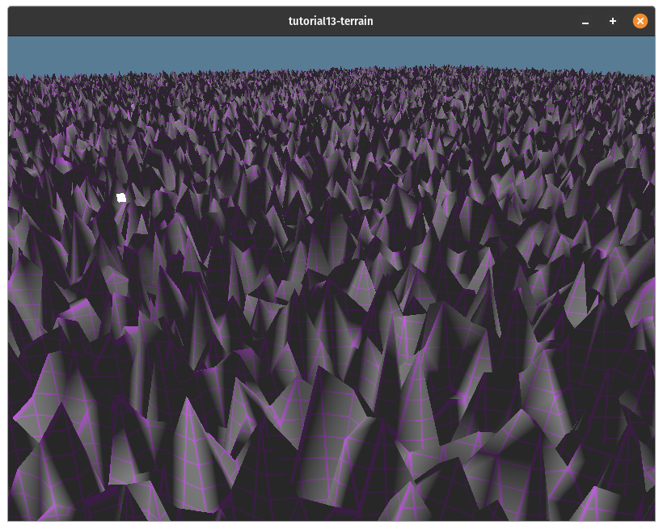
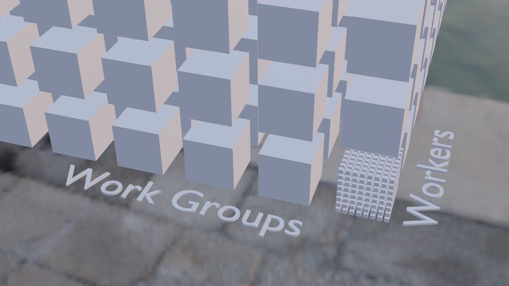

# Procedural Terrain

Up to this point, we've been working in an empty void. This is great when you want to get your shading code just right, but most applications will want to fill the screen with more interesting things. You could approach this in a variety of ways. You could create a bunch of models in Blender and load them into the scene. This method works great if you have some decent artistic skills and some patience. I'm lacking in both those departments, so let's write some code to make something that looks nice.

As the name of this article suggests, we're going to create a terrain. Now, the traditional method to create a terrain mesh is to use a pre-generated noise texture and sample it to get the height values at each point in the mesh. This is a valid approach, but I opted to generate the noise using a compute shader directly. Let's get started!

## Compute Shaders

A compute shader is simply a shader that allows you to leverage the GPU's parallel computing power for arbitrary tasks. You can use them for anything from creating a texture to running a neural network. I'll get more into how they work in a bit, but for now, suffice to say that we're going to use them to create the vertex and index buffers for our terrain.

<div class="note">

As of writing, compute shaders are still experimental on the web. You can enable them on beta versions of browsers such as Chrome Canary and Firefox Nightly. Because of this, I'll cover a method to use a fragment shader to compute the vertex and index buffers after we cover the compute shader method.

</div>

## Noise Functions

Let's start with the shader code for the compute shader. First, we'll create the noise functions. Then, we'll create the compute shader's entry function. Create a new file called `terrain.wgsl`. Then add the following:

```wgsl
// ============================
// Terrain Generation
// ============================

// https://gist.github.com/munrocket/236ed5ba7e409b8bdf1ff6eca5dcdc39
//  MIT License. © Ian McEwan, Stefan Gustavson, Munrocket
// - Less condensed glsl implementation with comments can be found at https://weber.itn.liu.se/~stegu/jgt2012/article.pdf

fn permute3(x: vec3<f32>) -> vec3<f32> { return (((x * 34.) + 1.) * x) % vec3<f32>(289.); }

fn snoise2(v: vec2<f32>) -> f32 {
  let C = vec4<f32>(0.211324865405187, 0.366025403784439, -0.577350269189626, 0.024390243902439);
  var i: vec2<f32> = floor(v + dot(v, C.yy));
  let x0 = v - i + dot(i, C.xx);
  // I flipped the condition here from > to < as it fixed some artifacting I was observing
  var i1: vec2<f32> = select(vec2<f32>(1., 0.), vec2<f32>(0., 1.), (x0.x < x0.y));
  var x12: vec4<f32> = x0.xyxy + C.xxzz - vec4<f32>(i1, 0., 0.);
  i = i % vec2<f32>(289.);
  let p = permute3(permute3(i.y + vec3<f32>(0., i1.y, 1.)) + i.x + vec3<f32>(0., i1.x, 1.));
  var m: vec3<f32> = max(0.5 -
      vec3<f32>(dot(x0, x0), dot(x12.xy, x12.xy), dot(x12.zw, x12.zw)), vec3<f32>(0.));
  m = m * m;
  m = m * m;
  let x = 2. * fract(p * C.www) - 1.;
  let h = abs(x) - 0.5;
  let ox = floor(x + 0.5);
  let a0 = x - ox;
  m = m * (1.79284291400159 - 0.85373472095314 * (a0 * a0 + h * h));
  let g = vec3<f32>(a0.x * x0.x + h.x * x0.y, a0.yz * x12.xz + h.yz * x12.yw);
  return 130. * dot(m, g);
}

```

Some of my readers may recognize this as an implementation of Simplex noise (specifically OpenSimplex noise). I'll admit to not really understanding the math behind OpenSimplex noise. The basics are that it's similar to Perlin Noise, but instead of a square grid, it's a hexagonal grid that removes some of the artifacts that generating the noise on a square grid gets you. Again, I'm not an expert on this, so to summarize: `permute3()` takes a `vec3` and returns a pseudorandom `vec3`, `snoise2()` takes a `vec2` and returns a floating point number between [-1, 1]. If you want to learn more about noise functions, check out [this article from The Book of Shaders](https://thebookofshaders.com/11/). The code's in GLSL, but the concepts are the same.

While we can use the output of `snoise` directly to generate the terrain's height values, the result of this tends to be very smooth, which may be what you want, but it doesn't look very organic, as you can see below:



To make the terrain a bit rougher, we're going to use a technique called [Fractal Brownian Motion](https://thebookofshaders.com/13/). This technique works by sampling the noise function multiple times, cutting the strength in half each time while doubling the frequency of the noise. This means that the overall shape of the terrain will be fairly smooth, but it will have sharper details. You can see what that will look like below:



The code for this function is actually quite simple:

```wgsl
fn fbm(p: vec2<f32>) -> f32 {
    let NUM_OCTAVES: u32 = 5u;
    var x = p * 0.01;
    var v = 0.0;
    var a = 0.5;
    let shift = vec2<f32>(100.0);
    let cs = vec2<f32>(cos(0.5), sin(0.5));
    let rot = mat2x2<f32>(cs.x, cs.y, -cs.y, cs.x);

    for (var i=0u; i<NUM_OCTAVES; i=i+1u) {
        v = v + a * snoise2(x);
        x = rot * x * 2.0 + shift;
        a = a * 0.5;
    }

    return v;
}
```

Let's go over this for a bit:

- The `NUM_OCTAVES` constant is the number of levels of noise you want. More octaves will add more texture to the terrain mesh, but you'll get diminishing returns at higher levels. I find that 5 is a good number.
- We multiply `p` by `0.01` to "zoom in" on the noise function. This is because our mesh will be 1x1 quads, and the simplex noise function resembles white noise when stepping by one each time. You can see what it looks like to use `p` directly: 
- The `a` variable is the amplitude of the noise at the given noise level.
- `shift` and `rot` are used to reduce artifacts in the generated noise. One such artifact is that at `0,0`, the output of the `snoise` will always be the same regardless of how much you scale `p`.

## Generating the mesh

To generate the terrain mesh, we're going to need to pass some information into the shader:

```wgsl
struct ChunkData {
    chunk_size: vec2<u32>,
    chunk_corner: vec2<i32>,
    min_max_height: vec2<f32>,
}

struct Vertex {
    @location(0) position: vec3<f32>,
    @location(1) normal: vec3<f32>,
}

struct VertexBuffer {
    data: array<Vertex>, // stride: 32
}

struct IndexBuffer {
    data: array<u32>,
}

@group(0) @binding(0) var<uniform> chunk_data: ChunkData;
@group(0)@binding(1) var<storage, read_write> vertices: VertexBuffer;
@group(0)@binding(2) var<storage, read_write> indices: IndexBuffer;
```

Our shader will expect a `uniform` buffer that includes the size of the quad grid in `chunk_size`, the `chunk_corner` that our noise algorithm should start at, and the `min_max_height` of the terrain.

The vertex and index buffers are passed in as `storage` buffers with `read_write` enabled. We'll create the actual buffers in Rust and bind them when we execute the compute shader.

The next part of the shader will be the functions that generate a point on the mesh and a vertex at that point:

```wgsl
fn terrain_point(p: vec2<f32>) -> vec3<f32> {
    return vec3<f32>(
        p.x,
        mix(chunk_data.min_max_height.x,chunk_data.min_max_height.y, fbm(p)),
        p.y,
    );
}

fn terrain_vertex(p: vec2<f32>) -> Vertex {
    let v = terrain_point(p);

    let tpx = terrain_point(p + vec2<f32>(0.1, 0.0)) - v;
    let tpz = terrain_point(p + vec2<f32>(0.0, 0.1)) - v;
    let tnx = terrain_point(p + vec2<f32>(-0.1, 0.0)) - v;
    let tnz = terrain_point(p + vec2<f32>(0.0, -0.1)) - v;

    let pn = normalize(cross(tpz, tpx));
    let nn = normalize(cross(tnz, tnx));

    let n = (pn + nn) * 0.5;

    return Vertex(v, n);
}
```

The `terrain_point` function takes an XZ point on the terrain and returns a `vec3` with the `y` value between the min and max height values.

`terrain_vertex` uses `terrain_point` to get its position and also to compute the normal of the surface by sampling four nearby points and uses them to compute the normal using [cross products](https://www.khanacademy.org/math/multivariable-calculus/thinking-about-multivariable-function/x786f2022:vectors-and-matrices/a/cross-products-mvc).

<div class="note">

You'll notice that our `Vertex` struct doesn't include a texture coordinate. We could easily create texture coordinates by using the XZ coords of the vertices and having the texture sampler mirror the texture on the x and y axes, but heightmaps tend to have stretching when textured in this way.

We'll cover a method called triplanar mapping to texture the terrain in a future tutorial. For now, we'll just use a procedural texture that will be created in the fragment shader we use to render the terrain.

</div>

Now that we can get a vertex on the terrain surface, we can fill our vertex and index buffers with actual data. We'll create a `gen_terrain()` function that will be the entry point for our compute shader:

```wgsl
@compute @workgroup_size(64)
fn gen_terrain(
    @builtin(global_invocation_id) gid: vec3<u32>
) {
    // snipped...
}
```

We specify that `gen_terrain` is a compute shader entry point by annotating it with `stage(compute)`.

The `workgroup_size()` is the number of workers the GPU can allocate per `workgroup`. We specify the number of workers when we execute the compute shader. There are technically three parameters to this as work groups are a 3d grid, but if you don't specify them, they default to 1. In other words `workgroup_size(64)` is equivalent to `workgroup_size(64, 1, 1)`.

The `global_invocation_id` is a 3d index. This may seem weird, but you can think of work groups as a 3d grid of work groups. These workgroups have an internal grid of workers. The `global_invocation_id` is the id of the current worker relative to all the other works.

Visually, the workgroup grid would look something like this:



<div class="note">

It may be helpful to think of a compute shader as a function that is run in a bunch of nested for loops, but each loop is executed in parallel. It would look something like this:

```
for wgx in num_workgroups.x:
    for wgy in num_workgroups.y:
        for wgz in num_workgroups.z:
            var local_invocation_id = (wgx, wgy, wgz)
            for x in workgroup_size.x:
                for y in workgroup_size.x:
                    for z in workgroup_size.x:
                        var global_invocation_id = local_invocation_id * workgroup_size + (x, y, z);
                        gen_terrain(global_invocation_id)

```

If you want to learn more about workgroups, [check out the docs](https://www.w3.org/TR/WGSL/#compute-shader-workgroups).

</div>


TODO: 
- Note changes to `create_render_pipeline`
- Mention `swizzle` feature for cgmath
- Compare workgroups and workgroups sizes to nested for-loops
    - Maybe make a diagram in Blender?
- Change to camera movement speed