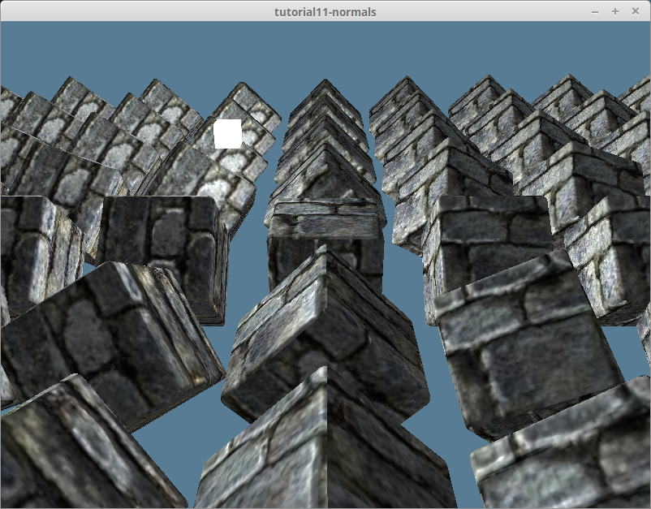

# News (Pre 0.12)

## Pong working on the web

This took a little while to figure out. I ended up using wasm-pack to create the wasm as I was having trouble with getting wasm-bindgen to work. I figured it out eventually but decided to keep using wasm-pack as I felt that the workflow would be more friendly to readers.

I would have released this sooner, but I wanted to add support for touch so that people on their phones could play the game. It appears that winit doesn't record touch events for WASM, so I shelved that idea.

If you want to check out the demo, just head over to [the write up](../showcase/pong/#wasm-support)

## 0.12 further changes to Surface

`SwapchainFrame` is no longer a thing. Instead `get_current_texture` will return a `SurfaceTexture` directly. This means that getting a frame to draw to looks somethings like this:

```rust
let output = self.surface.get_current_texture()?;
let view = output
    .texture
    .create_view(&wgpu::TextureViewDescriptor::default());
```

Another change is that you must call `SurfaceTexture::present()` after you submit your render command buffers to the `queue`. It goes something like this:

```rust
self.queue.submit(iter::once(encoder.finish()));
output.present();
```

There are a good deal of internal changes such as WebGL support (which I really need to cover). You can check out more on wgpu's [changelog](https://github.com/gfx-rs/wgpu/blob/master/CHANGELOG.md#wgpu-011-2021-10-07).

## Pong is fixed for 0.10

It wasn't actually that hard of a fix. I only really use the swapchain directly in the render module, and the only other change required me to include the `spirv` feature to wgpu in Cargo.toml.

## 0.10 SwapChain is dead, long live the Surface!

`SwapChain` and all related code has been removed from wgpu. All code pertaining to obtaining textures to draw to from the window will be available from the `Surface` instead. That means configuring `SurfaceTexture`s will look something like this:

```rust
let config = wgpu::SurfaceConfiguration {
    usage: wgpu::TextureUsages::RENDER_ATTACHMENT,
    format: surface.get_supported_formats(&adapter)[0],
    width: size.width,
    height: size.height,
    present_mode: wgpu::PresentMode::Fifo,
};
surface.configure(&device, &config);
```

Resizing the surface will use similar code:

```rust
if new_size.width > 0 && new_size.height > 0 {
    self.size = new_size;
    self.config.width = new_size.width;
    self.config.height = new_size.height;
    self.surface.configure(&self.device, &self.config);
}
```

Finally, getting a `SurfaceTexture` to draw to will use the surface directly.

```rust
let output = self.surface.get_current_texture()?;
let view = output
    .texture
    .create_view(&wgpu::TextureViewDescriptor::default());
```

The Pong and imgui examples are broken again. I may remove the imgui example as the corresponding crate already has examples of how to use it. I'm also considering reworking the Pong example, but I may end up just updating it.

## Pong and imgui demos are fixed!

The `imgui_wgpu` and `wgpu_glyph` crates have been updated to `wgpu` 0.8 so I was able to fix the demos! They both still use GLSL, and I don't think I'll be changing that for now. I may switch them over to `naga` at some point.

## 0.8 and WGSL

### The GLSL shaders have been translated to WGSL

Originally I wanted to wait until the WGSL spec fully stabilized, but due to some issues with the GLSL code, I've decided to switch over the code now. While GLSL is supported by WebGPU, it's currently secondary to WGSL. I'll keep an example of how to use GLSL (and maybe add HLSL and Metal as well), but I'm going to use WGSL from now on.

### Shaderc has been removed

I've been thinking about doing this for a while now. Because shaderc is a c library, it often has to be redownloaded during builds. This has been slowing down my ability to add new content and maintain old content. I had been considering switching to naga earlier, but some of my shaders (notably the lighting ones) weren't compiling with naga as I was using features not available for compatibility reasons (`inverse` is not available in all languages targeting spirv).

Since I needed to make a bunch of changes to the code base to make the glsl, and because I wanted to switch the tutorial to WGSL anyways, I decided to bite the bullet and recode everything in WGSL and remove shaderc from the tutorials.

### Some of the showcase examples are broken

The `wgpu_glyph`, and `imgui-wgpu` crates currently depend on `wgpu` 0.7, which is causing the `pong` and `imgui-demo` to not compile. I decided to exclude them from the workspace until the underlying crates update to using `wgpu` 0.8. (Feel free to submit a issue or even PR when that happens!)

### Various API changes

* The `depth` field is now `depth_or_array_layers`
* `wgpu::VertexFormat::Float3` is now `wgpu::VertexFormat::Float32x3`. Similar things apply to `Float2` and `Float4`
* `CullMode` is no longer a thing, instead `PrimitiveState::cull_mode` will require an `Option<Face>`
* Added `clamp_depth` and `conservative` to `PrimitiveState`. Part of this means that `DepthStencilState` no longer has a `clamp_depth` field.
* `color_blend` and `alpha_blend` have been moved into the new `blend` field with accepts an `Option<wgpu::BlendState>`
* `adapter.get_preferred_format()` now returns an `Option<wgpu::TextureFormat>`
* `wgpu::RenderPassColorAttachmentDescriptor` has been renamed `wgpu::RenderPassColorAttachement` and the `attachment` field has been renamed to `view`
* `wgpu::RenderPassDepthStencialAttachmentDescriptor` also loses the `Descriptor` part of it's name. `attachment` gets renamed to `view` as well.
* `wgpu::TextureCopyView` has been renamed to `wgpu::TexelCopyTextureInfo`. This is a typedef for `wgpu::TexelCopyTextureInfoBase<T>`
* `wgpu::TextureDataLayout` is now `wgpu::TexelCopyBufferLayout` and it's `bytes_per_row` and `rows_per_image` now take `NonZeroU32`.
* `wgpu::TexelCopyBufferInfo` is now `wgpu::TexelCopyBufferInfo`.

## 0.7

There were a lot of changes, particularly to the `RenderPipelineDescriptor`. Most other things have not changed. You can check out the [0.9 PR](https://github.com/sotrh/learn-wgpu/pull/140) for the full details.

## November 2020 Cleanup, Content Freeze, and Patreon

School is starting to ramp up, so I haven't had as much time to work on the site as I would like to. Because of that, there were some issues piling up. I decided to tackle a bunch of them in one go. Here's a snapshot of what I did:

* The tutorial now handles `SurfaceError` properly
* I'm now using bytemuck's derive feature on all buffer data structs.
* The [instancing tutorial](../beginner/tutorial7-instancing) now uses vertex buffers instead of storage buffers.
* `build.rs` now updates when individual shaders are changed, not whenever `/src` is changed.
* Had some help from Github user @kanerogers to clean up the [texturing tutorial](../beginner/tutorial5-textures).
* I made a [compute pipeline showcase](../showcase/compute) that computes the tangent and bitangent for each vertex in a model.
* I made a [imgui showcase](../showcase/imgui-demo). It's very basic, but it should be a good starting point.

Now in the headline, I mentioned a "Content Freeze". Wgpu is still a moving target. The migration from `0.4` to `0.5` was a lot of work. The same goes for `0.5` to `0.6`. I expect the next migration to be just as much work. As such, I won't be adding much content until the API becomes a bit more stable. That being said, I still plan on resolving any issues with the content.

One more thing. This is actually quite awkward for me (especially since I'll be slowing down development), but I've started a [patreon](https://www.patreon.com/sotrh). My job doesn't give me a ton of hours, so things are a bit tight. You are by no means obligated to donate, but I would appreciate it.

You can find out more about contributing to this project on the [introduction page](../#contribution-and-support)

## 0.6

This took me way too long. The changes weren't difficult, but I had to do a lot of copy pasting. The main changes are using `queue.write_buffer()` and `queue.write_texture()` everywhere. I won't get into the nitty gritty, but you can check out the [pull request](https://github.com/sotrh/learn-wgpu/pull/90) if you're interested.

## Added Pong Showcase

[See it here](../showcase/pong/)

## Normal mapping

My perfectionism got in my way a bit with this one. I wasn't sure that what I was getting was "physically accurate", but it seems to look good.



## 0.5!

Too many things changed to make note of them here. Check out [the 0.5 pull request](https://github.com/sotrh/learn-wgpu/pull/29) if you're curious about specifics. That being said, 2 things are worth mentioning directly: the y-axis now points up like with DirectX and Metal, and requesting an adapter and creating a device now use `Future`s. The tutorials have been updated as well as the code.

## Reworked lighting tutorial

The [lighting tutorial](/intermediate/tutorial10-lighting/) was not up to par, so I redid it.

## Added GIF showcase

[Creating GIFs](/showcase/gifs/)

## Updated texture tutorials

Up to this point, we created textures manually every time. I've pulled out the texture creation code into a new `texture.rs` file and included it in every tutorial from the [textures tutorial](/beginner/tutorial5-textures/#cleaning-things-up) onward.

## Fixed panics due to not specifying the correct `usage`

Wgpu has become more strict about what `BufferUsages`s and `TextureUsages`s are required when performing certain operations. For example in the [Wgpu without a window example](/intermediate/windowless/), the `texture_desc` only specified the usage to by `COPY_SRC`. This caused a crash when the `texture` was used as a render target. Adding `OUTPUT_ATTACHMENT` fixed the issue.

## Updating Winit from 0.20.0-alpha5 to 0.20

There were a lot of small changes to how the dpi stuff works. You can see all the changes [in the changelog](https://github.com/rust-windowing/winit/blob/master/CHANGELOG.md). That means that some of the tutorials had to change.

* I've removed `hidpi_factor` from `State` entirely. They removed the `hidpi_factor()` method from `winit::window::Window`, and changed `inner_size()` to return `PhysicalSize` instead of `LogicalSize`, so we don't need to store the `hidpi_factor` anymore.
* `update_hidpi_and_resize` is no more. Since `ScaleFactorChanged` passes in the windows new `PhysicalSize`, we can simply use `resize()`.
* `State::size` is now `PhysicalSize<u32>` instead of the pre 0.20 `LogicalSize`.
* `EventsCleared` is now `MainEventsCleared`.

I may have missed a change, but I made sure that all the examples compile and run, so if you have trouble with your code you can use them as a reference.

## Changed tutorial examples to use a src directory

I wasn't using the traditional cargo binary folder setup. I've changed it to the standardized form now.


## Updating to 0.4 from 0.3
There are a few things that have changed:
1. The use of `Instance` has been removed. Creating a `Surface` and requesting an `Adapter` are done as follows.
```rust
let surface = wgpu::Surface::create(window);
let adapter = wgpu::Adapter::request(&wgpu::RequestAdapterOptions {
    ..Default::default()
}).unwrap(); // needs to be unwrapped
```
2. The `request_device` method now returns a `(Device, Queue)` tuple. This means that you can borrow the `Queue` mutably while using the `Device` immutably. Because of this change, submitting `CommandBuffer`s to the queue uses the `submit` method on the `Queue` directly.
```rust
self.queue.submit(&[
    encoder.finish()
]);
```
3. The `create` method on `Surface` takes in any struct that implements the `HasRawWindow` trait, instead of a `RawWindowHandle`. This means that the `raw-window-handle = "0.3"` line in `Cargo.toml` is no longer needed.

I don't know if this is a change from 0.4, but you use `wgpu = "0.4"` line in dependencies instead of the `[dependencies.wgpu]` as wgpu will determine the best back end for you.


## New/Recent Articles
<RecentArticles/>