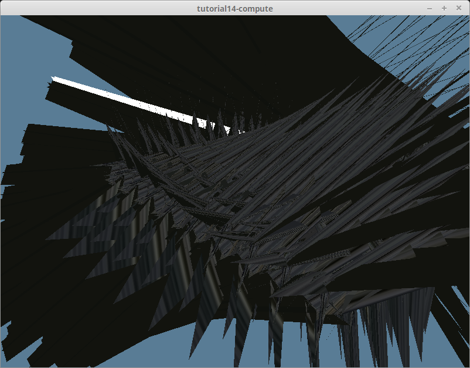
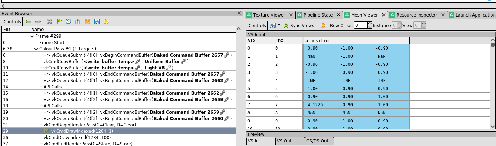
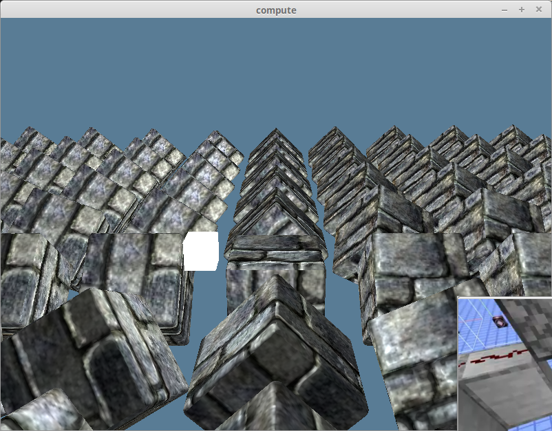

# Compute Example: Tangents and Bitangents

This proved more difficult than I anticipated. The first problem I encountered was some vertex data corruption due to the shader reading my vertex data incorrectly. I was using the `ModelVertex` struct I used in the [normal mapping tutorial](/intermediate/tutorial11-normals/).

```rust
#[repr(C)]
#[derive(Copy, Clone, Debug, bytemuck::Pod, bytemuck::Zeroable)]
pub struct ModelVertex {
    position: [f32; 3],
    tex_coords: [f32; 2],
    normal: [f32; 3],
    tangent: [f32; 3],
    bitangent: [f32; 3],
}
```

This structure works perfectly fine when used as a vertex buffer. Using it as a storage buffer proved less convenient. My previous code used a GLSL struct similar to my `ModelVertex`.

```glsl
struct ModelVertex {
    vec3 position;
    vec2 tex_coords;
    vec3 normal;
    vec3 tangent;
    vec3 bitangent;
};
```

At first glance, this seems just fine, but OpenGL experts would likely see a problem with the structure. Our fields aren't aligned properly to support the `std430` alignment that storage buffers require. I won't get into detail but you can check out the [alignment showcase](../alignment) if you want to know more. To summarize, the `vec2` for the `tex_coords` was messing up the byte alignment, corrupting the vertex data resulting in the following:



I could have fixed this by adding a padding field after `tex_coords` on the Rust side, but that would require modifying the `VertexBufferLayout`. I ended up solving this problem by using the components of the vectors directly which resulted in a struct like this:

```glsl
struct ModelVertex {
    float x; float y; float z;
    float uv; float uw;
    float nx; float ny; float nz;
    float tx; float ty; float tz;
    float bx; float by; float bz;
};
```

Since `std430` will use the alignment of the largest element of the struct, using all floats means the struct will be aligned to 4 bytes. This is alignment matches what `ModelVertex` uses in Rust. This was kind of a pain to work with, but it fixed the corruption issue.

The second problem required me to rethink how I was computing the tangent and bitangent. The previous algorithm I was using only computed the tangent and bitangent for each triangle and set all the vertices in that triangle to use the same tangent and bitangent. While this is fine in a single-threaded context, the code breaks down when trying to compute the triangles in parallel. The reason is that multiple triangles can share the same vertices. This means that when we go to save the resulting tangents, we inevitably end up trying to write to the same vertex from multiple different threads which is a big no no. You can see the issue with this method below:


Those black triangles were the result of multiple GPU threads trying to modify the same vertices. Looking at the data in Render Doc I could see that the tangents and bitangents were garbage numbers such as `NaN`.



While on the CPU we could introduce a synchronization primitive such as a `Mutex` to fix this issue, AFAIK there isn't really such a thing on the GPU. Instead, I decided to swap my code to work with each vertex individually. There are some hurdles with that, but those will be easier to explain in code. Let's start with the `main` function.

```glsl
void main() {
    uint vertexIndex = gl_GlobalInvocationID.x;
    ModelVertex result = calcTangentBitangent(vertexIndex);
    dstVertices[vertexIndex] = result;
}
```

We use the `gl_GlobalInvocationID.x` to get the index of the vertex we want to compute the tangents for. I opted to put the actual calculation into its own method. Let's take a look at that.

```glsl
ModelVertex calcTangentBitangent(uint vertexIndex) {
    ModelVertex v = srcVertices[vertexIndex];

    vec3 tangent = vec3(0);
    vec3 bitangent = vec3(0);
    uint trianglesIncluded = 0;

    // Find the triangles that use v
    //  * Loop over every triangle (i + 3)
    for (uint i = 0; i < numIndices; i += 3) {
        uint index0 = indices[i];
        uint index1 = indices[i+1];
        uint index2 = indices[i+2];

        // Only perform the calculation if one of the indices
        // matches our vertexIndex
        if (index0 == vertexIndex || index1 == vertexIndex || index2 == vertexIndex) {
            ModelVertex v0 = srcVertices[index0];
            ModelVertex v1 = srcVertices[index1];
            ModelVertex v2 = srcVertices[index2];

            vec3 pos0 = getPos(v0);
            vec3 pos1 = getPos(v1);
            vec3 pos2 = getPos(v2);

            vec2 uv0 = getUV(v0);
            vec2 uv1 = getUV(v1);
            vec2 uv2 = getUV(v2);

            vec3 delta_pos1 = pos1 - pos0;
            vec3 delta_pos2 = pos2 - pos0;

            vec2 delta_uv1 = uv1 - uv0;
            vec2 delta_uv2 = uv2 - uv0;

            float r = 1.0 / (delta_uv1.x * delta_uv2.y - delta_uv1.y * delta_uv2.x);
            tangent += (delta_pos1 * delta_uv2.y - delta_pos2 * delta_uv1.y) * r;
            bitangent += (delta_pos2 * delta_uv1.x - delta_pos1 * delta_uv2.x) * r; 
            trianglesIncluded += 1;
        }
        
    }

    // Average the tangent and bitangents
    if (trianglesIncluded > 0) {
        tangent /= trianglesIncluded;
        bitangent /= trianglesIncluded;
        tangent = normalize(tangent);
        bitangent = normalize(bitangent);
    }

    // Save the results
    v.tx = tangent.x;
    v.ty = tangent.y;
    v.tz = tangent.z;
    v.bx = bitangent.x;
    v.by = bitangent.y;
    v.bz = bitangent.z;

    return v;
}
```

## Possible Improvements

Looping over every triangle for every vertex is likely raising some red flags for some of you. In a single-threaded context, this algorithm would end up being O(N*M). As we are utilizing the high number of threads available to our GPU, this is less of an issue, but it still means our GPU is burning more cycles than it needs to.

One way I came up with to possibly improve performance is to store the index of each triangle in a hash map like structure with the vertex index as keys. Here's some pseudo code:

```rust
for t in 0..indices.len() / 3 {
    triangle_map[indices[t * 3]].push(t);
    triangle_map.push((indices[t * 3 + 1], t);
    triangle_map.push((indices[t * 3 + 2], t);
}
```

We'd then need to flatten this structure to pass it to the GPU. We'd also need a second array to index the first.

```rust
for (i, (_v, t_list)) in triangle_map.iter().enumerate() {
    triangle_map_indices.push(TriangleMapIndex { 
        start: i,
        len: t_list.len(),
    });
    flat_triangle_map.extend(t_list);
}
```

I ultimately decided against this method as it was more complicated, and I haven't had time to benchmark it to see if it's faster than the simple method.

## Results

The tangents and bitangents are now getting calculated correctly and on the GPU!



<AutoGithubLink/>