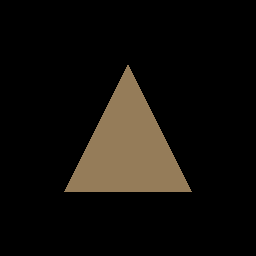

# Creating gifs

Sometimes you've created a nice simulation/animation, and you want to show it off. While you can record a video, that might be a bit overkill to break out your video recording if you just want something to post on Twitter. That's where what [GIF](https://en.wikipedia.org/wiki/GIF)s are for.

Also, GIF is pronounced GHIF, not JIF as JIF is not only [peanut butter](https://en.wikipedia.org/wiki/Jif_%28peanut_butter%29), it is also a [different image format](https://filext.com/file-extension/JIF).

## How are we making the GIF?

We're going to create a function using the [gif crate](https://docs.rs/gif/) to encode the actual image.

```rust
fn save_gif(path: &str, frames: &mut Vec<Vec<u8>>, speed: i32, size: u16) -> Result<(), failure::Error> {
    use gif::{Frame, Encoder, Repeat, SetParameter};
    
    let mut image = std::fs::File::create(path)?;
    let mut encoder = Encoder::new(&mut image, size, size, &[])?;
    encoder.set(Repeat::Infinite)?;

    for mut frame in frames {
        encoder.write_frame(&Frame::from_rgba_speed(size, size, &mut frame, speed))?;
    }

    Ok(())
}
```

<!-- image-rs doesn't currently support looping, so I switched to gif -->
<!-- A GIF is a type of image, and fortunately, the [image crate](https://docs.rs/image/) supports GIFs natively. It's pretty simple to use. -->

<!-- ```rust
fn save_gif(path: &str, frames: &mut Vec<Vec<u8>>, speed: i32, size: u16) -> Result<(), failure::Error> {
    let output = std::fs::File::create(path)?;
    let mut encoder = image::gif::Encoder::new(output);

    for mut data in frames {
        let frame = image::gif::Frame::from_rgba_speed(size, size, &mut data, speed);
        encoder.encode(&frame)?;
    }

    Ok(())
}
``` -->

All we need to use this code is the frames of the GIF, how fast it should run, and the size of the GIF (you could use width and height separately, but I didn't).

## How do we make the frames?

If you checked out the [windowless showcase](../windowless/#a-triangle-without-a-window), you'll know that we render directly to a `wgpu::Texture`. We'll create a texture to render to and a buffer to copy the output to.

```rust
// create a texture to render to
let texture_size = 256u32;
let rt_desc = wgpu::TextureDescriptor {
    size: wgpu::Extent3d {
        width: texture_size,
        height: texture_size,
        depth_or_array_layers: 1,
    },
    mip_level_count: 1,
    sample_count: 1,
    dimension: wgpu::TextureDimension::D2,
    format: wgpu::TextureFormat::Rgba8UnormSrgb,
    usage: wgpu::TextureUsages::COPY_SRC
        | wgpu::TextureUsages::RENDER_ATTACHMENT,
    label: None,
};
let render_target = framework::Texture::from_descriptor(&device, rt_desc);

// wgpu requires texture -> buffer copies to be aligned using
// wgpu::COPY_BYTES_PER_ROW_ALIGNMENT. Because of this we'll
// need to save both the padded_bytes_per_row as well as the
// unpadded_bytes_per_row
let pixel_size = mem::size_of::<[u8;4]>() as u32;
let align = wgpu::COPY_BYTES_PER_ROW_ALIGNMENT;
let unpadded_bytes_per_row = pixel_size * texture_size;
let padding = (align - unpadded_bytes_per_row % align) % align;
let padded_bytes_per_row = unpadded_bytes_per_row + padding;

// create a buffer to copy the texture to so we can get the data
let buffer_size = (padded_bytes_per_row * texture_size) as wgpu::BufferAddress;
let buffer_desc = wgpu::BufferDescriptor {
    size: buffer_size,
    usage: wgpu::BufferUsages::COPY_DST | wgpu::BufferUsages::MAP_READ,
    label: Some("Output Buffer"),
    mapped_at_creation: false,
};
let output_buffer = device.create_buffer(&buffer_desc);
```

With that, we can render a frame, and then copy that frame to a `Vec<u8>`.

```rust
let mut frames = Vec::new();

for c in &colors {
    let mut encoder = device.create_command_encoder(&wgpu::CommandEncoderDescriptor {
        label: None,
    });

    let mut rpass = encoder.begin_render_pass(&wgpu::RenderPassDescriptor {
        label: Some("GIF Pass"),
        color_attachments: &[
            wgpu::RenderPassColorAttachment {
                view: &render_target.view,
                resolve_target: None,
                ops: wgpu::Operations {
                    load: wgpu::LoadOp::Clear(
                        wgpu::Color {
                            r: c[0],
                            g: c[1],
                            b: c[2],
                            a: 1.0,
                        }
                    ),
                    store: wgpu::StoreOp::Store,
                },
            }
        ],
        depth_stencil_attachment: None,
    });

    rpass.set_pipeline(&render_pipeline);
    rpass.draw(0..3, 0..1);

    drop(rpass);

    encoder.copy_texture_to_buffer(
        wgpu::TexelCopyTextureInfo {
            texture: &render_target.texture,
            mip_level: 0,
            origin: wgpu::Origin3d::ZERO,
        }, 
        wgpu::TexelCopyBufferInfo {
            buffer: &output_buffer,
            layout: wgpu::TexelCopyBufferLayout {
                offset: 0,
                bytes_per_row: padded_bytes_per_row,
                rows_per_image: texture_size,
            }
        },
        render_target.desc.size
    );

    queue.submit(std::iter::once(encoder.finish()));
    
    // Create the map request
    let buffer_slice = output_buffer.slice(..);
    let request = buffer_slice.map_async(wgpu::MapMode::Read);
    // wait for the GPU to finish
    device.poll(wgpu::Maintain::Wait);
    let result = request.await;
    
    match result {
        Ok(()) => {
            let padded_data = buffer_slice.get_mapped_range();
            let data = padded_data
                .chunks(padded_bytes_per_row as _)
                .map(|chunk| { &chunk[..unpadded_bytes_per_row as _]})
                .flatten()
                .map(|x| { *x })
                .collect::<Vec<_>>();
            drop(padded_data);
            output_buffer.unmap();
            frames.push(data);
        }
        _ => { eprintln!("Something went wrong") }
    }

}
```

Once that's done we can pass our frames into `save_gif()`.

```rust
save_gif("output.gif", &mut frames, 1, texture_size as u16).unwrap();
```

That's the gist of it. We can improve things using a texture array, and sending the draw commands all at once, but this gets the idea across. With the shader I wrote we get the following GIF.




<AutoGithubLink/>
