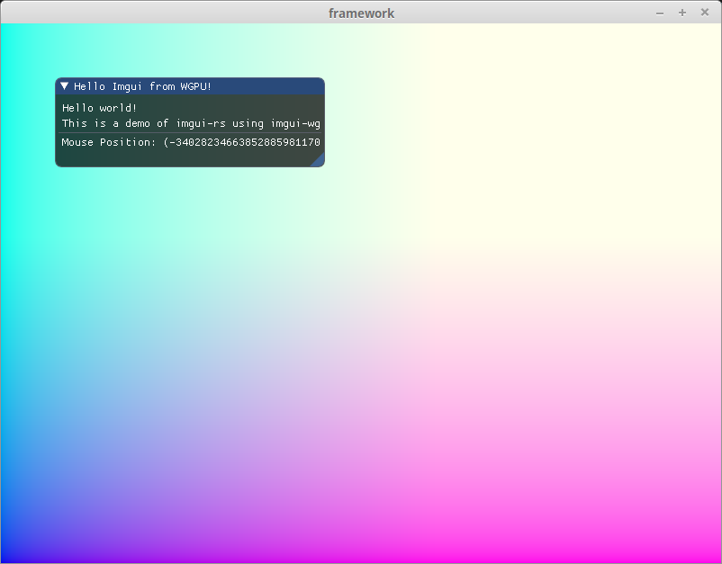

# Basic Imgui Demo

<div class="warning">

This example is currently broken. It got behind when I was migrating the tutorial to 0.8 as the imgui_wgpu crate was still on 0.7 at the time. I haven't updated it since. While fixing it wouldn't be too hard (feel free to send a PR), I'm considering removing this example entirely.

This tutorial is focused on how to use wgpu (and by extension the WebGPU standard). I'm looking to minimize the amount of wgpu-adjacent crates that I'm using. They can get in the way of keeping this tutorial as current as possible, and often a crate I'm using will have a different version of wgpu (or winit as is the case as of writing) preventing me from continuing with migration. Beyond dependency conflicts, I'd like to cover some of the topics that some of the existing crates implement such as text and guis.

For the 0.10 migration, I'll keep this example in and keep the showcase code excluded.

</div>

This is not an in-depth guide on how to use Imgui. But here are some of the basics you'll need to get started. We'll need to import [imgui-rs](https://docs.rs/imgui), [imgui-wgpu](https://docs.rs/imgui-wgpu), and [imgui-winit-support](https://docs.rs/imgui-winit-support).

```toml
imgui = "0.7"
imgui-wgpu = "24.0"
imgui-winit-support = "0.7"
```

<div class="note">

I've excluded some dependencies for brevity. I'm also using the [framework crate](https://github.com/sotrh/learn-wgpu/tree/master/code/showcase/framework) I've created for showcases to simplify setup. If you see a `display` variable in code, it's from the `framework`. `Display` is where the `device`, `queue`, `swap_chain`, and other basic wgpu objects are stored.

</div>

We need to set up imgui and a `WinitPlatform` to get started. Do this after creating you're `winit::Window`.

```rust
let mut imgui = imgui::Context::create();
let mut platform = imgui_winit_support::WinitPlatform::init(&mut imgui);
platform.attach_window(
    imgui.io_mut(), 
    &display.window,
    imgui_winit_support::HiDpiMode::Default,
);
imgui.set_ini_filename(None);
```

Now we need to configure the default font. We'll be using the window's scale factor to keep things from being too big or small.

```rust
let hidpi_factor = display.window.scale_factor();
let font_size = (13.0 * hidpi_factor) as f32;
imgui.io_mut().font_global_scale = (1.0 / hidpi_factor) as f32;
imgui.fonts().add_font(&[FontSource::DefaultFontData {
    config: Some(imgui::FontConfig {
        oversample_h: 1,
        pixel_snap_h: true,
        size_pixels: font_size,
        ..Default::default()
    }),
}]);
```

Then you need to create the renderer. We need to use the surface's `TextureFormat` in order for things to work properly.

```rust
let renderer_config = RendererConfig {
    texture_format: display.config.format,
    ..Default::default()
};
let renderer = Renderer::new(&mut imgui, &display.device, &display.queue, renderer_config);
```

When we update the scene, we'll need to update imgui.

```rust
self.imgui.io_mut().update_delta_time(dt); // dt: std::time::Duration
```

I'm not an expert with imgui, so I'll let the code speak for itself.

```rust
// Build the UI
self.platform
    .prepare_frame(self.imgui.io_mut(), &display.window)
    .expect("Failed to prepare frame!");
let ui = self.imgui.frame();
{
    let window = imgui::Window::new(im_str!("Hello Imgui from WGPU!"));
    window
        .size([300.0, 100.0], Condition::FirstUseEver)
        .build(&ui, || {
            ui.text(im_str!("Hello world!"));
            ui.text(im_str!("This is a demo of imgui-rs using imgui-wgpu!"));
            ui.separator();
            let mouse_pos = ui.io().mouse_pos;
            ui.text(im_str!(
                "Mouse Position: ({:.1}, {:.1})",
                mouse_pos[0],
                mouse_pos[1],
            ));
        });
}

// Prepare to render
let mut encoder = display.device.create_command_encoder(&Default::default());
let output = match display.swap_chain.get_current_texture() {
    Ok(frame) => frame,
    Err(e) => {
        eprintln!("Error getting frame: {:?}", e);
        return;
    }
}.output;

// Render the scene
self.canvas.render(
    &display.queue, 
    &mut encoder, 
    &output.view, 
    display.config.width as f32, 
    display.config.height as f32
);

// Render the UI
if self.last_cursor != ui.mouse_cursor() {
    self.last_cursor = ui.mouse_cursor();
    self.platform.prepare_render(&ui, &display.window);
}

let mut pass = encoder.begin_render_pass(&wgpu::RenderPassDescriptor {
    label: Some("UI RenderPass"),
    color_attachments: &[wgpu::RenderPassColorAttachment {
                    view: &view,
        attachment: &output.view,
        resolve_target: None,
        ops: wgpu::Operations {
            load: wgpu::LoadOp::Load,
            store: wgpu::StoreOp::Store,
        },
    }],
    depth_stencil_attachment: None,
});
self.renderer
    .render(ui.render(), &display.queue, &display.device, &mut pass)
    .expect("Failed to render UI!");
drop(pass);

display.queue.submit(Some(encoder.finish()));
```

That's all there is to it. Here's a picture of the results!



<AutoGithubLink/>
