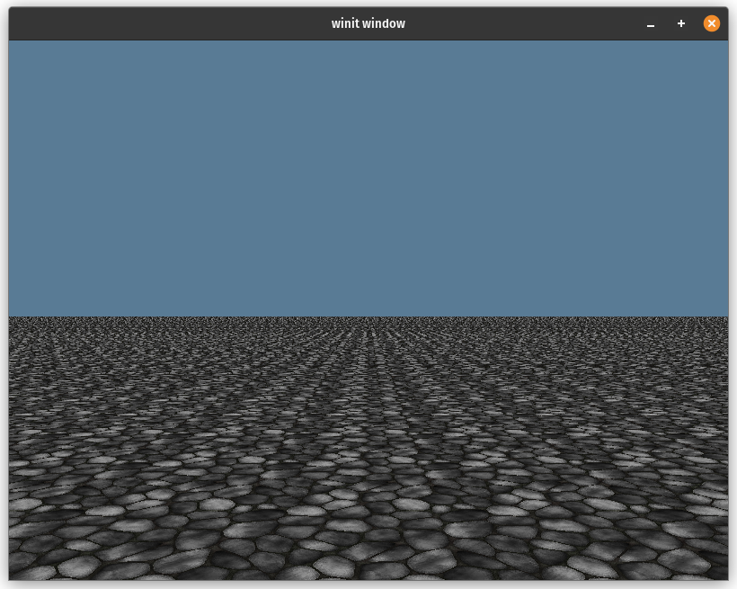
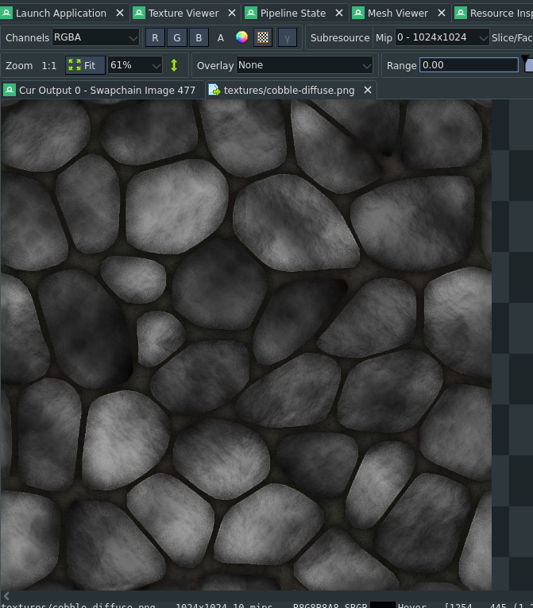
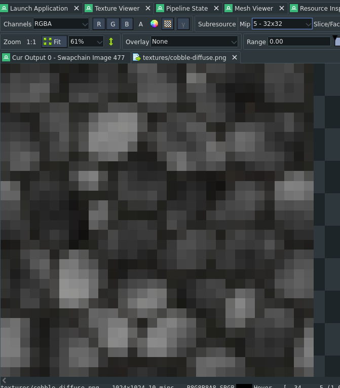
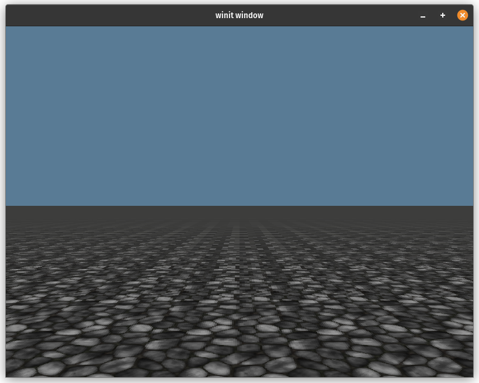
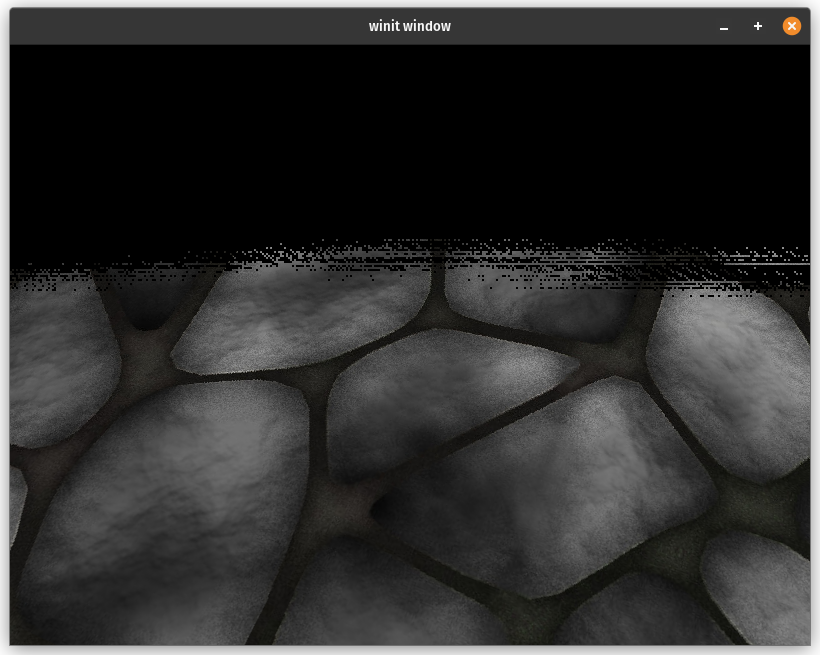

# Mipmapping

I games and other graphics applications it's often convenient to
use a single texture that gets tiled across the surface. If you
use a texture with some complexity, and your scene is large you'll
get a lot of noise in the distances.



This looks really bad, but fortunately we can fix this with mipmaps.

## What are mipmaps?

Mipmaps are smaller versions of an image that are stored in the same
texture. Each mip is half the size of the one above it. Below you can
see mip level 0, or the texture at full size viewed in RenderDoc.



This is the full 1024x1024 image. The next level is 1 and looks like this:


This is half the size of the original (512x512). Skipping the few here's
level 5 which is 32x32.



Level 9 is just 2x2


You may be thinking, well that's nice and all, but how does it make our
scene look less noisy? The trick is that when we sample a texture in
the fragment shader, if the texture has mipmaps enabled the GPU will
try to pick the best one based on how much space it thinks the texture
will take up on screen. Here's what our scene looks like with a texture
that has mip maps setup:



This looks a lot better as the horizon is no longer a noisy mess. Let's
dive into how we achieved this.

## Setting up mipmaps

I'll gloss over the code for rending the base scene as it's nothing
special. I'm just rendering a textured quad thats 2000x2000 units large.
The texture setup is more involved though. Let's dig into that.

```wgsl
// Load the texture with the [image] crate
let diffuse_img = image::open(res_dir.join("textures/cobble-diffuse.png"))?.to_rgba8();

// Here we compute the number of mip levels using the smaller of width and height
let mip_level_count = diffuse_img.width().min(diffuse_img.height()).ilog2() + 1;

// Now we create the texture
let diffuse_blit_texture = display.device.create_texture(&wgpu::TextureDescriptor {
    label: Some("textures/cobble-diffuse.png"),
    size: wgpu::Extent3d {
        width: diffuse_img.width(),
        height: diffuse_img.height(),
        depth_or_array_layers: 1,
    },
    mip_level_count, // This is the important bit
    sample_count: 1,
    dimension: wgpu::TextureDimension::D2,
    format: wgpu::TextureFormat::Rgba8UnormSrgb,
    usage: wgpu::TextureUsages::TEXTURE_BINDING
        | wgpu::TextureUsages::COPY_DST
        | wgpu::TextureUsages::COPY_SRC,
    view_formats: &[],
});

// Now we upload our image to our texture
display.queue.write_texture(
    wgpu::TexelCopyTextureInfo {
        texture: &diffuse_blit_texture,
        // We need to specify what mip level we are coppying to
        mip_level: 0,
        origin: wgpu::Origin3d::ZERO,
        aspect: wgpu::TextureAspect::All,
    },
    &diffuse_img,
    wgpu::TexelCopyBufferLayout {
        offset: 0,
        bytes_per_row: Some(4 * diffuse_img.width()),
        rows_per_image: Some(diffuse_img.height()),
    },
    diffuse_blit_texture.size(),
);
```

No if you were to sample this texture as is, you would see a lot
of black pixels far away, and the regular texture up close.



The reason for this is hinted when we used `write_texture()`. We
need to specify what mip level we were copying to. This means that
all of the other mip levels are black as that's what wgpu sets them
to when creating the texture. We need to fill that data in ourselves.

We'll create a struct called `Mipmapper` that will generate our the
other mip levels for us.

```rust
/// Pipeline for creating mipmaps
pub(crate) struct Mipmapper {
    blit_mipmap: wgpu::RenderPipeline,
    blit_sampler: wgpu::Sampler,
    compute_mipmap: wgpu::ComputePipeline,
    storage_texture_layout: wgpu::BindGroupLayout,
}

impl Mipmapper {
    pub fn new(device: &wgpu::Device) -> Self {
        // ...
    }
}
```

You'll see that we have two different pipelines here a `RenderPipeline`
and a `ComputePipeline`. There are a lot of ways that we could generate
our other mip levels, we'll show off two here: rendering, and using a
compute shader.

## Rendering to a mip level

When we create a `RenderPass` we pass in a `TextureView`. This view allows
us to pick what part of the texture a shader is allowed to access. The GPU
will render to whatever mip level is set by the `base_mip_level` when we
create the texture view. We can use this to draw directly to specific mips
which is just what we need to fill out our mipmaps.

Basically we are going to create a pipeline that will get a texture view
starting at mip level 0, and render that with linear sampling to mip level 1.
We'll repeat this for 1 -> 2, 2 -> 3, etc. until we get to the last level,
in this case 10.

First we have to create the pipeline.

```rust
impl Mipmapper {
    pub fn new(device: &wgpu::Device) -> Self {
        let blit_shader = wgpu::include_wgsl!("blit.wgsl");
        let blit_format = wgpu::TextureFormat::Rgba8Unorm;
        let blit_mipmap = RenderPipelineBuilder::new()
            .vertex_shader(blit_shader.clone())
            .fragment_shader(blit_shader.clone())
            .cull_mode(Some(wgpu::Face::Back))
            .color_solid(blit_format)
            .build(device)
            .unwrap();
        let blit_sampler = device.create_sampler(&wgpu::SamplerDescriptor {
            min_filter: wgpu::FilterMode::Linear,
            mag_filter: wgpu::FilterMode::Linear,
            ..Default::default()
        });

        // ...
    }
}
```

We're using a custom [RenderPipelineBuilder](https://github.com/sotrh/learn-wgpu/blob/master/code/showcase/framework/src/pipeline.rs)
to make setting up the render pipeline easier. In this case this just
creates a render pipeline with a vertex and fragment shader defined in
`blit.wgsl` that expects to render to a `Rgba8Unorm` texture with back
face culling enabled.

We also need a sampler with linear sampling enabled so each mipmap blends
seamlessly with the one above it.

Next let's look at `blit.wgsl`:

```wgsl
struct VertexOutput {
    @builtin(position) clip_position: vec4<f32>,
    @location(0) uv: vec2<f32>,
};

@group(0)
@binding(0)
var tex: texture_2d<f32>;
@group(0)
@binding(1)
var tex_sampler: sampler;

@vertex
fn vs_main(
    @builtin(vertex_index) in_vertex_index: u32,
) -> VertexOutput {
    var out: VertexOutput;
    // Create fullscreen triangle
    let x = f32((in_vertex_index << 1u) & 2u);
    let y = f32(in_vertex_index & 2u);
    out.clip_position = vec4<f32>(x * 2.0 - 1.0, y * 2.0 - 1.0, 0.0, 1.0);
    out.uv = vec2<f32>(x, 1.0 - y);
    return out;
}

@fragment
fn fs_color(in: VertexOutput) -> @location(0) vec4<f32> {
    let sample = textureSample(tex, tex_sampler, in.uv);
    return sample;
}
```

This shader draws a triangle that is bigger than the viewport (in this
case the mip level we are rendering to). It then samples a texture
and outputs that sample directly.

Next we will create a function to actually use all of this.

```rust
impl Mipmapper {
    // ...

    pub fn blit_mipmaps(
        &self,
        device: &wgpu::Device,
        queue: &wgpu::Queue,
        texture: &wgpu::Texture,
    ) -> anyhow::Result<()> {
        // We would need to change the render pipeline to support different texture types
        match texture.format() {
            wgpu::TextureFormat::Rgba8Unorm | wgpu::TextureFormat::Rgba8UnormSrgb => {}
            _ => bail!("Unsupported format {:?}", texture.format()),
        }

        // Exit early if there is only one mip level.
        if texture.mip_level_count() == 1 {
            return Ok(());
        }

        let mut encoder = device.create_command_encoder(&Default::default());

        // We need to render to this texture, so if the supplied texture
        // isn't setup for rendering, we need to create a temporary one.
        let (mut src_view, maybe_temp) = if texture
            .usage()
            .contains(wgpu::TextureUsages::RENDER_ATTACHMENT)
        {
            (
                texture.create_view(&wgpu::TextureViewDescriptor {
                    // sRGB and non sRGB textures can be interchanged, but
                    // we specified RGBA8Unorm when we created the pipeline
                    // so we need a view with the same format.
                    format: Some(texture.format().remove_srgb_suffix()),
                    base_mip_level: 0,
                    // When rendering to a mip we need to ignore all other
                    // mip levels.
                    mip_level_count: Some(1),
                    ..Default::default()
                }),
                None,
            )
        } else {
            // Create a temporary texture that can be rendered to since the
            // supplied texture can't be rendered to. It will be basically
            // identical to the original apart from the usage field and removing
            // sRGB from the format if it's present.
            let temp = device.create_texture(&wgpu::TextureDescriptor {
                label: Some("Mipmapper::compute_mipmaps::temp"),
                size: texture.size(),
                mip_level_count: texture.mip_level_count(),
                sample_count: texture.sample_count(),
                dimension: texture.dimension(),
                format: texture.format().remove_srgb_suffix(),
                usage: wgpu::TextureUsages::RENDER_ATTACHMENT
                    | wgpu::TextureUsages::TEXTURE_BINDING
                    | wgpu::TextureUsages::COPY_DST
                    | wgpu::TextureUsages::COPY_SRC,
                view_formats: &[],
            });

            encoder.copy_texture_to_texture(
                texture.as_image_copy(),
                temp.as_image_copy(),
                temp.size(),
            );

            (
                temp.create_view(&wgpu::TextureViewDescriptor {
                    mip_level_count: Some(1),
                    ..Default::default()
                }),
                Some(temp),
            )
        };

        for mip in 1..texture.mip_level_count() {
            let dst_view = src_view
                .texture()
                .create_view(&wgpu::TextureViewDescriptor {
                    format: Some(texture.format().remove_srgb_suffix()),
                    // What mip we want to render to
                    base_mip_level: mip,
                    // Like src_view we need to ignore other mips
                    mip_level_count: Some(1),
                    ..Default::default()
                });

            let texture_bind_group = device.create_bind_group(&wgpu::BindGroupDescriptor {
                label: None,
                layout: &self.blit_mipmap.get_bind_group_layout(0),
                entries: &[
                    wgpu::BindGroupEntry {
                        binding: 0,
                        resource: wgpu::BindingResource::TextureView(&src_view),
                    },
                    wgpu::BindGroupEntry {
                        binding: 1,
                        resource: wgpu::BindingResource::Sampler(&self.blit_sampler),
                    },
                ],
            });

            let mut pass = encoder.begin_render_pass(&wgpu::RenderPassDescriptor {
                label: None,
                color_attachments: &[Some(wgpu::RenderPassColorAttachment {
                    view: &dst_view,
                    depth_slice: None,
                    resolve_target: None,
                    ops: wgpu::Operations {
                        load: wgpu::LoadOp::Load,
                        store: wgpu::StoreOp::Store,
                    },
                })],
                depth_stencil_attachment: None,
                timestamp_writes: None,
                occlusion_query_set: None,
                multiview_mask: None,
            });
            pass.set_pipeline(&self.blit_mipmap);
            pass.set_bind_group(0, &texture_bind_group, &[]);
            pass.draw(0..3, 0..1);

            // Make sure that we use the mip we just generated for the
            // next iteration.
            src_view = dst_view;
        }

        // If we created a temporary texture, now we need to copy it back
        // into the original.
        if let Some(temp) = maybe_temp {
            let mut size = temp.size();
            for mip_level in 0..temp.mip_level_count() {
                encoder.copy_texture_to_texture(
                    wgpu::TexelCopyTextureInfo {
                        mip_level,
                        ..temp.as_image_copy()
                    },
                    wgpu::TexelCopyTextureInfo {
                        mip_level,
                        ..texture.as_image_copy()
                    },
                    size,
                );

                // Each mipmap is half the size of the original,
                // so we need to half the copy size as well.
                size.width /= 2;
                size.height /= 2;
            }
        }

        queue.submit([encoder.finish()]);

        Ok(())
    }

    // ...
}
```

With all that we can create our `Mipmapper` and call `blit_mipmaps`
with our texture.

```rust
let mipmapper = Mipmapper::new(&display.device);
mipmapper.blit_mipmaps(&display.device, &display.queue, &diffuse_blit_texture)?;
```

## Generating mipmaps with a compute shader

## Possible improvements
