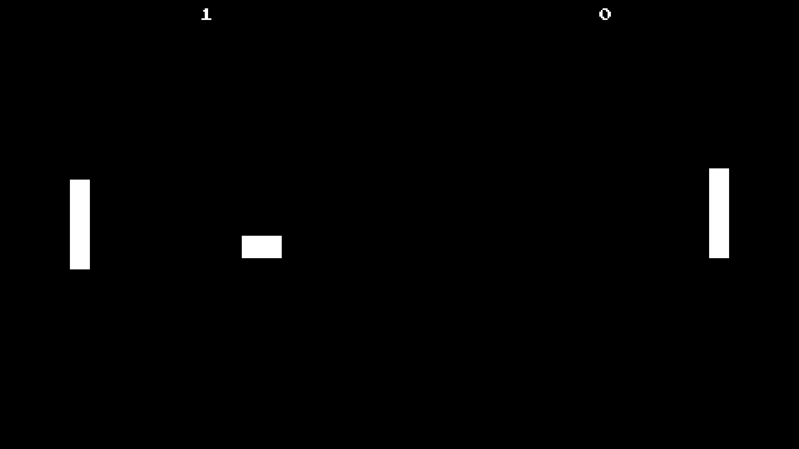

# Pong



<div class="warning">

This example is not working as of `wgpu = "24.0"`. If the crate updates to
the latest version I'll switch it over, but given that the crate maintainer
is directing users to use [glypon](https://github.com/grovesNL/glyphon?tab=readme-ov-file)
I'm considering either switching to using that, or writing my own text code.

</div>

Practically the "Hello World!" of games. Pong has been remade thousands of times. I know Pong. You know Pong. We all know Pong. That being said, this time I wanted to put in a little more effort than most people do. This showcase has a basic menu system, sounds, and different game states.

The architecture is not the best as I prescribed to the "get things done" mentality. If I were to redo this project, I'd change a lot of things. Regardless, let's get into the postmortem.

## The Architecture

I was messing around with separating state from the render code. It ended up similar to an Entity Component System model.

I had a `State` class with all of the objects in the scene. This included the ball and the paddles, as well as the text for the scores and even the menu. `State` also included a `game_state` field of type `GameState`.

```rust
#[derive(Debug, Copy, Clone, Eq, PartialEq)]
pub enum GameState {
    MainMenu,
    Serving,
    Playing,
    GameOver,
    Quiting,
}
```

The `State` class didn't have any methods on it as I was taking a more data-oriented approach. Instead, I created a `System` trait and created multiple structs that implemented it.

```rust
pub trait System {
    #[allow(unused_variables)]
    fn start(&mut self, state: &mut state::State) {}
    fn update_state(
        &self, 
        input: &input::Input, 
        state: &mut state::State, 
        events: &mut Vec<state::Event>,
    );
}
```

The systems would be in charge of controlling updating the different objects' states (position, visibility, etc), as well as updating the `game_state` field. I created all the systems on startup and used a `match` on `game_state` to determine which ones should be allowed to run (the `visiblity_system` always runs as it is always needed).

```rust
visiblity_system.update_state(&input, &mut state, &mut events);
match state.game_state {
    state::GameState::MainMenu => {
        menu_system.update_state(&input, &mut state, &mut events);
        if state.game_state == state::GameState::Serving {
            serving_system.start(&mut state);
        }
    },
    state::GameState::Serving => {
        serving_system.update_state(&input, &mut state, &mut events);
        play_system.update_state(&input, &mut state, &mut events);
        if state.game_state == state::GameState::Playing {
            play_system.start(&mut state);
        }
    },
    state::GameState::Playing => {
        ball_system.update_state(&input, &mut state, &mut events);
        play_system.update_state(&input, &mut state, &mut events);
        if state.game_state == state::GameState::Serving {
            serving_system.start(&mut state);
        } else if state.game_state == state::GameState::GameOver {
            game_over_system.start(&mut state);
        }
    },
    state::GameState::GameOver => {
        game_over_system.update_state(&input, &mut state, &mut events);
        if state.game_state == state::GameState::MainMenu {
            menu_system.start(&mut state);
        }
    },
    state::GameState::Quiting => {},
}
```

It's definitely not the cleanest code, but it works.

I ended up having 6 systems in total.

1. I added the `VisibilitySystem` near the end of development. Up to that point, all the systems had to set the `visible` field of the objects. That was a pain and cluttered the logic. Instead, I decided to create the `VisiblitySystem` to handle that.

2. The `MenuSystem` handled controlling what text was focused, and what would happen when the user pressed the enter key. If the `Play` button was focused, pressing enter would change `game_state` to `GameState::Serving` which would start the game. The `Quit` button would shift to `GameState::Quiting`.

3. The `ServingSystem` sets the ball's position to `(0.0, 0.0)`, updates the score texts, and shifts into `GameState::Playing` after a timer.

4. The `PlaySystem` controls the players. It allows them to move and keeps them from leaving the play space. This system runs on both `GameState::Playing` as well as `GameState::Serving`. I did this to allow the players to reposition themselves before the serve. The `PlaySystem` also will shift into `GameState::GameOver` when one of the players' scores is greater than 2.

5. The `BallSystem` system controls the ball's movement as well as its bouncing of walls/players. It also updates the score and shifts to `GameState::Serving` when the ball goes off the side of the screen.

6. The `GameOver` system updates the `win_text` and shifts to `GameState::MainMenu` after a delay.

I found the system approach quite nice to work with. My implementation wasn't the best, but I would like to work with it again. I might even implement my own ECS.

## Input

The `System` trait, originally had a `process_input` method. This became a problem when I was implementing allowing players to move between serves. The players would get stuck when the `game_state` switched from `Serving` to `Playing` as the inputs were getting stuck. I only called `process_input` on systems that were currently in use.  Changing that would be finicky, so I decided to move all the input code into its own struct.

```rust
use winit::event::{VirtualKeyCode, ElementState};

#[derive(Debug, Default)]
pub struct Input {
    pub p1_up_pressed: bool,
    pub p1_down_pressed: bool,
    pub p2_up_pressed: bool,
    pub p2_down_pressed: bool,
    pub enter_pressed: bool,
}

impl Input {
    pub fn new() -> Self {
        Default::default()
    }

    pub fn update(&mut self, key: VirtualKeyCode, state: ElementState) -> bool {
        let pressed = state == ElementState::Pressed;
        match key {
            VirtualKeyCode::Up => {
                self.p2_up_pressed = pressed;
                true
            }
            VirtualKeyCode::Down => {
                self.p2_down_pressed = pressed;
                true
            }
            VirtualKeyCode::W => {
                self.p1_up_pressed = pressed;
                true
            }
            VirtualKeyCode::S => {
                self.p1_down_pressed = pressed;
                true
            }
            VirtualKeyCode::Return => {
                self.enter_pressed = pressed;
                true
            }
            _ => false
        }
    }

    pub fn ui_up_pressed(&self) -> bool {
        self.p1_up_pressed || self.p2_up_pressed
    }

    pub fn ui_down_pressed(&self) -> bool {
        self.p1_down_pressed || self.p2_down_pressed
    }
}
```

This works really well. I simply pass this struct into the `update_state` method.

## Render

I used [wgpu_glyph](https://docs.rs/wgpu_glyph) for the text and white quads for the ball and paddles. There's not much to say here, it's Pong after all.

I did mess around with batching, however. It was totally overkill for this project, but it was a good learning experience. Here's the code if you're interested.

```rust
pub struct QuadBufferBuilder {
    vertex_data: Vec<Vertex>,
    index_data: Vec<u32>,
    current_quad: u32,
}

impl QuadBufferBuilder {
    pub fn new() -> Self {
        Self {
            vertex_data: Vec::new(),
            index_data: Vec::new(),
            current_quad: 0,
        }
    }

    pub fn push_ball(self, ball: &state::Ball) -> Self {
        if ball.visible {
            let min_x = ball.position.x - ball.radius;
            let min_y = ball.position.y - ball.radius;
            let max_x = ball.position.x + ball.radius;
            let max_y = ball.position.y + ball.radius;
    
            self.push_quad(min_x, min_y, max_x, max_y)
        } else {
            self
        }
    }

    pub fn push_player(self, player: &state::Player) -> Self {
        if player.visible {
            self.push_quad(
                player.position.x - player.size.x * 0.5, 
                player.position.y - player.size.y * 0.5, 
                player.position.x + player.size.x * 0.5,
                player.position.y + player.size.y * 0.5, 
            )
        } else {
            self
        }
    }

    pub fn push_quad(mut self, min_x: f32, min_y: f32, max_x: f32, max_y: f32) -> Self {
        self.vertex_data.extend(&[
            Vertex {
                position: (min_x, min_y).into(),
            },
            Vertex {
                position: (max_x, min_y).into(),
            },
            Vertex {
                position: (max_x, max_y).into(),
            },
            Vertex {
                position: (min_x, max_y).into(),
            },
        ]);
        self.index_data.extend(&[
            self.current_quad * 4 + 0,
            self.current_quad * 4 + 1,
            self.current_quad * 4 + 2,
            self.current_quad * 4 + 0,
            self.current_quad * 4 + 2,
            self.current_quad * 4 + 3,
        ]);
        self.current_quad += 1;
        self
    }

    pub fn build(self, device: &wgpu::Device) -> (StagingBuffer, StagingBuffer, u32) {
        (
            StagingBuffer::new(device, &self.vertex_data),
            StagingBuffer::new(device, &self.index_data),
            self.index_data.len() as u32,
        )
    }
}
```

## Sound

I used [rodio](https://docs.rs/rodio) for sound. I created a `SoundPack` class to store the sounds. Deciding how to get the sounds to play took some thinking. I chose to pass in a `Vec<state::Event>` into the `update_state` method. The system would then push an event to the `Vec`. The `Event` enum is listed below.

```rust
#[derive(Debug, Copy, Clone)]
pub enum Event {
    ButtonPressed,
    FocusChanged,
    BallBounce(cgmath::Vector2<f32>),
    Score(u32),
}
```

I was going to have `BallBounce` play a positioned sound using a `SpatialSink`, but I was getting clipping issues, and I wanted to be done with the project. Aside from that, the events system worked nicely.

## WASM Support

This example works on the web, but there are a few steps that I needed to take to make things work. The first one was that I needed to switch to using a `lib.rs` instead of just `main.rs`. I opted to use [wasm-pack](https://rustwasm.github.io/wasm-pack/) to create the web assembly. I could have kept the old format by using wasm-bindgen directly, but I ran into issues with using the wrong version of wasm-bindgen, so I elected to stick with wasm-pack.

In order for wasm-pack to work properly I first needed to add some dependencies:

```toml[dependencies]
cfg-if = "1"
env_logger = "0.10"
winit = { version = "0.29", features = ["rwh_05"] }
anyhow = "1.0"
bytemuck = { version = "1.16", features = [ "derive" ] }
cgmath = "0.18"
pollster = "0.3"
wgpu = { version = "24.0", features = ["spirv"]}
wgpu_glyph = "0.19"
rand = "0.8"
rodio = { version = "0.15", default-features = false, features = ["wav"] }
log = "0.4"
instant = "0.1"

[target.'cfg(target_arch = "wasm32")'.dependencies]
console_error_panic_hook = "0.1.6"
console_log = "1.0"
getrandom = { version = "0.2", features = ["js"] }
rodio = { version = "0.15", default-features = false, features = ["wasm-bindgen", "wav"] }
wasm-bindgen-futures = "0.4.20"
wasm-bindgen = "0.2"
web-sys = { version = "0.3", features = [
    "Document",
    "Window",
    "Element",
]}
wgpu = { version = "24.0", features = ["spirv", "webgl"]}

[build-dependencies]
anyhow = "1.0"
fs_extra = "1.2"
glob = "0.3"
rayon = "1.4"
naga = { version = "0.9", features = ["glsl-in", "spv-out", "wgsl-out"]}

```

I'll highlight a few of these:

- rand: If you want to use rand on the web, you need to include getrandom directly and enable its `js` feature.
- rodio: I had to disable all of the features for the WASM build, and then enabled them separately. The `mp3` feature specifically wasn't working for me. There might have been a workaround, but since I'm not using mp3 in this example I just elected to only use wav.
- instant: This crate is basically just a wrapper around `std::time::Instant`. In a normal build, it's just a type alias. In web builds it uses the browser's time functions.
- cfg-if: This is a convenient crate for making platform-specific code less horrible to write.
- env_logger and console_log: env_logger doesn't work on web assembly so we need to use a different logger. console_log is the one used in the web assembly tutorials, so I went with that one.
- wasm-bindgen: This crate is the glue that makes Rust code work on the web. If you are building using the wasm-bindgen command you need to make sure that the command version of wasm-bindgen matches the version in Cargo.toml **exactly** otherwise you'll have problems. If you use wasm-pack it will download the appropriate wasm-bindgen binary to use for your crate.
- web-sys: This has functions and types that allow you to use different methods available in js such as "getElementById()".

Now that that's out of the way let's talk about some code. First, we need to create a function that will start our event loop.

```rust
#[cfg(target_arch="wasm32")]
use wasm_bindgen::prelude::*;

#[cfg_attr(target_arch="wasm32", wasm_bindgen(start))]
pub fn start() {
    // Snipped...
}
```

The `wasm_bindgen(start)` tell's wasm-bindgen that this function should be started as soon as the web assembly module is loaded by javascript. Most of the code inside this function is the same as what you'd find in other examples on this site, but there is some specific stuff we need to do on the web.

```rust
cfg_if::cfg_if! {
    if #[cfg(target_arch = "wasm32")] {
        console_log::init_with_level(log::Level::Warn).expect("Could't initialize logger");
        std::panic::set_hook(Box::new(console_error_panic_hook::hook));
    } else {
        env_logger::init();
    }
}
```

This code should run before you try to do anything significant. It sets up the logger based on what architecture you're building for. Most architectures will use `env_logger`. The `wasm32` architecture will use `console_log`. It's also important that we tell Rust to forward panics to javascript. If we didn't do this we would have no idea when our Rust code panics.

Next, we create a window. Much of it is like we've done before, but since we are supporting fullscreen we need to do some extra steps.

```rust
let event_loop = EventLoop::new();
let monitor = event_loop.primary_monitor().unwrap();
let video_mode = monitor.video_modes().next();
let size = video_mode.clone().map_or(PhysicalSize::new(800, 600), |vm| vm.size());
let window = WindowBuilder::new()
    .with_visible(false)
    .with_title("Pong")
    .with_fullscreen(video_mode.map(|vm| Fullscreen::Exclusive(vm)))
    .build(&event_loop)
    .unwrap();

// WASM builds don't have access to monitor information, so
// we should specify a fallback resolution
if window.fullscreen().is_none() {
    window.set_inner_size(PhysicalSize::new(512, 512));
}
```

We then have to do some web-specific stuff if we are on that platform.

```rust
#[cfg(target_arch = "wasm32")]
{
    use winit::platform::web::WindowExtWebSys;
    web_sys::window()
        .and_then(|win| win.document())
        .and_then(|doc| {
            let dst = doc.get_element_by_id("wasm-example")?;
            let canvas = web_sys::Element::from(window.canvas()?);
            dst.append_child(&canvas).ok()?;

            // Request fullscreen, if denied, continue as normal
            match canvas.request_fullscreen() {
                Ok(_) => {},
                Err(_) => ()
            }

            Some(())
        })
        .expect("Couldn't append canvas to document body.");
}
```

Everything else works the same.

## Summary

A fun project to work on. It was overly architected, and kinda hard to make changes, but a good experience nonetheless.

<!-- Try the code down below! (Controls currently require a keyboard.)

<WasmExample example="pong"></WasmExample> -->