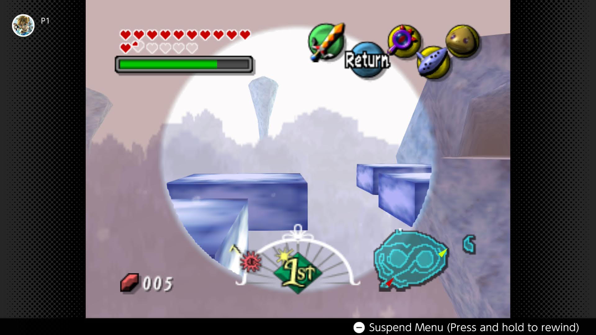
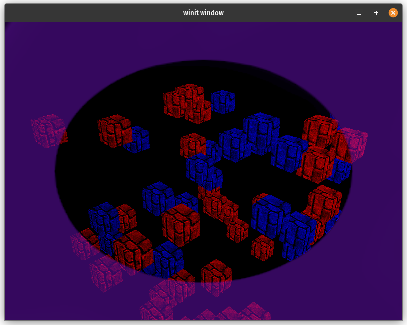

# Stencil Buffers

One of the lesser known buffer types, but useful for a lot of
different effects. In this showcase we'll be using it to mimic
the "Lens of Truth" effect seen in the Legend of Zelda Ocarina
of Time and Majora's Mask. Let's jump into it!

## The effect

For those of you who don't know, the Legend of Zelda series has
a reoccurring item in it called the [Lens of Truth](https://zelda.fandom.com/wiki/Lens_of_Truth)
that allows you see objects that are invisible using an overlay
on the screen.



Basically it's a transparent circle that's overlayed on top of
the scene and objects that are normally invisible show up in
the circle. Not only objects that are only partially in the cirle
get cut so that the hidden objects stay in the circle.

## What are stencil buffers and how do they help?

If you've done any arts and crafts you've likely used a stencil
to paint a tricky shape onto a surface. Stencil buffers allow us
to define a shape to use to mask out parts of the scene to draw.
Internally a stencil buffer is an unsigned integer texture that
you can read and/or write values to when you render objects.

Here's how we are going to use a stencil buffer to achieve the
Lens of Truth effect:

1. We'll render a texture to the stencil buffer to use later
2. We'll render the visible objects as normal
3. We'll use the stencil buffer to mask out parts of the hidden
objects.
4. Finally we'll render the texture we used as a mask over top
of the scene to complete the effect.

## Drawing the stencil

First let's take a look at creating a stencil texture.

```rust
let depth_stencil_format = wgpu::TextureFormat::Depth24PlusStencil8;
let depth_stencil = display.device.create_texture(&wgpu::TextureDescriptor {
    label: Some("depth_stencil"),
    size: wgpu::Extent3d {
        width: display.width(),
        height: display.height(),
        depth_or_array_layers: 1,
    },
    mip_level_count: 1,
    sample_count: 1,
    dimension: wgpu::TextureDimension::D2,
    format: depth_stencil_format,
    usage: wgpu::TextureUsages::RENDER_ATTACHMENT,
    view_formats: &[],
});
let depth_stencil_view = depth_stencil.create_view(&Default::default());
```

You may have noticed that the texture format for the stencil buffer
is `wgpu::TextureFormat::Depth24PlusStencil8`. This combines a 24-bit
depth texture and an 8-bit stencil texture. That means we have 256
possible values that we can use to mask out our scene. Other than that
everything looks pretty normal.

We then create 4 render pipelines. One to render the mask to the stencil
buffer, one to rendering the visible objects, one to render the hidden
objects using a stencil stage, and one to render the texture we used as
a mask to the screen. We'll skip the visible object pipeline as that's
something that we've already covered in the rendering guide. Let's start
with the mask pipeline.

<div class="note">

I'm leveraging some code shared between multiple showcases, including
a `RenderPipelineBuilder` to reduce the boilerplate. I won't go into all
the code for that here, but you can check it out in the
[Github Repo](https://github.com/sotrh/learn-wgpu/tree/master/code/showcase/framework)

</div>

```rust
let mask_pipeline_layout =
    display
        .device
        .create_pipeline_layout(&wgpu::PipelineLayoutDescriptor {
            label: Some("mask_pipeline_layout"),
            bind_group_layouts: &[&mask_bind_group_layout],
            push_constant_ranges: &[],
        });

let mask_shader = wgpu::include_wgsl!("mask.wgsl");
let mask_pipeline = framework::RenderPipelineBuilder::new()
    .vertex_shader(mask_shader.clone())
    .fragment_shader(mask_shader.clone())
    .fragment_entry_point("fs_mask")
    .cull_mode(Some(wgpu::Face::Back))
    .depth_stencil(wgpu::DepthStencilState {
        format: depth_stencil_format,
        depth_write_enabled: false,
        depth_compare: wgpu::CompareFunction::Always,
        stencil: wgpu::StencilState {
            write_mask: 0xFF,
            read_mask: 0xFF,
            front: wgpu::StencilFaceState {
                compare: wgpu::CompareFunction::Always,
                pass_op: wgpu::StencilOperation::Replace,
                ..Default::default()
            },
            back: wgpu::StencilFaceState::IGNORE,
        },
        bias: wgpu::DepthBiasState::default(),
    })
    .layout(&mask_pipeline_layout)
    .build(&display.device)?;
```

Here we specify that we:

- Want to use a shader called `mask.wgsl`
- Want to use backface culling
- Want to disable depth checking and writing
- Want a stencil stage that
  - Reads and writes to all 8-bits of the texture
  - Always replaces that value in the stencil buffer with reference
  value (we'll talk about that later) for front facing polygons
  - Ignores back facing polygons
- Want to use the `mask_pipeline_layout`

Let's take a look at `mask.wgsl` now:

```wgsl
struct VertexOutput {
    @builtin(position) clip_position: vec4<f32>,
    @location(0) uv: vec2<f32>,
};

@group(0)
@binding(0)
var mask_sampler: sampler;
@group(0)
@binding(1)
var mask_texture: texture_2d<f32>;

@vertex
fn vs_main(
    @builtin(vertex_index) in_vertex_index: u32,
) -> VertexOutput {
    var out: VertexOutput;
    // Create fullscreen triangle
    let x = f32((in_vertex_index << 1u) & 2u);
    let y = f32(in_vertex_index & 2u);
    out.clip_position = vec4<f32>(x * 2.0 - 1.0, y * 2.0 - 1.0, 0.0, 1.0);
    out.uv = vec2<f32>(x, 1.0 - y);
    return out;
}

@fragment
fn fs_mask(in: VertexOutput) {
    let sample = textureSample(mask_texture, mask_sampler, in.uv);
    // We invert this check so that the mask will render objects in
    // the center
    if (sample.a > 0.1) {
        discard;
    }
}

@fragment
fn fs_color(in: VertexOutput) -> @location(0) vec4<f32> {
    let sample = textureSample(mask_texture, mask_sampler, in.uv);
    return sample;
}
```

This shader is very simple. The vertex shader takes in the current
vertex index and draws a triangle that's bigger than the screen to
create a fullscreen image. The mask fragment shader samples a texture
and discards any fragments that are beyond a certain threshold. The
check is opposite what you would think it would be because we want
to render objects where the mask is transparent, not the other way
around. The color fragment shader just draws the texture to the screen.

When we go to render we first need to render the stencil mask.

```rust
{
    let mut draw_mask_stencil = encoder.begin_render_pass(&wgpu::RenderPassDescriptor {
        label: Some("draw_mask"),
        color_attachments: &[],
        depth_stencil_attachment: Some(wgpu::RenderPassDepthStencilAttachment {
            view: &self.depth_stencil_view,
            depth_ops: None,
            stencil_ops: Some(wgpu::Operations {
                load: wgpu::LoadOp::Clear(0),
                store: wgpu::StoreOp::Store,
            }),
        }),
        timestamp_writes: None,
        occlusion_query_set: None,
    });

    draw_mask_stencil.set_stencil_reference(0xFF);
    draw_mask_stencil.set_pipeline(&self.mask_pipeline);
    draw_mask_stencil.set_bind_group(0, &self.mask_bind_group, &[]);
    draw_mask_stencil.draw(0..3, 0..1);
}
```

Most of this is standard rendering code, but two things of note here

1. We tell wgpu to clear the stencil buffer
2. The `set_stencil_reference()` function tells wgpu what value we want
to write to the stencil buffer when the stencil test passes.

## Drawing the unseen

The next thing we will want to do is to draw our objects with
the stencil buffer. First we need to setup the pipeline.

```rust
let hidden_pipeline = framework::RenderPipelineBuilder::new()
    .layout(&model_pipeline_layout)
    .vertex_shader(model_shader.clone())
    .fragment_shader(model_shader.clone())
    .cull_mode(Some(wgpu::Face::Back))
    .color_state(wgpu::ColorTargetState {
        format: display.config.format,
        blend: None,
        write_mask: wgpu::ColorWrites::ALL,
    })
    .depth_stencil(wgpu::DepthStencilState {
        format: depth_stencil.format(),
        depth_write_enabled: true,
        depth_compare: wgpu::CompareFunction::Less,
        stencil: wgpu::StencilState {
            // Read all bits
            read_mask: 0xFF,
            write_mask: 0xFF,
            front: wgpu::StencilFaceState {
                // Only draw when stencil reference == what's in the buffer
                compare: wgpu::CompareFunction::Equal,
                depth_fail_op: wgpu::StencilOperation::Keep,
                ..Default::default()
            },
            back: wgpu::StencilFaceState::IGNORE,
        },
        bias: wgpu::DepthBiasState::default(),
    })
    .vertex_buffer_desc(ModelVertex::desc())
    .vertex_buffer_desc(InstanceVertex::DESC)
    .build(&display.device)?;
```

<div class="note">

We are skipping over `model.wgsl` as it's a standard shader that
just renders the objects using normal mapping and diffuse lighting.
The effect we want can use any shading method as long as the stencil
buffer is used properly.

You can check out [the code](https://github.com/sotrh/learn-wgpu/tree/master/code/showcase/stencil/src/model.wgsl)
if you are curious.

</div>

We also create another pipeline just like this one to draw the visible
objects. Will skip over that because it's just the same code but we use
`wgpu::StencilState::default()` as we don't need to refer/update the
stencil buffer.

With that in place we can now draw our hidden objects:

```rust
{
    let mut draw_hidden = encoder.begin_render_pass(&wgpu::RenderPassDescriptor {
        label: Some("draw_hidden"),
        color_attachments: &[Some(wgpu::RenderPassColorAttachment {
            view: &view,
            resolve_target: None,
            ops: wgpu::Operations {
                load: wgpu::LoadOp::Load,
                store: wgpu::StoreOp::Store,
            },
            depth_slice: None,
        })],
        depth_stencil_attachment: Some(wgpu::RenderPassDepthStencilAttachment {
            view: &self.depth_stencil_view,
            depth_ops: Some(wgpu::Operations {
                load: wgpu::LoadOp::Load,
                store: wgpu::StoreOp::Store,
            }),
            stencil_ops: Some(wgpu::Operations {
                load: wgpu::LoadOp::Load,
                store: wgpu::StoreOp::Store,
            }),
        }),
        occlusion_query_set: None,
        timestamp_writes: None,
    });

    draw_hidden.set_stencil_reference(0xFF);
    draw_hidden.set_pipeline(&self.hidden_pipeline);
    draw_hidden.set_bind_group(0, &self.camera_bind_group, &[]);
    draw_hidden.set_vertex_buffer(1, self.instance_buffer.buffer.slice(..));
    for mesh in &self.model.meshes {
        if let Some(material) = self.model.materials.get(mesh.material) {
            draw_hidden.set_bind_group(1, &material.bind_group, &[]);
            draw_hidden
                .set_index_buffer(mesh.index_buffer.slice(..), wgpu::IndexFormat::Uint32);
            draw_hidden.set_vertex_buffer(0, mesh.vertex_buffer.slice(..));
            draw_hidden.draw_indexed(
                0..mesh.num_elements,
                0,
                instance_split..num_instances,
            );
        }
    }
}
```

I'm using a `Model` struct based on [the model rendering tutorial](../../beginner/tutorial9-models/)
with some custom drawing code as I have put the visible and hidden
objects in the same instance buffer. Again the exact model rendering
doesn't matter here as long as your pipeline is setup to use the
stencil buffer correctly.

You can also use any model you want, but I'm using the rounded cube
from the same demo.

The visible objects use similar code so I'll leave that out for
brevity. You can check 
[the example code](https://github.com/sotrh/learn-wgpu/tree/master/code/showcase/stencil/)
if your stuck.

## Completing the effect

The last thing to do is to draw the stencil texture over the
screen to get finish the effect. The code is roughly the same as
drawing the mask to the stencil buffer, but I'll list it here.

```rust
{
    let mut draw_mask_color = encoder.begin_render_pass(&wgpu::RenderPassDescriptor {
        label: Some("draw_mask_color"),
        color_attachments: &[Some(wgpu::RenderPassColorAttachment {
            view: &view,
            resolve_target: None,
            ops: wgpu::Operations {
                load: wgpu::LoadOp::Load,
                store: wgpu::StoreOp::Store,
            },
            depth_slice: None,
        })],
        depth_stencil_attachment: None,
        timestamp_writes: None,
        occlusion_query_set: None,
    });

    draw_mask_color.set_pipeline(&self.mask_color_pipeline);
    draw_mask_color.set_bind_group(0, &self.mask_bind_group, &[]);
    draw_mask_color.draw(0..3, 0..1);
}
```

With all that you should get something like this:



## Conclusion

This is only scratching the surface of what you can do with
stencil buffers. Other effects you can create with stencil
buffers are outlines around objects, x-ray vision, and more complex
lighting techniques such as spot lights all use a stencil buffer.

I may cover some of these at a later date, but this should
give you all the tools you need to try some of these yourself.

## Thanks to these supporters!

- David Laban
- Bernard Llanos
- Ian Gowen
- Aron Granberg
- 折登 樹
- Julius Liu
- Lennart
- Jani Turkia
- Feng Liang
- Lions Heart
- Paul E Hansen
- Gunstein Vatnar
- Nico Arbogast
- Dude
- Youngsuk Kim
- Alexander Kabirov
- Danny McGee
- charlesk
- yutani
- Filip
- Eliot Bolduc
- Ben Anderson
- Thunk
- Craft Links
- Zeh Fernando
- Ken
- Ryan
- IC
- Felix
- Tema
- 大典 加藤
- Andrea Postal
- Davide Prati
- dadofboi
- ツナマヨ

If this helped you out and you want to support checkout
[my patreon](https://patreon.com/sotrh) or [my kofi account](https://ko-fi.com/sotrh)!

## The Code

<AutoGithubLink/>
